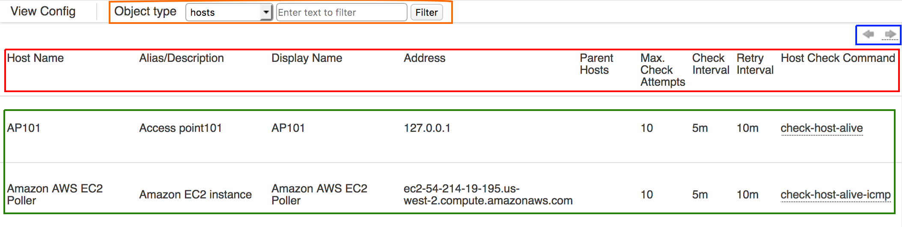

# View Active Config

# About

The **View Active Config** page (Manage \> View Active Config) displays all of the configured objects in the OP5 Monitor install. There can be quite a few objects in a production install, and **View Active Config** provides a way to get an overview of the configuration.

The objects can have more attribute columns then can be displayed in the browser window, so expanding the window horizontally might be necessary to see all of the attributes.

# Overview

There are several parts of the View Active Config page:

-   Object Type Filter (Orange box in the screenshot)

-   Column Arrows (Blue box in screenshot)

-   Column Headers (Red box in screenshot)

-   Object List (Green box in screenshot)

The Object Type Filter filters the displayed objects. The drop down menu lists the different object categories which can be displayed, and the text box allows for search terms to be entered. Different categories will have different columns, and for this document, the *hosts* object type is selected.
A few things to note about the search terms. The searches are case insensitive, so `AWS` and `aws` are the same thing. The search terms apply to the *Host Name* column, and the text box also allows for rudimentary regular expressions (regex) to be used to narrow down the number objects displayed. For instance, `com$` will display objects with a host name which ends with "`com`", such as "`domain.com`".
*Column Arrows* resize the width of the columns. Clicking on the left facing arrow will increase the amount of space in each cell for a more expansive view, and clicking on the right facing arrow will reduce the amount of space in each cell for a more compact view.
*Column Headers* are labels for the columns. *Host Name* corresponds to the configured host name for the object, *Alias/Description* corresponds to the configured alias, or description, of the object, and so on.
*Object List* consists of objects returned by the filter. In the screenshot, the *hosts* filter is active, and hosts configured in the system are displayed.

 

