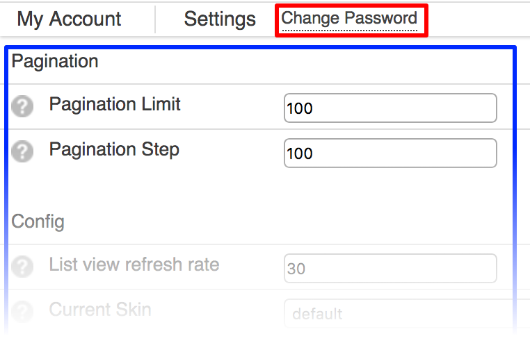
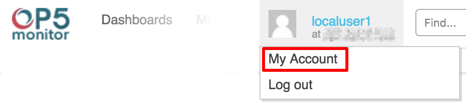
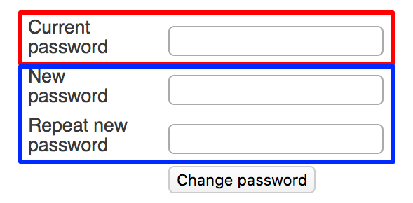

# My account

## About

The **My Account** page is the place to change various settings for the currently logged in account.

From here, the account password can be changed, the pagination behavior changed, and the list refresh rate can be set along with various other settings.

There are two parts to the **My Account** page.

- Change Password link (Red box in the screenshot)
- Settings list (Blue box in the screenshot)

The Change Password link opens the **Change Password** page where the password for the current account can be set.

The *Settings* list is where various user accessible settings can be tuned or enabled.

## Accessing the My Account Page

1. Hover over the account avatar/account name on the left hand side of the OP5 Monitor Toolbar to reveal a drop down menu.
2. Click on *My Account* from the drop down menu to open the **My Account** page. (Red box in the screenshot.)
    

## Changing account password

1. Click on the *Change Password* link to open the **Change Password** page.

2. Once the **Change Password** page appears, enter the current account password in the Current Password field. (Red box in the screenshot.)

3. Next, enter the new password in the New Password field. (Green box in the screenshot.)

4. Enter the new password again in the Repeat New Password field. (Green box in the screenshot.)

5. Click on the Change Password button to set the new password.

- A green banner will be displayed if successful.

- A red banner will be displayed indicating the problem if unsuccessful.

6. Click on the Account Settings link to return to the **Account Settings** page, or return via the back feature of the browser.

## Pagination

The *Pagination* section controls the number of items displayed per page.

|:--|
|**Pagination Setting**

**Description**|Pagination Limit
Sets the maximum number of items to display per screen.|Pagination Step

Sets the default value of the pagination drop-down menu.|
