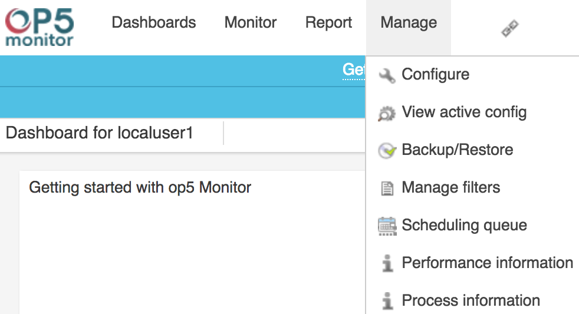
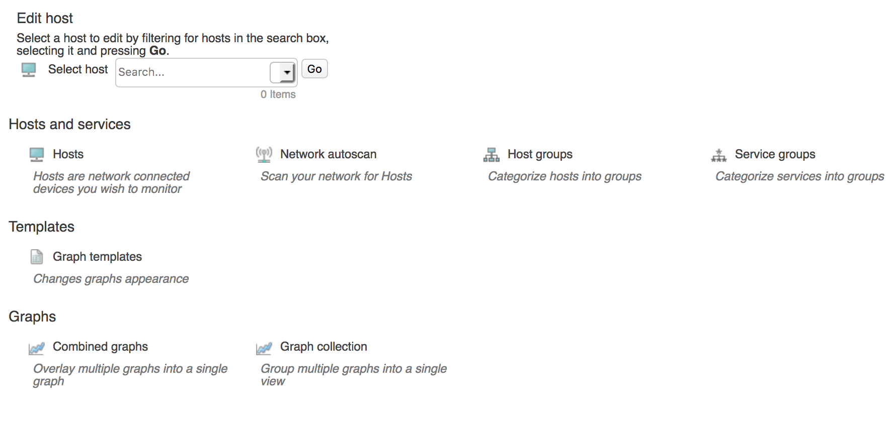

# Configuration

## About

The Configuration menu item in OP5 Monitor is the place where all the pages related to configuring OP5 Monitor.

It should be noted the options below are highly dependent on the permissions given to the account. This document was written with an account assigned to the builtin `limited_edit` group, but the actual account may have more permissions or fewer permissions. In short, don't worry if some sections don't apply or if some options aren't covered. The [OP5 Monitoring Admin Guide](op5_Monitor_Administrator_Manual) has more information about the various options.

## Overview

### Configure

The **Configure** page (Manage \> Configure) is the central location for links to pages which control different aspects of OP5 Monitor. From here, hosts can be added, host or services groups can be created, and graphs can be edited or combined, to name a few options.

More in-depth discussion of the **Configure** page can be found in the [OP5 Monitor Admin Guide](op5_Monitor_Administrator_Manual)
