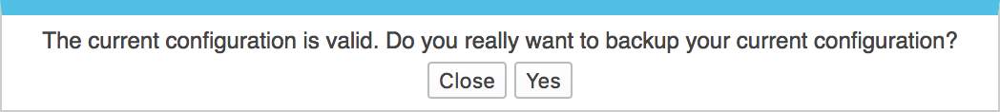
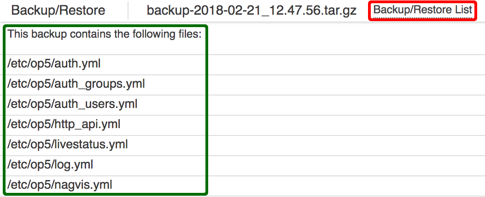
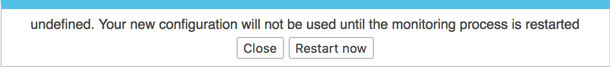
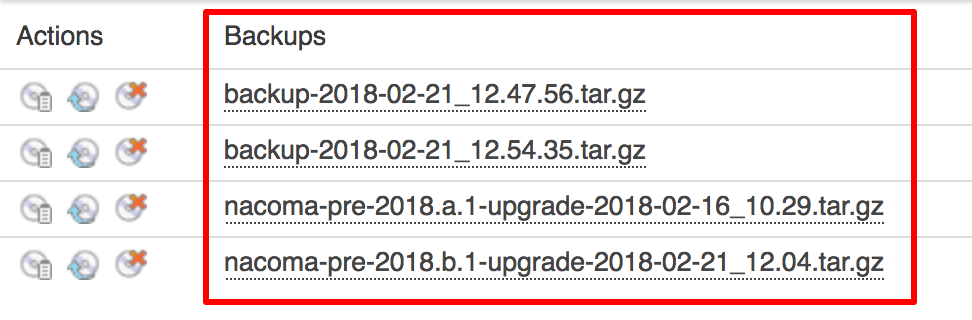

# Backup and Restore

## About

The **Backup/Restore** page (Manage \> Backup/Restore) allows the current configuration to be saved or restored. A more complete backup/restoration solution is provided in the form of the `op5-backup` command line tool, but the **Backup/Restore** page is the place to save or restore the configurations.

The backup files are compressed tar files, and certain operating systems may need third-party software in order to open the files. Software which understands Gzip compression and Tar format will be able to open the files and extract the collected configuration files.

## Overview

There are three main parts to the Backup/Restore page:

- Save your current OP5 Monitor Configuration link (Red box in the screenshot)
- Actions column (Green box in the screenshot)
- Backups columns (Orange box in the screenshot)

Clicking on Save you current OP5 Monitor Configuration link will create a backup of the current configuration, and the resulting file will appear in the list below.

The *Actions* column contains links to the View Backup,  Restore Backup, and Delete Backup operations. Each action only affects the row it's on, so clicking on the Delete Backup link on row one only deletes the backup file listed in row one.

Icon

Action

Explanation

View

View the contents of the backup file.

Restore

Return the configuration to production.

Delete

Remove the backup file from the server.

The *Backups* columns contains the names of the backup files. The names also happen to be links to the backup files, and clicking on one will prompt the web browser to download the file.

## Working with Backups

### Create a new backup file

1. Click on the Save your current OP5 Monitor configuration link.
2. A dialog box will appear asking for confirmation.
    
  - Click *Yes* to confirm the creation of a backup file.
  - Click *Close* to exit without creating a backup file.

3. If *Yes* was clicked, the dialog box will display a spinning pinwheel icon while the files are collected.
4. Next, the dialog box will display the results once the process has finished. Clicking on *OK* will close the dialog box, or wait for it to automatically close after a few seconds.
5. The list of backups will now contain a new entry with the current date and time in the file name.

### View the contents of a backup file

1. Click on the View Backup icon in the *Actions* column to open a page listing the contents of the backup file.
2. Scroll up and down the page to view the list of included files. (Green box in the screenshot below.)
    
3. Return to the **Backup/Restore** page by clicking on the Backup/Restore List link to the right of the backup file name (Red box in the screenshot), or use the back button in the browser to return to the previous page.

### Restore a backup file

1. Click on the Restore Backup icon in the *Actions* column to start the restoration process.
2. A dialog box will appear asking for confirmation.
    
  - Click *Yes* to confirm restoration of the configuration.
  - Click *Close* to exit without restoring the configuration.

3. If *Yes* was clicked, another dialog box asking to restart OP5 Monitor will appear.

    Only the OP5 Monitor services are restarted. This does not restart the server.

    

  - Click *Restart Now* to immediately restart the OP5 Monitor services and apply the configuration.
  - Click *Close* to exit without restoring the configuration.

4. A dialog box stating OP5 Monitor is restarting will appear. Click *Close* to close the dialog box, or wait for it to automatically close after a few seconds.
5. The previous configuration should now be active, if everything was successful.

### Delete a backup file

1. Click on the Delete Backup icon in the *Actions* column to start the deletion process.
2. A dialog box will appear asking for confirmation.
    
  - Click *Yes* to confirm the deletion of a backup file.
  - Click *Close* to exit without deleting a backup file.

3. If *Yes* was clicked, another dialog box will appear displaying the results of the process. Clicking on *OK* will close the dialog box, or wait for it to automatically close after a few seconds.
4. The selected configuration backup file should now be deleted, if everything was successful.

### Download a backup file

1. Click on the name of the backup file from the *Backups* column to start downloading the file.
    

### Miscellaneous Information

#### Backup file naming convention:

##### File name:

- `backup-2018-02-21_12.54.35.tar.gz`
- `nacoma-pre-2018.a.1-upgrade-2018-02-16_10.29.tar.gz`

##### File name broken down into parts:

- Creation process:
  - `backup` is from the web application backup process.
  - `nacoma-pre-2018.a1.1-upgrade` is from the OS level upgrade process.
- Process Date Delimiter: `-`
- Date backup was created (ISO 8601 format):
  - `2018-02-21` is February 21, 2018 formatted as `YYYY-MM-DD`.
- Date Time Delimiter: `_`
- Time (24 hour format):
  - `12.54.35` is 12:54.35 pm.
  - `10.29` is 10:29 am.
- Extension: `.tar.gz`
