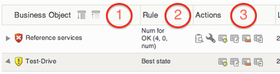
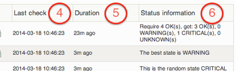

# Business Service Monitoring

# About

The business services view is designed to combine your IT monitoring and your business service management (BSM) to give an overview of the applications and/or services that your organisation is providing either to customers or internally.

# Viewing Business Services

To access the Business Services view click on **Business Services** in the main menu.

The Business Services view gives an easy overview of how your Business Processes are working.

For better viewing the following screenshot has been divided in to two pieces.

| **Figure Number** | **Description** |
| ----- | ----- |
| 1 | Business Object: Lists all the Business service objects. \
An object can be: Group, Service, Host, Random value, Constant value |
| 2 | Rule: Shows which rule is applied to the group. |
| 3 | Actions: A list of action buttons. |
| 4 | Last check: This will show when the object was last checked. \
The time on a group is the time for when the last sub element was checked. |
| 5 | Duration: Displays how long the group or service has been in it's current \
state. |
| 6 | Status Information: Displays in what state the current group is in. For \
hosts and services the output from the OP5 Monitor check is displayed. |
