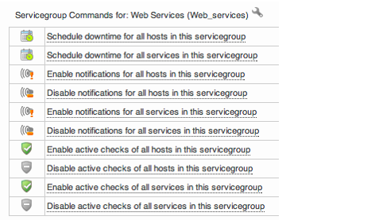

# Host and Service Groups

## About

A host or service group is a collection of hosts or services that has something in common.

It can be for example location, function or hadrware type.

## Using Host groups

A host is normally placed in one or more host groups. A host group can contains any kind of hosts in any way you want to.

You can use host groups to:

- group hosts from the same geographic area in the same host group.
  - put the same type of hosts in the same host group.
  - place all hosts in a special service in the same group.
  - place a customer's host in a host group of its own.

 Beside just being a way of sorting hosts in you can use host groups to decide what user is supposed to be able to see what hosts. More about that in Access rights on page Main Objects.
 Using host groups makes it easy to find hosts that got something in common. Let us say you have a whole bunch of Citrix servers you can show just these servers in a listview.

### Host group commands

By clicking on the "Action" icon on a host group you will get a menu to control the host group.
 

From this menu you can:

- Schedule downtime for all host and/or services in the host group.
- Enable and disable notifications for all hosts and/or services in the host group.
- Enable and disable active checks for all hosts and/or services in the host group.
- Go directly to the configuration for this host group.

### Host group reporting

From the host group command menu (see above) there are also a couple of reporting tools
 
 From this menu you can view Availability reports and Alert history for the host group.

## Using Service groups

One of the most useful things with service groups is to group them by what useful service they are giving the users.
*A service group example*
 Let us say you have a mail service for you customers. This mail service needs the following components to be working as it should:

- DNS
  - MTA
  - IMAP-/POP-server
  - Webmail
  - Storage

On the hosts listed above there are services that must be working otherwise your customer will not be able to user the email service you shall deliver to them.
 Place all the important services in one service group and you can then easily see if an alert and/or notification says anything about the email service in the example.

### Service group commands

By clicking on a service group name (the name within parentheses) in any of the service group views you will get a menu to control the service group.

 From this menu you can:

- Schedule downtime for all host and/or services in the service group.
  - Enable and disable notifications for all hosts and/or services in the service group.
  - Enable and disable active checks for all hosts and/or services in the service group.
  - Go directly to the configuration for this service group.

### Service group reporting

From the service group command menu (see above) there are also a couple of reporting tools
 
 From this menu you can view Availability reports and Alert history for the service group.

Another good way to use service groups is to create Service Level Agreement (SLA) reports based on service groups. If you take the example above and create a SLA report from it you will directly see if you can deliver your service the way you promised your customers.
