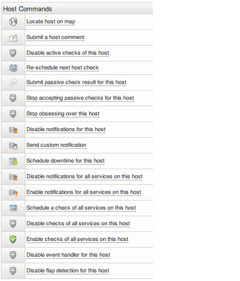

# Hosts and services

## About

Hosts and services are the objects that are monitored by OP5 Monitor.

## A host in detail

A host can be any kind of network device, virtual device and other objects that you might reach from the OP5 Monitor server.
 Let us take a look at the Host information view and see what parts it is built upon. In the coming sections we will go through each part and learn how they can be used.

 \

The table below describes each part of the Host information view briefly.

**Nr**

**Part**

**Description**

1

Page links

Quick links to other information about the host

- Status detail list all services on this host.
  - Alert history show the alert log if the host.
  - Alert histogram show a graphical view, or trend, of the problems on the host.
  - Availability report of the host.
  - Notifications shows all notifications that has been sent out about this host.

2

Host information header

Displays brief information about the host and its surroundings like

- Host name and address.
  - Parent host.
  - Hostgroup membership
  - Extra actions and notes.
  - Links to configure and graphs.
  - Host notifications.

3

Host state information

Here you can see status information for the host like

- Current status.
- Current attempt.
- Last state changes and notification.
- What is enabled or not on this host.

4

Host commands

Here you can perform different commands for the host and/or all services on that host.

5

Comments

Manually added comments and comments from the system are shown here.

## Page links

The page links gives you a couple of shortcuts to more information about this host and its services.

 \

## Host information header

Here you will get a short summary of the host.

 \

The host header information contains

- the host address.
- the parent host.
- what host groups it's member of.
- what group will get the notifications for this host.
- links to extra service actions, service notes and the performance graphs.
- a link to the object in the configuration GUI.

## Host state information

In this view you get all kind of status information about the host. This is the most detailed view you can get over a host.

 \

## Host commands

The host commands part gives you a various commands to handle the host. Here you can

- locate the host in a status map
- add a host comment
- re-schedule the next check for this host
- disable and enable active and passive checks
- disable and enable notifications
- schedule downtime
- disable and enable event handlers.
- send custom notifications

 \

## Comments

There are two types of comments:

- automatically added
- manually added

Automatically added comments can be:

- acknowledged comments
- scheduled downtime comments

As a manually added comment you can type in almost anything you like.

 \

 Comments are designed to be short texts. If you would like to add documentation, longer descriptions and so on you should consider using the Dokuwiki that is included in OP5 Monitor.

## A service in detail

A service is practically anything that can be measured. A service must be connected to a host.
 Let us take a look at the Service information view and see what parts it is built upon. In the coming sections we will go through each part and learn how they can be used.
 The picture below shows the Service information view.

 \

**Nr**

**Part**

**Description**

1

Page links

Quick links to other information about the service and the host it is connected to.

- Information for this host.
- Status details for the host.
- Status detail list all services on this host.
- Alert history show the alert log if the service.
- Alert histogram show a graphical view, or trend, of the problems on the service.
- Availability report of the service.
- Notifications shows all notifications that has been sent out about this service.

2

Service information header

Displays brief information about the service, host and its surroundings like

- Host name and address.
- What service groups the service belongs to.
- Extra actions and notes.
- Links to configuration and graphs.

3

Service state information

Here you can see status information for the service like

- Current status.
- Current attempt.
- Last state changes and notification.
- What is enabled or not on this service.

4

Service commands

Here you can perform different commands for the service.

5

Comments

These are comments you put there either by adding a scheduled downtime or just a comment of it own.

 \

## Page links

The page links gives you a couple of short cuts to more information about this service and the host it is connected to.

 \

## Service header information

Here you will get a short summary of the service.

 \

Here you may see things like

- What host it belongs to.
  - The service groups it is a member of.
  - What contact groups that will get the notifications.
  - Service notes.
  - Links to extra service actions, service notes and performance graphs.
  - A link to the object in the configuration GUI.

## Service state information

In this view you get all kind of status information about the host. This is the most detailed view you can get over a service.

 \

## Service commands

The service commands part gives you a various commands to handle the service. Here you can

- Disable and enable active and passive checks
  - Reschedule the service check
  - Disable and enable notifications
  - Schedule downtime
  - Disable and enable event handlers.
  - Submit a service comment
  - Send custom notification

 \

## Comments

There are two types of comments:

- Automatically added
  - Manually added
  - Automatically added comments can be
  - acknowledged comments
  - scheduled downtime comments

As a manually added comment you can type in almost anything you like.

 \

Comments are designed to be short texts. If you would like to add documentation, longer descriptions and so on you should consider using the Dokuwiki that is included in OP5 Monitor.
