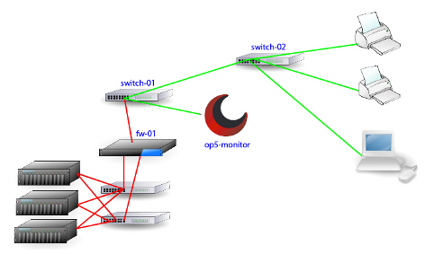

# Parenting

## About

Parenting in OP5 Monitor is used to determine whether a host is down or unreachable.

## Description

A host is...
 down if the host is the first one it can not reach in the "tree"
 unreachable if the host is after the host described above.
 *This example describes how the parenting works in practice*
 *The picture below shows how a network looks like from the monitor servers point of view.*

 \

 *As you can se everything starts with the op5-monitor server. If fw-01 is down, as shown in the picture above, all child hosts of fw-01 is considered as unreachable.*
 The example above shows that you can use parenting to exclude a lot of unnecessary alerts and notifications. This because you can tell OP5 Monitor not to send any notifications for a host that is unreachable. That means you will only get notification about fw-01 in this case, not the hosts "below" fw-01.
