# Problem handling

# About

Much of your work with OP5 Monitor is about problem handling. In the beginning when you start working with OP5 Monitor normally most of the time is about configuring, tweaking and fixing problems. After a while you will see that you can start working in a proactive way instead of how it used to be.
In this section we will take a look at how you can work effectively with OP5 Monitor as a great help during your problem handling.

# Hard and soft states

A problem is classified as a **soft** problem until the number of checks has reached the configured **max\_check\_attempts** value. When **max\_check\_attempts** is reached the problem is reclassified as **hard** and normally OP5 Monitor will send out a notification about the problem. **Soft** problems do not result in a notification.

# Alerts and notifications management

Alerts and notifications are two of the most important things for you as a system administrator who depends on a monitoring tool like OP5 Monitor.
 Alerts, alarm and notifications are called different things in most monitoring system. In OP5 Monitor we define them like this:

**Description**

Alerts

An alert is when any kind of status changes on a host or a service, like:

- host up
- host down
- host unreachable
- service ok
- service warning
- service critical
- service unknown
     and so on.

Notifications

Notifications are the messages sent out to the contacts associated with the object the notification is sent about.

Notifications are sent out on state changes. A notification is sent during one of the following alerts:

- any service or host problem or recovery
- acknowledgments
- flapping started, stopped and disabled
- downtime started, stopped and canceled

 Notifications can be sent by almost anything. The following are included by default in OP5 Monitor:

- email
- sms

 Of course there are a lot of other ways to send notifications like sending them to a database, ticket handling system etc.

 An alert can happen any time and it does not necessary needs to be associated with a notification, but a notification is always associated with an alert.

# Unacknowledged problems views

As you can see in the GUI there are many views in OP5 Monitor to show you host and service status in. Two of the most useful default views for a system administrator, is the unacknowledged  service view and the unacknowledged hosts view.

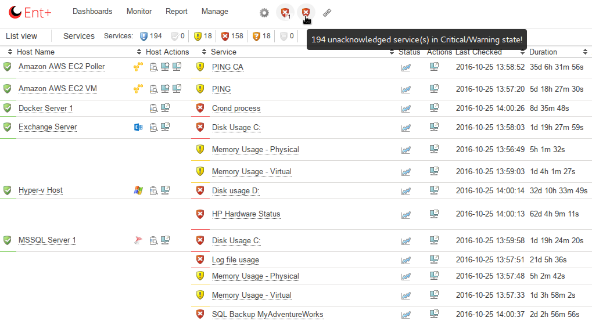

In these views you will only find unacknowledged problems for hosts and services
This views can be accessed from the quickbar menu.

# Acknowledge problems

When a new problem is discovered you need to take care of it. The first thing you should do is to acknowledge the problem. There are many ways to acknowledge a problem.
 When you acknowledge a problem you will:

- make sure no more notifications are sent out.
- show other users that you have seen the problem and are aware of it.

We will here take a look at two of them, acknowledge by:

- The GUI
- SMS

## Acknowledging a problem in the GUI

The most common way to acknowledge a problem is to do it in the GUI. This is easy and you will also be able to add a comment to your acknowledge. It is also the same routine no matter if it is a host or service problem you are about to acknowledge.
 To acknowledge a host problem:

1. Look up the host in the GUI and click on the host name.
2. Click on **Acknowledge This host problem** in the left area of the user interface.

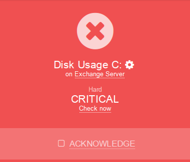

3. Fill in a comment and click **Submit**.

    With the Sticky options all notifications are suppressed until the problem goes to OK or UP. Un-check this box to remove the acknowledgment even when the problem goes to another problem state, for example from WARNING to CRITICAL or from CRITICAL to WARNING. Use the **Notify** checkbox to send out a notification that this problem has been acknowledged. With every acknowledgment a comment is added to the object. If you would like this comment to remain after the problem has retured to OK or UP use the **Persistent** checkbox.
4. Click **Submit** and you will be directed back to the host you where on when you started.

## Acknowledging a problem by sms

If you have received your notification by sms you can acknowledge it by sending a sms back to the OP5 Monitor server.
 To acknowledge a problem by sms

1. Pick up the notification sms in your mobile phone.
2. Forward it to the OP5 Monitor server (you must forward the complete sms just the way it looked like when you got it).

If you now take a look at the host or service you will see that it has been acknowledged and a small comment is placed in the comment part for the object.

## Removing an acknowledge

Sometimes you might need to remove an acknowledge. Maybe you acknowledged the wrong problem or you for some reason need to stop working on it but you like more notifications to be sent out.
 To remove an acknowledge for a host:

1. Pick up the host or service detail view in the gui.
2. Hover the menu **Options -\> Actions -\> Remove acknowledgment**

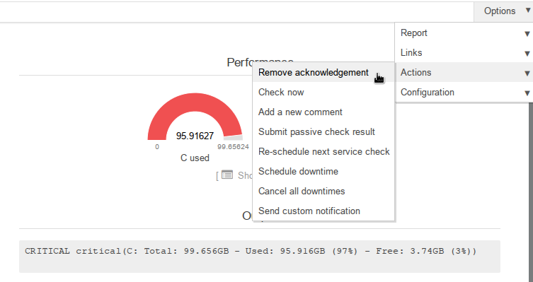

Now the notifications will continue as it is setup for the object.
The comment for the acknowledge *is not removed*.

## Removing multiple acknowledgements

To remove several acknowledgements:

1. Go to  your dashboard, and in the "**acknowledge service problem**" widget and click on "X Acknowledged services"

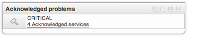

2. Click **Send Multi Action** below the search field. It is located in the top right of the list.

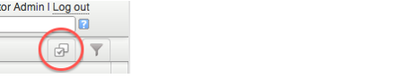

3. Chose **Acknowledge** in **Select Action** drop down list just below the list and click **Submit**.

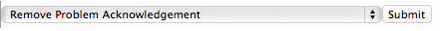

# Schedule downtime

Using scheduled downtime enables you to plan for system work ahead. When a host or service is scheduled for downtime OP5 Monitor suppresses alarms for that host or service. Furthermore OP5 Monitor informs you about when a host or service is scheduled for downtime through the web interface. Information about the scheduled downtime is also stored so that planned system work does not affect availability reports.
 It is possible to schedule downtime for the following object types:

- hosts
  - services
  - all members of a host group
  - all members of a service group.

You can also configure triggered downtime for hosts located below a host currently in scheduled downtime. To do this you need to have your parenting configured correctly. You can read more about [Parenting](Parenting).

## Viewing scheduled downtime

Basically the Scheduled Downtime view is a summary of all currently configured scheduled downtime for hosts and services.

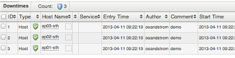

In this view you can also remove scheduled downtime

### To view all scheduled downtime

1. Click **Scheduled downtime** in the main menu under the **Monitoring menu**.

## Scheduling downtime

As you have seen we can schedule downtime for both hosts and services. Now we will take a look at how to schedule downtime for a host and a host group. The procedure is the same for services and service groups.
 When the scheduled downtime starts a notification is sent saying that the scheduled downtime has started.
 When adding a retroactively downtime, this will be noted in the log for the service or host.

### To schedule downtime for a host

1. Find the host you like to schedule downtime for and pick up the host information page ([Hosts and services](Hosts_and_services)).
2. In the **Host detail view** click **Schedule Downtime.**

3. Fill in the form
    
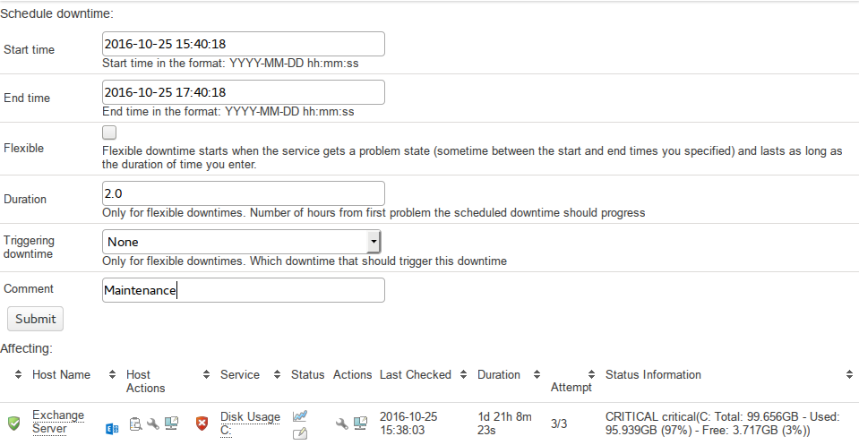

    1.  Enter start and end time.
    2.  Choose between fixed or flexible. **Fixed** downtime starts and stops at the exact start and end times that you specify when you schedule it. **Flexible** is used when you know for how long a host or service will be down but do not know exactly when it will go down.
    3.  Use **Triggered by** if you would like another schedule downtime to start the downtime. For instance, if you schedule flexible downtime for a particular host (because its going down for maintenance), you might want to schedule triggered downtime for all of that hosts' "children". Note that this option is hidden if no other scheduled downtimes are available.
    4.  If you chosen flexible in **b** then type in how long the scheduled downtime is supposed to be active.
    5.  Add a comment about this scheduled downtime.
    6.  Choose what to do with the child host of this host (if there are any).

4. Click **Submit**.
5. Click **Done**.

### To schedule downtime for a host group

1. Locate the host group you like to schedule downtime for by clicking on Hostgroup summary in the main menu under Monitoring.

2. Click on the hostgroup "Action" icon

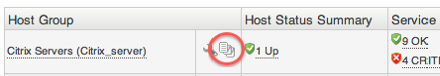

3. Click **Schedule downtime for all hosts in this Hostgroup** in the list of Hostgroup Commands.

4. Follow a-e in step Fill in the form in To schedule downtime for a host.
5. Click **Submit**.
6. Click **Done**.

## Remove a scheduled downtime

Sometimes it is necessary to remove a scheduled downtime. This can be done both before the scheduled downtime has started and during the downtime. If the scheduled downtime has been canceled before it has reached its end time a notification will be sent saying that the scheduled downtime has been canceled.

### Removing a scheduled downtime

To remove a scheduled downtime

1. Open up the scheduled downtime view by follow the instructions in To view all scheduled downtime.
2. Click the **delete** icon under Actions.

3. Click **Submit**. Now the scheduled downtime and the comment have been removed.

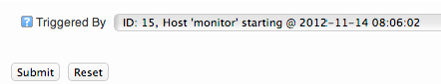

# Schedule recurring downtime

As a good practice you shall put your hosts and services in scheduled downtime when you are planing to take them down. Many downtime events are recurring and it is pretty easy to forget to put your objects in scheduled downtime.
 This is when Recurring Downtime is a great help for you.

## Scheduling a recurring downtime

Let us say that you are using Citrix and you need to reboot your citrix servers once per week. This is a perfect case of when you should use a recurring downtime schedule.

### To add a recurring downtime

1. Click **Recurring downtime** in the Monitoring menu.

2. Select **New**, located to the left of the filter and multi select options

3. Choose the object type.

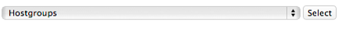

4. Chose objects to use, in this case the citrix host group.

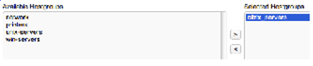

5. Add a comment.
6. Set start and end time.

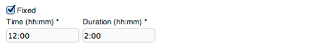

7. Choose day of week and months of the year this schedule shall be used.
8. Click **Add schedule**.

## Viewing your recurring downtime schedules

Once you have created a recurring downtime schedule you may

- view it
  - edit it
  - delete it.

This is done from the Schedules tab.
The view looks like this

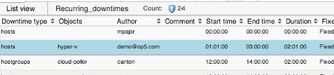

## Editing a recurring downtime

### To edit a recurring downtime

1. Click **Recurring downtime** and then **Schedules**.
2. Click **Edit**.

3. Edit the fields you like to change and click **Add schedule**.

## Deleting a recurring downtime

### To delete a recurring downtime

1. Click **Recurring downtime** and then **Schedules**.
2. Click **Delete**

 .

3. Click **Ok**.
