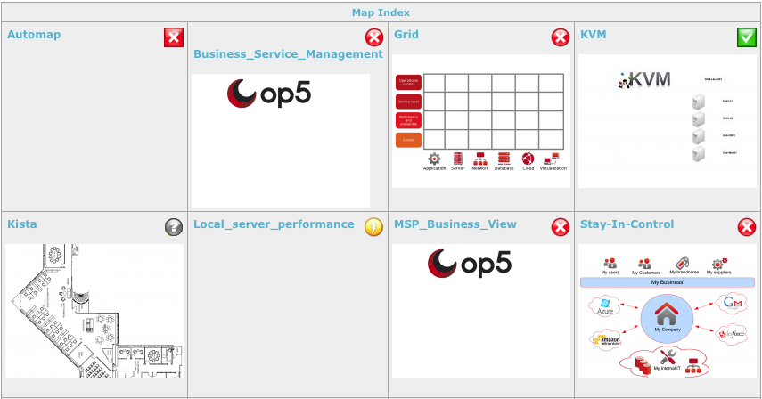

# NagVis

## Introduction

NagVis is a visualization add-on for OP5 Monitor and it is used to visualize OP5 Monitor data, e.g. to display business processes like a mail system, network infrastructure or critical production processes.
In this chapter each type of map will be described. You will also learn how to complete the most common tasks like how to

- add, edit and delete maps
  - add, edit and delete objects
  - change global configuration

The first thing you will see when you open up NagVis in OP5 Monitor is a few default demo maps, Automap and Geomap.
The picture below shows an example of how the view may look like.

It is from this view you can display and manage you maps.
