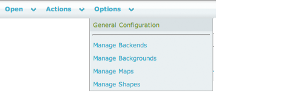
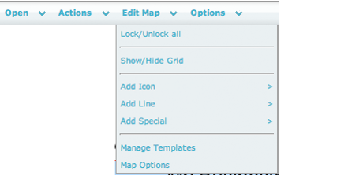

# Configure NagVis

## About

All settings are administrated through the Configuration. The **Configuration** menu can be found under **Options** in the menu at the top of the default view

From this menu you can:

- Change the global configuration
- Add, edit and delete map and objects
- Add and delete background images
- Add, edit and delete shapes
- Configure the backend.

## Edit plain maps

### To edit a plain NagVis map

1. Click on NagVis in the monitoring menu of OP5 Monitor.
2. Click on the NagVis map that you want to edit.
3. Use the menu on the top to access the edit options.
    
