# NagVis maps

## About

As you have seen there are a couple of demo maps in the default configuration. They are included so you have something to start with when you are using NagVis for the first time.

## Manage backgrounds

When you start to create your own maps you will need to have a background image. The background image can be what ever you want.
The following image types are supported:

- jpeg (jpg)
- png
- gif

### Add

#### To add a new background image

1. Go to nagvis in the monitoring menu.
2. Go to the menu on top and select **Options -\> Manage** **Backgrounds

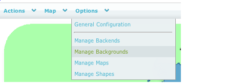 \

3. Click on **Choose File** in the **Upload background image** and choose the image to upload.

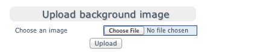 \

4. Click **Upload**. Now your background image is ready to use.

### Delete

#### To delete a background image

1. Go to Nagvis in the monitoring menu.
2. Go to the menu on top and select **Options -\> Manage** **Backgrounds**

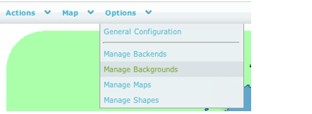 \

3. Under **Delete background image** choose the background image you like to remove and click **Delete**.

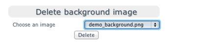 \

## Manage maps

### Add

#### To add a new map

1. Go to the menu on top and select **Options** **-\> Manage Maps**

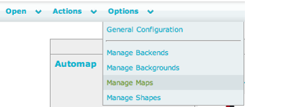 \

2. Now fill in the following fields:

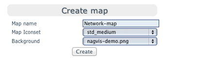 \

    <table>
    <colgroup>
    <col width="50%" />
    <col width="50%" />
    </colgroup>
    <tbody>
    <tr class="odd">
    <td align="left">
<strong>Option</strong>

    
<strong>Description</strong>
</td>
    <td align="left">
Map name

    
The map name without space in the name.
</td>
    </tr>
    </tbody>
    </table>

3. Click on the **Create** button and your map is created and ready to be filled with objects.

This will be the name of the map and used both in URLs and it will be the name of the configuration file in the file system

### Change options

Since the **Add new map** window is pretty limited you probably want to change some of the options for your newly created map.

#### To find the Option window for your map.

1. Go to the map that you would like to change.
2. Go to the menu on top and select **Edit Map -\> Map Options**

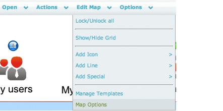 \

The number of options is large. For more information about the options please read more in the official NagVis Manual at:
[http://www.nagvis.org/documentation](http://www.nagvis.org/documentation+)

### Deleting a map

#### To delete a map

1. Select **Options -\> Manage** **Maps from the menu on top**

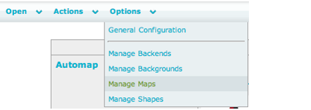 \

2. Under **Delete map** choose the map you like to remove and click **Delete**.

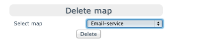 \

3. Click **Ok** in the pop-up question to deleted the map.

### Renaming a map

#### To rename a map

1. Go to the top menu and choose **Options** -\> **Manage Maps**

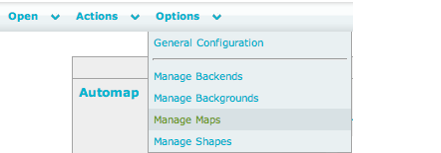 \

2. Select the map you like to rename.

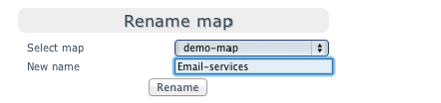 \

3. Type the new name in the **New name** text field and click **Rename**.
4. Click **Ok** in the pop-up dialog that shows up and the map will be renamed.

## Map object types

A map can have three types of objects. See the list of objects below:

- Icon
- Line
- Special

Each object type consist of a number of objects that may be used in a map. The table below briefly describes what objects each type includes:

<table>
<colgroup>
<col width="50%" />
<col width="50%" />
</colgroup>
<tbody>
<tr class="odd">
<td align="left">
Object Type

Objects
</td>
<td align="left">
Icon

<ul>
<li>Host</li>
<li>Service</li>
<li>Hostgroup</li>
<li>Servicegroup</li>
<li>Map</li>
</ul></td>
</tr>
</tbody>
</table>

If a host is in a problem state or a service on that host is in a problem state the host will be displayed in a non-green color (red, yellow or grey).
If you hover the mouse over an object you will get a summary of how the current object.

## Icon objects

As you can see in the table in Map object types the type Icon consists of five different objects. All of them are icons that displays status of a certain object in OP5 Monitor. They will change color depending of the status of the corresponding object in OP5 Monitor.

### Adding a host icon

#### To add a host icon

1. Go to the menu on top and select **Edit** **Map** -\> **Add Icon** -\> **Host**

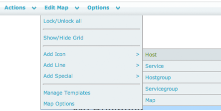 \

2. You will now get a mouse pointer looking like a cross:

 \

    Click on the map where you like to add your host.
3. A box with the host options is now shown.

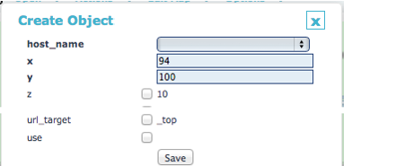 \

    The options marked with bold text are mandatory. So the host name is the only one you have to change for now.
4. Click **Save** and your object is saved on the map.

### Adding a service icon

1. Go the menu on top and select **Edit** **Map** -\> **Add Icon** -\> **Service**

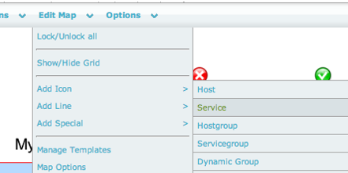 \

2. You will now get a mouse pointer looking like a cross:

 \

3. Click on the map where you like to add your service.

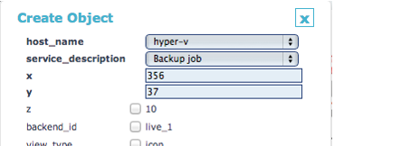 \

    First select the host of the service, then select the service.
4. Click **Save** and your object is saved on the map.

## Line objects

A line object is a printed line between two objects. It can symbolize a connection between two icon objects and be associated with a object.

### Adding a line

Here we will add a line between two hosts and connect it to a switch-port Bandwidth Usage check.

#### To add a line

1. Go to the menu on top and chose: **Edit Map** -\> **Add Line** -\> **Service**

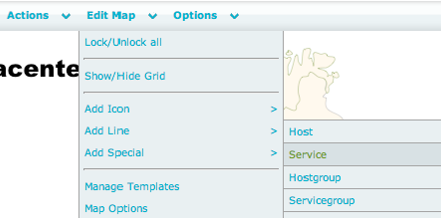 \

2. Place the line between your objects like this.

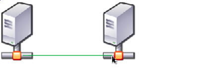 \

    1.  Click on the host icon you like to start your line from.
    2.  Drag the mouse to the other host you like to connect the line to.
    3.  Click where you like to end the line.

3. A box with the line options is now shown.

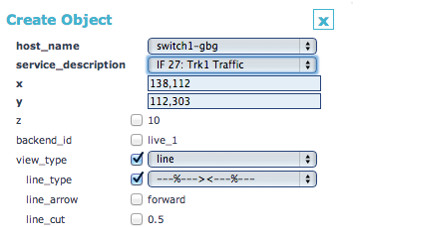 \

    The options marked with bold text and **line type** are mandatory. So the host name, service descriptions and line type the only one you have to change for now.
4. Select line\_type. The line type "-%\>

    The line type "-%+BW\>\<%+BW-" is used for showing both percentage and Bandwidth. This line does not work with the standard traffic check.

5.  Click **Save** and your object is saved on the map. Note that the percentage is not viewable in configuration mode.

## Graph objects

##  Add a graph

To add a graph to a Nagvis map works in the same way as creating a service object.

1. Go the menu on top and select **Edit** **Map** -\> **Add Icon** -\> **Service**

 \

2. You will now get a mouse pointer looking like a cross:

 \

    Click on the map where you like to add your service.
3. On the service dialog add the service as usage but change the following values:
    Set **view\_type** to **gadget**
    Set **gadget\_url** to **pnp\_graph.php**
    Set **gadget\_typ** to **HTML Code**

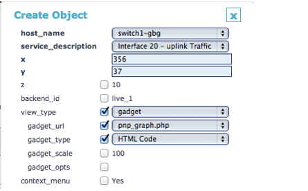 \

4. Click on **Save** to add the graph to the nagvis map.

### Selecting graph source

A graph on a service can have multiple sources, for example the ping service has both Round Trip Times and Package loss where in this case RTT is source 0 and package loss is source 1.
To change the source for a graph in nagvis edit the graph object and add &source=x to **gadget\_opts**

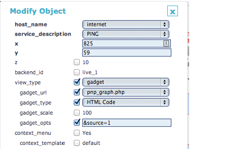 \

### Selecting graph length

To select another graph length use the gadget\_opts option
 **&view=0** = 4 hours
 **&view=1** = 25 hours
 **&view=2** = one week
 **&view=3** = one month
 **&view=4** = one year

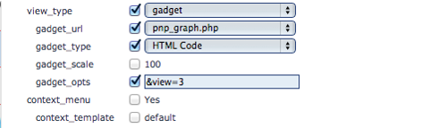 \

### Using multiple options

To combine multiple options for a graph enter the options directy after each other.
For example if you would like to view a package loss graph for the last year use the **gadget\_opts** &source=1&view=4.

## Managing objects

### Deleting objects

#### To delete an object

1. Open the map in which the object is located.
2. Right click on the object icon and the following dialog is shown

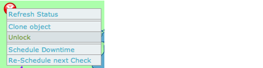 \

3. Click **Unlock** to enter edit mode for that object
4. Right click on the object again and select **Delete**.

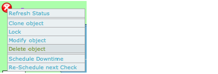 \

5. Lock the object again to exit edit mode. Right click on the object and select **Lock

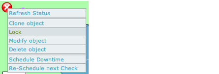 \

### Modifying objects

#### To modify an object

1. Open the map in which the object is located.
2. Right click on the object icon and the following dialog is shown

 \

3. Click **Unlock** to enter edit mode for that object
4. Right click on the object again and select **Modify object**.

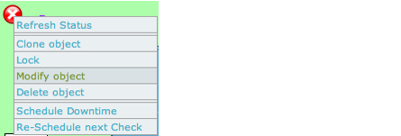 \

5. Lock the object again to exit edit mode. Right click on the object and select **Lock**

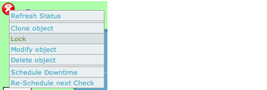 \

    # OP5 Monitor: Open Source Network Monitoring

    [OP5 ](https://www.op5.com/)is the preferred Open Source Networking & Server Monitoring tool for large multi-national companies in over 60 markets. If you would like to experience OP5 Monitor you can get started here, alternatively, if you prefer to get more hands on you can Download OP5 Monitor for free.
