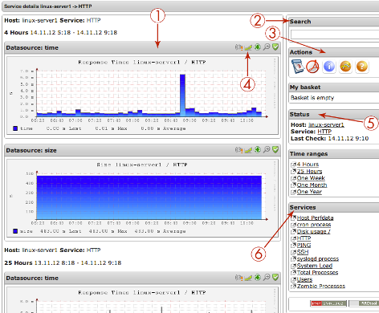
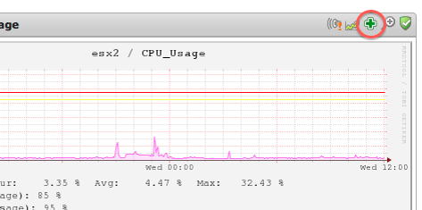
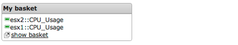

# Viewing Graphs

## About

op5 Monitor includes support for graphing what's known as "performance data" returned by check plugins that support this feature.
Performance data can be anything that gives a more detailed picture of a particular check's performance characteristics than the OK/WARNING/CRITICAL levels found in Monitor responses.
For example: check\_ping returns performance data for packet loss and round trip times. This data is stored by Monitor and used to create graphs for different time periods, such as the last 24 hours and past week. This feature can be very helpful in identifying trends or potential problems in a network.

## Viewing graphs

From most of the views in OP5 Monitor you can find the graph icon looking like this: 
To view the graphs for a service or a host click on the graph icon and you will get the graph view.

The table below describes the parts of the Service Overview, where all graphs are being displayed --

**Nr**

**Description**

1

Graphs
Each graph shows the obvious visual plotting as well as:

- Host and service name
- Warning and critical levels
- Last, average and max values

2

Search
Here you can quickly get the graphs of an other host. Just type in the correct name of the host and press **Enter**.

3

Exports and calendar
Clicking various icons here will:

- Export to PDF or XML
- Open up the calendar to view old data.

4

Zooming and reports
 Clicking various icons here will:

- Zoom in or out of the graph
- Show most resent alert for this time period for this host
- Create an availability report for this time period for this host

5

Host information
Here you see a short information about the host. Click the host or service name to get extended details.

6

Other graphs on this host
The list shows the rest of the graphs available for this host. Just click on one of them to view the graphs of an other service.

## Adding graphs for custom plugins

Sometimes you find a plugin you like to use but there are no graphs made from the output of the plugin. Then you need to create your own template.
To create a template of your own, review our [Graph Template documentation](Graph_templates).

## Graph basket

To view graphs from multiple sources it's possible to add graphs to the basket.
By adding a graph to the basket it will be possible to view the basket with the selected graphs below each other.
This will give you an easy way to compare graphs from one or more hosts.

To add a graph to the basket select the graph that you would like to add then click on the + icon above the graph:

After adding the desired graphs select **graphs** from the menu 
then click on **show basket**

**
**
