# Using Geomap

## About

Geomap creates maps to help to visualize the locations of objects and the links between objects in geographically diverse systems. Location and links are attributes added to objects in OP5 Monitor, and the map tiles used to render the map are downloaded from the specified geographic data service.

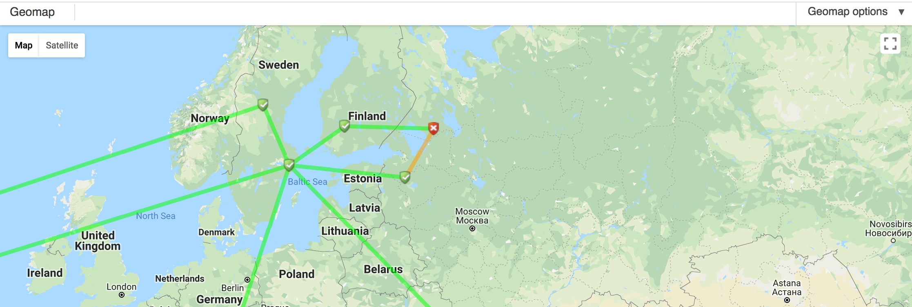 \

## Geomap

The **Geomap** page (Monitor \> Geomap) provides a visualization of object locations and links.

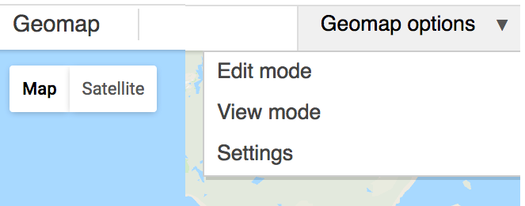 \

There are two main parts of Geomap:

- Geomap options menu
- Map area

The *Geomap options* menu is located in the right hand side of the OP5 Monitor toolbar, and clicking on it will open a drop down menu with links to set the mode and open Geomap settings.

The *Map area* takes up the lower part of the page, and it works like most mapping webpages. The default geographic data service is Google Maps and the map controls are imported from there.

## Geomap Options

There are three entries in the *Geomap options* menu:

- Edit mode
- View mode (Default mode)
- Settings

*Edit mode* allows locations and links to be added to the map or removed from the map. Locations do need to exist before links can be created. *Edit mode* also allows has a search bar which allows locations to be located via search term.

The search function returns inconsistent results, and the *Map area* isn't automatically adjusted to include the search results. To see all of the results, the *Map area* may need to be zoomed out.

*View mode* is the default mode for Geomap. When in *View mode*, the map cannot be edited. Locations and links can be clicked on to bring up an information balloon which contains hypertext links back to the associated objects, and the map can be scrolled around and zoom level changed to get more or less information.

*Settings* opens a dialog box where the geographic data provider can be set, with various provider specific options, and the refresh rate can be changed. The refresh rate is displayed in seconds. The screenshots shows refresh rates of 10 seconds and 290 seconds (4 minutes).

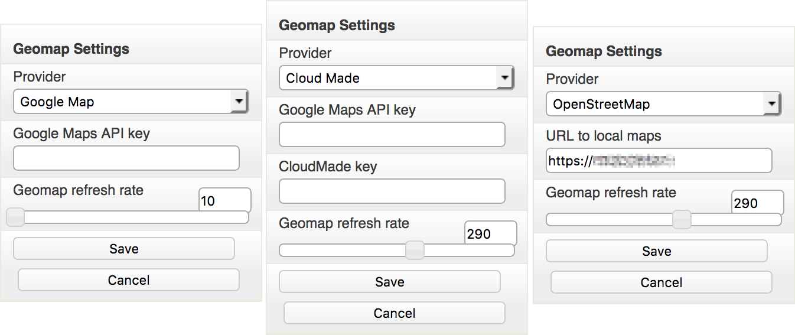 \

## Geomap Settings

There are two basic settings, *Provider* and *Geomap refresh rate*, and a third setting which is dependent on the *Provider* setting.

There are three geographic data service providers available in Geomap:

- Google Maps (Default)
- CloudMade
- OpenStreetMap

Google Maps is the default geographic data service for Geomap. Out of the box OP5 Monitor will use data from Google Maps, and an API key can be entered into the *Google Maps API Key* field to allow utilization of addition features of the Google Maps API.

CloudMade can be set as the data source by selecting it as the data provider from the *Provider* drop down menu, and when set as the data provider, the *CloudMade key* will appear to allow a CloudMade key to be entered.

OpenStreetMap is the final option in the *Provider* drop down menu.

Real-time information on a Geomap client requires the client to have Internet access. By default, the client will need to download mapping tiles from one of the mapping services, and it will then use the downloaded tiles to render the map. It is possible to use pre-rendered maps if an Internet connection is not available to the client, but the process to enable this is covered elsewhere.

*Geomap refresh rate* sets the interval, in seconds, between data refreshes. A stock install of OP5 Monitor sets the refresh interval to 10 seconds.

### Accessing Geomap

1. Hover over the *Monitor* menu entry in the OP5 Monitor Toolbar to expand it.

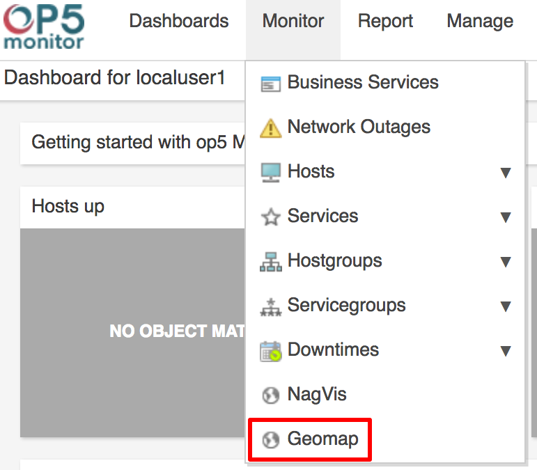 \

2. Click on the *Geomap* link to open the **Geomap Page**. (Red box in the screenshot)

## Locations

Before Geomap is useful you have to add locations to the map. Each location can be associated with an object. The following object types can be used:

- Host
  - Service
  - Host Group
  - Service Group

### Adding a location

Here we will add a new location. First we need to locate where on the map we want to put the location. Then we save the location with some basic settings.

#### To add the location

1. Open up the Geomap from the monitoring menu.
2. Click on edit in the upper left corner, just above the map.

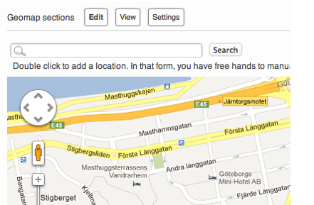 \

3. Double click on the map to place your location
4. A bubble will appear on the location, select 'Add location':

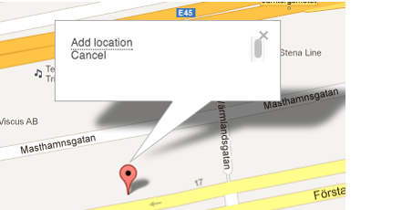 \

    Enter the variables for this locations and select type, then the object you want to link to this location. You can also enter the exact latitude and longitude here:

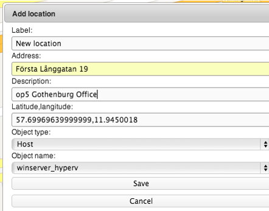 \

5. Click on **Save** to create the location.

## Links

When you have added a couple of locations to your Geomap you might want to add a link between them. This can easily be done by associating a service to a so called link object.

### Adding a link

Here we will use two locations called:

- Gothenburg
- Stockholm

The locations listed above are associated with one host each.
 Now we will add a link between the two locations and associate it with a service that will symbolize the link between the both locations.

#### To add the link

1. Open up the **Geomap** from the menu. Click on **Edit** above the map:

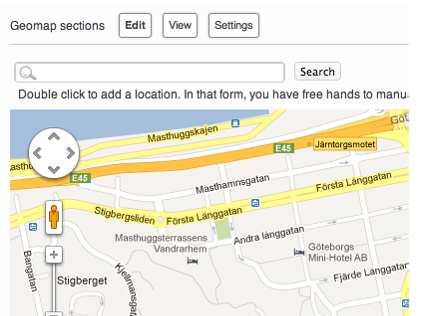 \

2. Click on one of the locations that you want to link together and select **Link**:

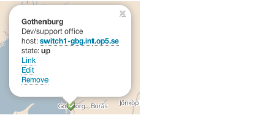 \

3. Choose the second location and select **Link** in the bubble on that location. This will create grey line between the two locations.

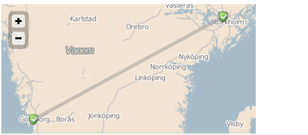 \

4. Click on the grey line. Click on **Edit** in the pop-up bubble.
    1.  Enter a description.
    2.  Select a type.
    3.  Select the object you want the link to represent.

5. Click **Save** to save your link.

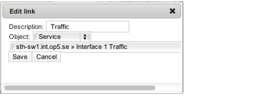 \

