# Reports

# About

It shows you the status on your hosts and services right now. The Reporting headline is about letting the user create historical reports from the information that OP5 Monitor has collected.
A monitoring system receives a huge amount of data from your IT environment. OP5 Monitor has a powerful, yet easy-to-use, built-in report generator.
The reports are generated from the history-logs from all the elements included in the report. 

# SLA

The reports in OP5 Monitor can be mapped against unique Service Level Agreements. This means that you can directly see and follow-up on both your internal and external SLAs.

## Creating an SLA report

The fast and easy way to create an SLA report is to only follow steps 1-3 and then skip to the end of the guide, which will cause default values to be used for almost all settings.
 The complete instruction describes all settings.
 To create a SLA report:

1.  In the reporting menu click on **SLA Reporting
    **
    The report setup page is displayed
    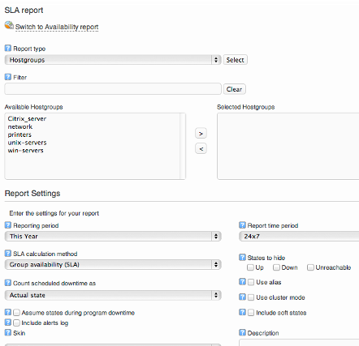
2.  Choose **Report type** (what type of objects to base your reports on). We will use **hostgroups** in this guide. 
    
3.  Select the objects you like to base the report on and move them from **Available hostgroups** to **Selected hostgroups**. 
    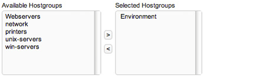
4.  Select Reporting period and Report timeperiod. Reporting period controls the length of the report. Report time period can be used to include or exclude times and dates from the report. This is based on the time periods set in the configuration.
    
5.  Choose which SLA calculation method to use. 
    
    You may choose between Traditional Availability reports are based on group availability (worst case). An alternative way is to use average values for the group or object in question. Note that using average values is sometimes considered not to be an proper form of SLA.
    - Group availability (worst state)
    - Average
    - Cluster mode (best state)
6.  Set the desired values in the following options or go directly to step 7 and leave the settings with their default value.
    1.  Choose if you like to count scheduled downtime as uptime, actual state or uptime with difference.
        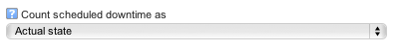
        Uptime, with difference" will count downtime as uptime, but will also print the difference from counting downtime as the actual state.
    2.  Choose whether you would like to see the alias instead of the host name in the generated report. 
        
    3.  Choose whether to assume the previous state still applies when OP5 Monitor isn't running.
        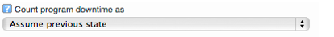
    4.  Choose whether you would like to hide specific states for the hosts or services in the report. Note that this option just hides the column and does not recalculate the percentage show in the graph.
    5.  If this report is based on a Business Service whose top level element has been published as a serviced, it is possible to include the events from the BSM. It will show the underlying checks that triggered alerts in the BSM. If the selected BSM service is not a top level element, no BSM events will be displayed. 
        
    6.  Enter a description for the report. This will be included in the header of the report. 
        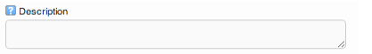
    7.  Choose whether to include soft states or only use hard states in the report. 
        
    8.  It is possible to include a Summary Report with the SLA report. For more information about summary reports, see [Alert summary - Top alert producers](Events-and-logs_16482316.html#Eventsandlogs-Alertsummary-Topalertproducers)
    9.  Include performance graphs if you would like to include all the graphs for the hosts and services included in the SLA report. 
        
    10. Select skin. Skins modify the visual appearance of the report.
        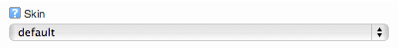
    11. This skin will be used in both HTML and PDF reports.

7.  Enter SLA values as percentages between 0 and 100.
    
    Click on the icon in front of the name of the months to copy the value to the other months that are available Only the months that are included in the report will be available.
8.  Click **Show report**.

## The SLA report

When you have created your report you will get a result page looking like this.
 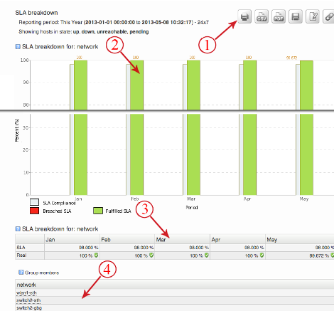
 The table below describes the parts of the result page

**Nr**

**Description**

1

The action icons allow you to

-   save the report
-   direct link to report
-   edit settings
-   save the report as a pdf or csv
-   print the report.

2

The report graphs.
Click on the graph to get an availability report for the duration of the SLA report.

3

The result, same result as above, shown in a table.

4

A list of every object included in the report. Click on the object name to get an SLA report for each and every object.

## Editing the SLA report settings

You do not have to create a completely new report if you only want to change a minor setting in the one you just created.

### To edit the settings

1.  Click edit settings.
    
2.  Edit the settings you would like to change in the dialog shown below. All options are described in [Creating SLA report](#Reports-CreatingSLAreport).
    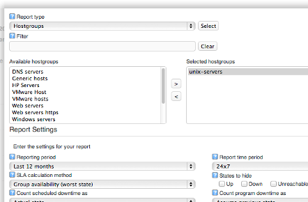
3.  Click **Show report** to save the new values.

# Availability

An availability report shows availability for host groups, service groups, hosts or services, during a specified period of time.

## Creating an availability report

The fast and easy way to create an availability report is to only follow steps 1-3 and then skip to the end of the following guide, which will use default values for almost all settings.
 The complete instruction describes all settings.

### To create an availability report

1.  In the main menu to the left click **Availability
    **
    The report setup page is displayed 
    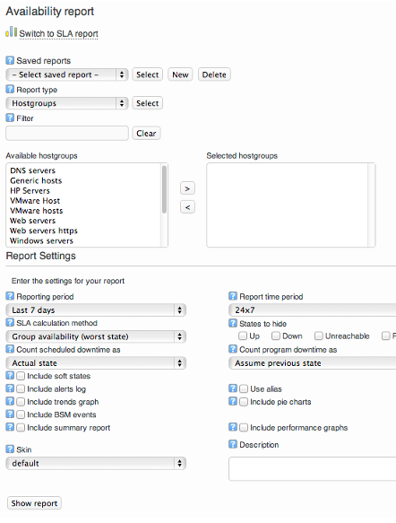
2.  Choose **Report type** (what type of objects to base your reports on). 
    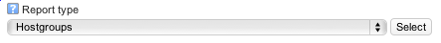
    We use hostgroups in this guide.
3.  Select the objects you would like to base the report on and move them from **Available hostgroups** to **Selected hostgroups**.
    
4.  Select Reporting period and Report timeperiod. If you leave Report timeperiod empty it will be the same as 24/7. 
    Reporting period controls the length of the report. Report time period can be used to include or exclude times and dates from the report. This is based on the time periods set in the configuration. 
5.  Choose which SLA calculation method to use.
    
    You may choose between Traditional Availability reports are based on group availability (worst case). An alternative way is to use average values for the group or object in question. Note that using average values is sometimes considered not to be a proper form of SLA.
    - Group availability (worst state)
    - Average
    - Cluster mode (best state)
6.  Set the desired values in the following options or go directly to step 7 and leave the settings with their default value.
    1.  Choose if you like to count scheduled downtime as uptime. 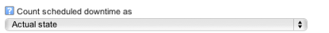
    2.  Choose whether you would like to include a complete log for the included objects in the report
        
    3.  Choose whether you would like to to include trend graphs. It is also possible to rescale the part of the graphs where there are state changes to make them more visible.
        
    4.  Choose whether you would like to see the alias instead of the host name in the generated report.
        
    5.  Choose whether to assume the previous state still applies when OP5 Monitor isn't running.
        
    6.  Choose whether you would like to hide specific states for the hosts or services in the report.
        
    7.  Enter a description for the report. This will be included in the header of the report.
        
    8.  Choose whether to include soft states or only use hard states in the report.
        
    9.  It is possible to include a Summary Report with the SLA report. For more information about summare reports, see [Alert summary - Top alert producers](Events-and-logs_16482316.html#Eventsandlogs-Alertsummary-Topalertproducers)
    10. Include a summary pie chart to the report.
        
    11. Include performace graphs if you would like to include all the graphs for the hosts and services included in the SLA report.
        
    12. Select skin.
        
         This skin will be used in both HTML and PDF reports.
    13. If this report is based on a Business Service whose top level element has been published as a serviced, it is possible to include the events from the BSM. It will show the underlying checks that triggered alerts in the BSM. If the selected BSM service is not a top level element, no BSM events will be displayed.
        

7.  Click **Show report**.

## The Availability report

When you have created your report you will get a result page looking like this.
 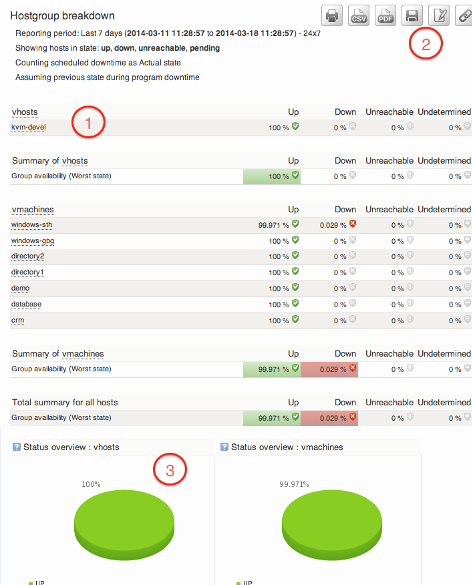
 The table below describes the different parts of the result page.

**Nr**

**Description**

1

The action icons allow you to change and save the report:

-   Save it to be able to create a scheduled report
-   Edit some report settings in a popup frame
-   Direct link to report
-   Download the report as a CSV file.
-   Show the report as an PDF.
-   Print the report.

2

This is the actual result. You can here see how much time each object has been in the different states.
 Click on the object names in the list to get a more detailed report for them.
 There are two summary rows in the bottom of the table:

-   Average
    This is the average value for a group of hosts/services. It is calculated by adding the % Time for each host/service and then divide the total value with the amount of hosts/services in the group.
-   Group Availability (SLA)
     The SLA value for a given time is the worst, "most broken" state of any of the objects in the report. It displays the amount of time where all hosts/services in the group has been UP/OK or in a PROBLEM state at the same time.

3

A pie chart displaying the result in a graphical way.

 

## Editing the availability report settings

You do not have to create a totally new report if you only like to change a minor settings of the one you just created.

### To edit the settings

Click edit settings.

 Edit the settings you like to change in the dialog shown below. All options are described in [Creating an availability report](#Reports-Creatinganavailabilityreport).
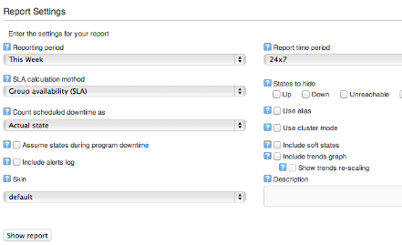
 Click **Show report** to save the new values.

# Save reports

There are two reasons for saving a report:
 It is easy to reach the same report the next time you would like to see it.
 You can set up a schedule for it to be regularly regenerated with current data and sent to you or anybody else in an email, or saved as file.
 To save a report you need first to create the report. When viewing the report the save option will be available.
 The procedure is the same for both SLA reports and Availability reports. In the guide below we will use a SLA report.

## Saving a report

### To save a report

Create a new report.
 In the result page click **Save report**.
 
 Give the report a name.
 
 Click **Save report**.

# Schedule reports

If you want a report to be regularly regenerated, you should schedule the report to do this automatically.
 Before you schedule a report you need to create it ( [Creating SLA report](#Reports-CreatingSLAreport) or [availability report](#Reports-Creatinganavailabilityreport)) and then save it ([Save reports](#Reports-Savereports)).
 Scheduling reports can be done by clicking Schedule in the reporting menu.

Note that the report first must be saved before a scheduled report can be created.

## Schedule a report from the result page

In the guides below we will schedule a SLA report but it is done exactly the same way for the availability reports.

1.  Create the report as shown in [Creating SLA report](#Reports-CreatingSLAreport).
2.  Save the report as shown in [Save reports](#Reports-Savereports)
3.  Click create schedule icon.
    
4.  Fill in the options in the new window.
    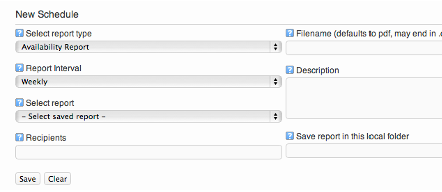
5.  Select report type, choose the same type of report that you saved before.
6.  Choose Report Interval. This will be how often the report is supposed to be sent.
7.  Select the saved report.
8.  Add Recipients email addresses, separated by a comma.
9.  Give the report a file name. This is the name that the pdf file will have when it arrives in your mailbox.
10. Add a description for the scheduled report.
11. Add a path where to save the report. The path must be absolute and include the filename, with either .pdf or .csv prefix depending in what format you want the file. This is optional.
12. Click **Save**.

## Schedule a report from the report menu

Before a report can be scheduled through the menu a report must first be saved.

1.  Create the report as shown in [Creating SLA report](#Reports-CreatingSLAreport).
2.  Save the report as shown in Save reports.
3.  Go to the report menu and select **Schedule Reports
    **
4.  Select the report typ, the saved report and report interval.
    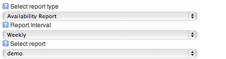
5.  Enter the email addresses of the recipients of the report. To enter multiple addresses, separate them by commas
    
6.  If you would like to save the report as a file, enter a local path of the OP5 server. This could be saved to a mounted share on the OP5 server.
    
7.  Click on **Save**.

Weekly reports are sent out on Mondays and monthly reports are sent out on the 1:st every month.

 

# Modifying scheduled reports

## To modify a scheduled report

1.  Click Schedule reports in the main menu.
     
2.  Double click on any field you like to modify.
    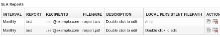
3.  Click **OK** to save. 
    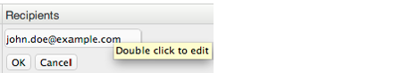

 If you want to save the report as file, enter a absolute path including the filename and prefix (.pdf or .csv) in local persistent filepath.

# Deleting scheduled reports

To delete a scheduled report

1.  Click Schedule reports in the main menu.
    
2.  Click delete icon on the schedule you like to delete.
    
3.  Click **OK**.

 

