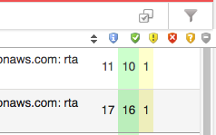
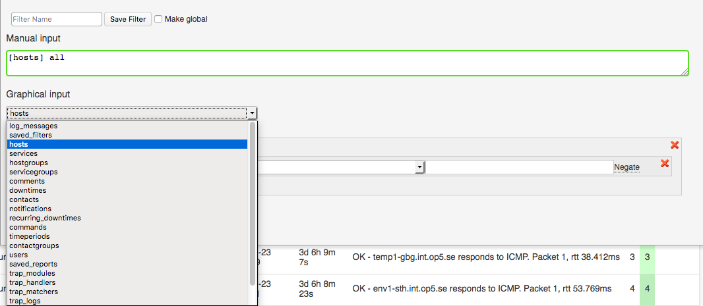
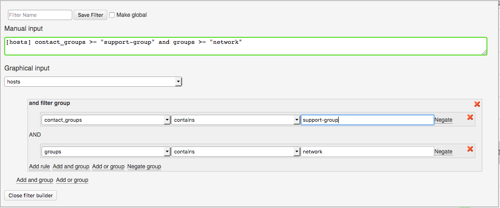
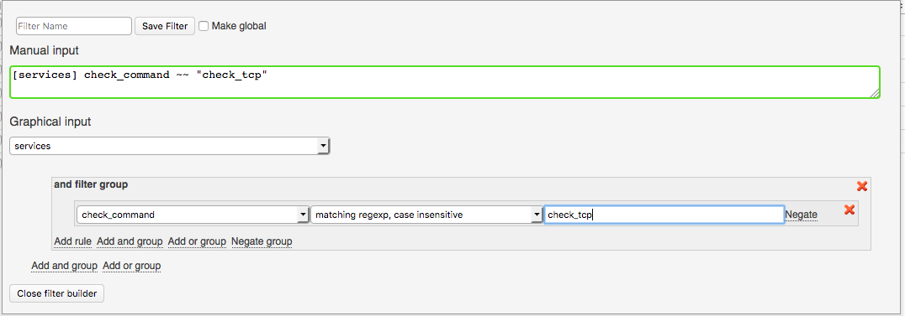
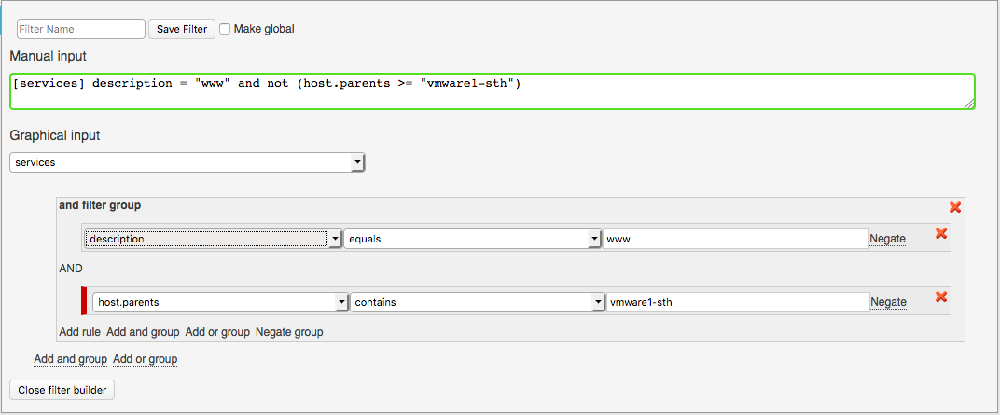
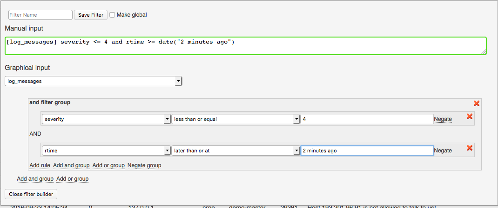
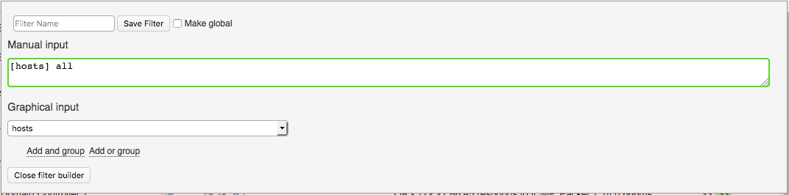
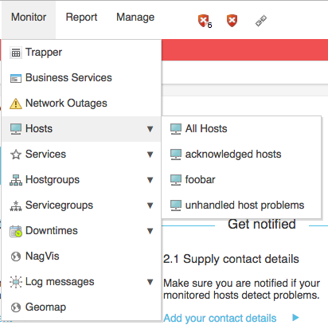
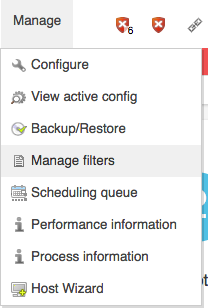
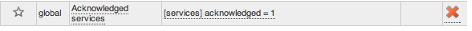

# Filters

## About

Filters can be used to filter out content in OP5 Monitor. They can be based on names, states, comments or other information.
Filters can be applied on listviews. All listview content is based on filters, so for example when viewing a host and its services the view is based on a filter that can be manipulated.

## Edit filter

To edit a filter, click on the filter icon in the listview

 \

You can either edit the filter manually or graphically. When editing a filter graphically the manual string is automatically shown. We will focus on the graphical design of filters.

## Filter categories

 \

There are many different filter categories to choose from, depending on what type of information you want to consume.
You can base your filter on sources like

- Hosts
- Services
- Contacts
- Hostgroups
- Servicegroups
- Syslog messages
- Traps
- Downtimes
- Notifications

## Filter Groups

A filter group is a logical "AND" or "OR" operator. There is also a negate group.
In each filter group there can be several rules and sub-groups.

## Rule

A rule contains an actual search field. Different types of categories have different types of rules. A rule can, for example, be host.name or service.group.

## Date and Time

When filtering on fields with either time or date it is possible to use relative time, it is also possible to use relative time in combination with specific time. More information about this can be found in the [PHP manual.](http://php.net/manual/en/datetime.formats.php)

Some examples that can be used are

- now
- yesterday
- today
- this week
- 2 hours ago
- one month ago
- 16:30:00

These can also be used in combination, for example

- last week + 1 hour
- yesterday 16:30:00

## Examples

### Example 1

Here we will list all services that are notifying to contact-group "support-group" and is a member of the hostgroup "network".
Manual Input: `[services] contact_groups >= "support-group" and groups >= "network"`

 \

### Example 2

In this example we will list all services that uses the check command "check\_tcp"
Manual Input: `[services] check_command ~~ "check_tcp"`

 \

### Example 3

Here we would like to list all services that contains the description "www" and is not located on the vmware host "vmware1-sth". (For this to work parent/child relationships must have been set)
Manual input: `[services] description ~~ "www" and not (host.parents >= "vmware1-sth")`

 \

Note that we use the **negate** (not) option on the host.parents rule.

### Example 4

In this example we filter for syslog messages with error or warning severity, received in the last two minutes.
Manual input: `[syslog] severity <= 4 and rtime >= date("2 minutes ago")`

 \

## Save filters

To save a filter, you need to enter a name and click on **save filter** in the filter dialog.

 \

To make the filter global, accessible for everyone, select **Make global** before you save the filter.
Save filters are accessible from the main menu of the type the filter was defined as (i.e. host filter are located under Monitoring -\> Hosts).

 \

## Remove filters

Remove a saved filter by selecting **Manage filters** from the Manage -\> Manage filters menu.

 \

Use the delete icon behind the filter that you would like to remove.

 \

