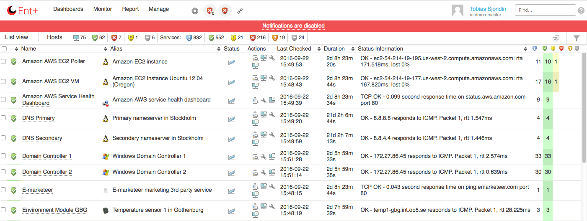
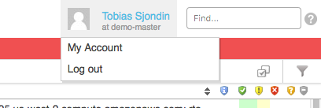
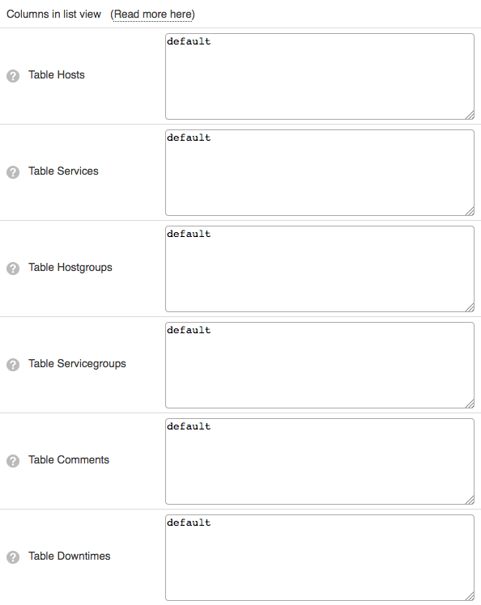
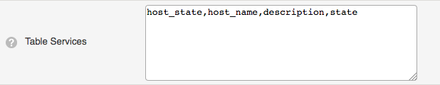
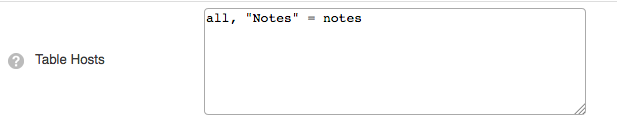
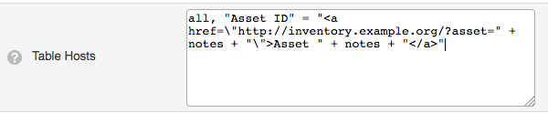
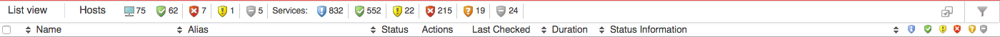

# Listviews

## About

Listviews are all views that lists host, services, hostgroups etc.

The content of listviews is selected by the use of filters, see [Filters](Filters).

A listview is divided into two parts - the first is a top banner that contains a summary of the content in the listview, and the second contains the list items themselves, together with their properties. This documentation page covers the most common usage of values that can be used in the listview filter language. For a full list of the columns, please see the page [Listview filter columns](https://kb.op5.com/display/GUI/Listview+filter+columns)

The following views, or tables, uses listviews:

- Hosts
- Services
- Hostgroups
- Servicegroups
- Comments
- Scheduled Downtimes
- Contacts
- Notifications
- Saved filters

## Columns

Every user can choose which columns to display in listviews. The columns can be specified under **My Account** in the **Profile** menu, by hovering your username.

The user can specify a set of columns to display on a per-table basis, all of the tables can have their own set of columns.

To change which columns to show in a table, you change the text "default" to a list of the columns that you want to see.

 For example if you would like to view only Status, Host name, Service name and the state in the service-view, you need to enter:
 host\_state,host\_name,description, state

 It is also possible to hide one column by using a "-" before the column that you would like to remove from the table. If you want to hide the attempts column enter:
 default, -attempt

### Column list

#### Hosts

<table>
<colgroup>
<col width="50%" />
<col width="50%" />
</colgroup>
<tbody>
<tr class="odd">
<td align="left">
<strong>Column</strong>

<strong>Description</strong>
</td>
<td align="left">
select

The select checkbox for the host-object
</td>
</tr>
</tbody>
</table>

#### Services

<table>
<colgroup>
<col width="50%" />
<col width="50%" />
</colgroup>
<tbody>
<tr class="odd">
<td align="left">
<strong>Column</strong>

<strong>Description</strong>
</td>
<td align="left">
host_state

The state of the host on which the service is located
</td>
</tr>
</tbody>
</table>

#### Host groups

<table>
<colgroup>
<col width="50%" />
<col width="50%" />
</colgroup>
<tbody>
<tr class="odd">
<td align="left">
<strong>Column</strong>

<strong>Description</strong>
</td>
<td align="left">
name

The name of the hostgroup
</td>
</tr>
</tbody>
</table>

#### Service groups

<table>
<colgroup>
<col width="50%" />
<col width="50%" />
</colgroup>
<tbody>
<tr class="odd">
<td align="left">
<strong>Column</strong>

<strong>Description</strong>
</td>
<td align="left">
name

The name of the servicegroup
</td>
</tr>
</tbody>
</table>

#### Comments

<table>
<colgroup>
<col width="50%" />
<col width="50%" />
</colgroup>
<tbody>
<tr class="odd">
<td align="left">
<strong>Column</strong>

<strong>Description</strong>
</td>
<td align="left">
select

Select checkbox for the comment
</td>
</tr>
</tbody>
</table>

#### Downtimes

<table>
<colgroup>
<col width="50%" />
<col width="50%" />
</colgroup>
<tbody>
<tr class="odd">
<td align="left">
<strong>Column</strong>

<strong>Description</strong>
</td>
<td align="left">
select

Select checkbox for the scheduled downtime entry
</td>
</tr>
</tbody>
</table>

#### Contacts

<table>
<colgroup>
<col width="50%" />
<col width="50%" />
</colgroup>
<tbody>
<tr class="odd">
<td align="left">
<strong>Column</strong>

<strong>Description</strong>
</td>
<td align="left">
name

The contacts name
</td>
</tr>
</tbody>
</table>

#### Notifications

<table>
<colgroup>
<col width="50%" />
<col width="50%" />
</colgroup>
<tbody>
<tr class="odd">
<td align="left">
<strong>Column</strong>

<strong>Description</strong>
</td>
<td align="left">
state

The state (OK, WARNING, DOWN etc.) of the object in the notification
</td>
</tr>
</tbody>
</table>

#### Saved filters

<table>
<colgroup>
<col width="50%" />
<col width="50%" />
</colgroup>
<tbody>
<tr class="odd">
<td align="left">
<strong>Column</strong>

<strong>Description</strong>
</td>
<td align="left">
icon

Shows the designated icon for the filter
</td>
</tr>
</tbody>
</table>

#### Log Messages

This is used by Logger.

<table>
<colgroup>
<col width="50%" />
<col width="50%" />
</colgroup>
<tbody>
<tr class="odd">
<td align="left">
<strong>Column</strong>

<strong>Description</strong>
</td>
<td align="left">ID
The ID of the message in the database, this is not shown in the GUI by default</td>
</tr>
</tbody>
</table>

### Custom columns

It is possible to create a custom column if the column isn't available from the standard columns.
 The format is "\<label\>" = \<data\> where \<data\> is the source of the data, for example if you would like to create a column that show the note of a host set in the configuration:
 "Notes" = notes

 It is also possible to fetch. For example the host notes on a service as well, by using the host.notes label.

#### Links in custom columns

It is also possible to add HTML code into the column. Let's say that you have a note with an ID that corresponds to the system in your CMS database and you would like to create a link directly to that object.
 "Asset ID" = "\<a href=\\"http://inventory.example.org/?asset=" + notes + "\\"\>Asset " + notes + "\</a\>"

#### Custom variables

To show a custom variable in a column use the format custom\_variable.\<VARIABLE\_NAME\>. The custom variable should be used without the underscore prefix. Using the same example as above, but this time we have the ID in a custom variable called **ASSETID**
 "Asset ID" = "\<a href=\\"http://inventory.example.org/?asset=" + custom\_variables.ASSETID + "\\"\>Asset " + custom\_variables.ASSETID + "\</a\>"

### Sorting

To sort a column use click on the column. It is possible to sort columns ascending and descending.

## More information

List views support POSIX extended regular expressions as supported by MK Livestatus. For more information, see [http://mathias-kettner.de](http://mathias-kettner.de/checkmk_livestatus.html#Regular%20expression%20matching)

Full list of columns that can be used in the filter language can be found on the page [Listview filter columns](https://kb.op5.com/display/GUI/Listview+filter+columns)

* * * * *

### Related pages

Error rendering macro 'sv-contentbylabel' : null
