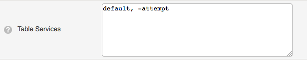

# Listviews

## About

Listviews are all views that lists host, services, hostgroups etc.

 \

The content of listviews is selected by the use of filters, see Filters.

A listview is divided into two parts - the first is a top banner that contains a summary of the content in the listview, and the second contains the list items themselves, together with their properties. This documentation page covers the most common usage of values that can be used in the listview filter language. For a full list of the columns, please see the page [Listview filter columns](https://kb.op5.com/display/GUI/Listview+filter+columns)

The following views, or tables, uses listviews:

- Hosts
- Services
- Hostgroups
- Servicegroups
- Comments
- Scheduled Downtimes
- Contacts
- Notifications
- Saved filters

## Columns

Every user can choose which columns to display in listviews. The columns can be specified under **My Account** in the **Profile** menu, by hovering your username.

 \

The user can specify a set of columns to display on a per-table basis, all of the tables can have their own set of columns.

To change which columns to show in a table, you change the text "default" to a list of the columns that you want to see.

 \

 For example if you would like to view only Status, Host name, Service name and the state in the service-view, you need to enter:
 host\_state,host\_name,description, state

 \

 It is also possible to hide one column by using a "-" before the column that you would like to remove from the table. If you want to hide the attempts column enter:
 default, -attempt

 \

### Column list

There are several columns, and each one has several suboptions.

| **Hosts Column** | **Description** |
| --------------------- | -------------------------------------------------------- | 
| select                | The select checkbox for the host-object |
| state                 | The state of the host. UP, DOWN, UNREACHABLE or PENDING. |
| name                  | The hostname |
| alias                 | The alias of the host |
| status                | The column where comments, graphs and notification status is shown |
| action                | Links to configuration, extra host notes etc. |
| last\_check            | The date and time when the host was last checked |
| duration              | Time for how long the host has been in it's current state |
| status\_information    | The output from the last check command |
| services\_num\_all      | Total number of services on the host |
| services\_num\_warning  | Total number of services on the host in state WARNING |
| services\_num\_critical | Total number of services on the host in state CRITICAL |
| services\_num\_unknown  | Total number of services on the host in state UNKNOWN |
| services\_num\_pending  | Total number of services on the host in state PENDING |

| **Services Column**          | **Description** |
| ------------------- | ------------------------------------------------------------------- |
| host\_state         | The state of the host on which the service is located |
| host\_name          | The name of the host on which the service is located |
| select              | The select checkbox for the service-object |
| state               | The state of the service. OK, WARNING, CRITICAL, UNKNOWN or PENDING |
| description         | The description (name) of the service-check |
| status              | The column where comments, graphs and notification status is shown |
| action              | Links to configuration, extra service notes etc. |
| last\_check         | The date and time when the service was last checked |
| duration            | Time for how long the service has been in its current state |
| attempt             | The number of attempts needed before a notification is sent out. |
| status\_information | The output from the last check command |

| **Host groups Column** | **Description** |
| ------------------------ | -------------------------------------------- |
| name                     | The name of the hostgroup |
| actions                  | Links to hostgroup commands |
| host\_status\_summary    | Shows the total number of hosts and its states in the hostgroup |
| service\_status\_summary | Shows the total number of services in the hostgroup and their states |

| **Service groups Column** | **Description** |
| ------------------------ | ------------------------------ |
| name                     | The name of the servicegroup |
| actions                  | Links to servicegroup commands |
| service\_status\_summary | Shows the total number of services in the servicegroup and it states |

| **Comments Column** | **Description**  |
| -------------------- | ------------------------------------------- |
| select               | Select checkbox for the comment |
| id                   | ID of the comment |
| object\_type         | Show the object type for the comment. Host or Service |
| host\_state          | The state of the host on which the comment is located |
| host\_name           | The name of the host on which the comment is located |
| service\_state       | The state of the service on which the comment is located |
| service\_description | The name of the service on which the comment is located |
| entry\_time          | The submisson date and time of the comment |
| author               | Shows the author of the comment |
| comment              | The comment it self. |
| persistent           | Shows if the comment is persistent or not |
| expires              | The time and date when the comment expires |
| actions              | The action for the comment, delete comment |

| **Downtime Column** | **Description**  |
| -------------------- | ------------------------------------------------ |
| select               | Select checkbox for the scheduled downtime entry |
| id                   | ID of the scheduled downtime entry |
| object\_type         | Show the object type affected by the scheduled downtime. Host or Service |
| host\_state          | The current state of the host on which the scheduled downtime is located |
| host\_name           | The name of the host on which the scheduled downtime is located |
| service\_state       | The current state of the service on which the scheduled downtime is located |
| service\_description | The name of the service on which the scheduled downtime is located |
| entry\_time          | When the scheduled downtime was created |
| author               | Shows by whom the scheduled downtime was created. |
| comment              | The comment of the scheduled downtime. |
| start\_time          | Date and time for when the objects enters the scheduled downtime |
| end\_time            | Date and time for when the objects exits the scheduled downtime |
| actions              | The action for the comment, delete comment |
| type                 | Shows if the scheduled downtime is fixed or flexible |
| duration             | Shows how long the object will be in scheduled downtime if flexible schedule is used. |
| triggered\_by        | Shows if the scheduled downtime is triggered by another event. |
| actions              | The action for the scheduled downtime. Remove is the only action available for scheduled downtime. |

| **Contacts Column** | **Description** |
| ---------- | ------------------ |
| name       | The contacts name  |
| alias      | The contacts alias |

| **Notifications Column** | **Description**  |
| --------------------- | ------------------------------------------ |
| state                 | The state (OK, WARNING, DOWN etc.) of the object in the notification |
| host\_name            | The hosts name in the notification |
| service\_description  | The name of the service in the notification. Only valid for service notification |
| time                  | The date and time of the notification |
| contact               | To which contact the notification was sent |
| notification\_command | Shows which notification command that was used for the notification |
| status\_information   | The check command output from the check |

| **Saved Filters Column** | **Description** |
| ---------- | --------------- |
| icon       | Shows the designated icon for the filter |
| scope      | Shows if the filter is a global filter or a personal filter |
| name       | The name of the filter |
| owner      | Shows who created the filter |
| actions    | Action for the filter, only delete is available  |

| **Log Messages Column** | **Description** |
| ---------- | --------------- |
| ID         | ID of the message in the database, this is not show in GUI by default |
| IP         | IP from the source host |
| rtime      | Received time of the message | 
| Facility   | The facility of the message |
| Severity   | The severity of the message |
| mtime      | The time stated within the message |
| Host       | The host name of the source |
| Ident      | Ident (Identity) string within the message |
| PID        | The PID of the source process |
| Event      | The Event ID, mainly used in messages from Windows sources |
| msg        | The message text |

### Custom Columns

It is possible to create a custom column if the column isn't available from the standard columns.
 The format is "\<label\>" = \<data\> where \<data\> is the source of the data, for example if you would like to create a column that show the note of a host set in the configuration:
 "Notes" = notes

 \

 It is also possible to fetch. For example the host notes on a service as well, by using the host.notes label.

### Links in custom columns

It is also possible to add HTML code into the column. Let's say that you have a note with an ID that corresponds to the system in your CMS database and you would like to create a link directly to that object. 

"Asset ID" = "\<a href=\\"http://inventory.example.org/?asset=" + notes + "\\"\>Asset " + notes + "\</a\>"

 \

### Custom variables

To show a custom variable in a column use the format custom\_variable.\<VARIABLE\_NAME\>. The custom variable should be used without the underscore prefix. Using the same example as above, but this time we have the ID in a custom variable called **ASSETID**

"Asset ID" = "\<a href=\\"http://inventory.example.org/?asset=" + custom\_variables.ASSETID + "\\"\>Asset " + custom\_variables.ASSETID + "\</a\>"

### Sorting

To sort a column use click on the column. It is possible to sort columns ascending and descending.

 \
png

## More information

List views support POSIX extended regular expressions as supported by MK Livestatus. For more information, see [http://mathias-kettner.de](http://mathias-kettner.de/checkmk_livestatus.html#Regular%20expression%20matching)

Full list of columns that can be used in the filter language can be found on the page [Listview filter columns](https://kb.op5.com/display/GUI/Listview+filter+columns)

