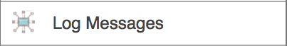
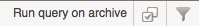
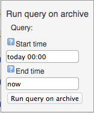

# Logger Interface

## About

In the OP5 Logger interface you can:

- Search messages in database
  - Search messages in archive

Logger uses filters for selecting the data to show, these are described in the [Filters](Filters) chapter.

## Logger GUI

To access Logger click on Log Messages in the Monitor menu

The GUI uses [Listviews](Listviews) and filters to [filter](Filters) the messages.

### Filters

The filters can be built based on the following fields:

Filter

Description

id

The ID of the message in the database, this is not shown in the GUI by default

ip

The IP of the source host

rtime

Received time of the message

facility

The facility of the message

severity

The severity of the message

mtime

The time stated within the message

host

The host name of the source

ident

Ident (Identity) string within the message

pid

The PID of the source process

event

The Event ID, mainly used in messages from Windows sources

msg

The message text

### Columns

The columns in Logger can be modified in the same way as the rest of the listviews, see the [Listviews](Listviews) chapter.

## Search archive

To perform a search in the archived logs go to Logger in the monitoring menu.

1. 1.  Create a filter or leave the filter blank to search for all messages
    2.  Click on **Run query on Archive **in the upper right corner
        
    3.  Select a start and stop time
        
    4.  Click on **Run query on archive **

This will create a report on the specified filter.

* * * * *

## Related pages

Error rendering macro 'sv-contentbylabel' : null
