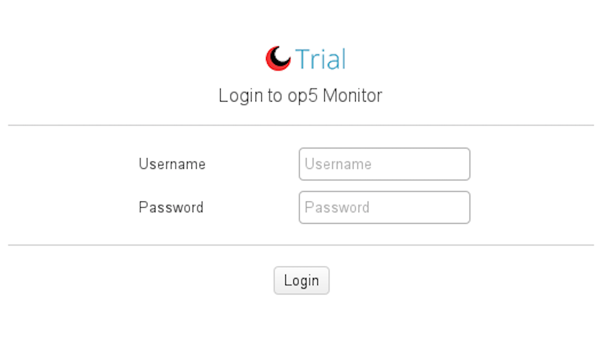
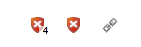
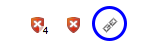
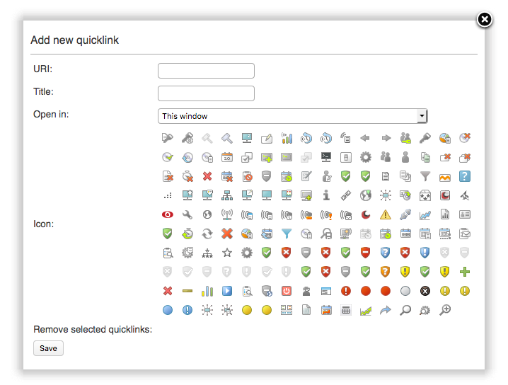
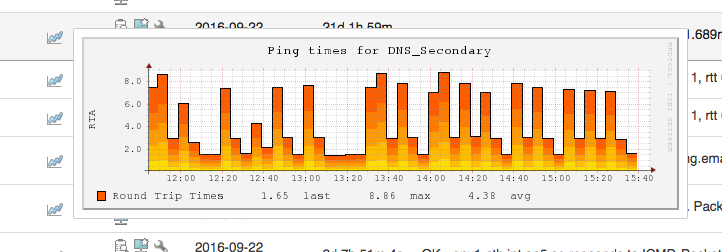
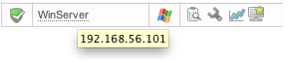

# Navigation

# About

The GUI in OP5 Monitor is built to be as simple as possible to use.
In this chapter the different parts of the GUI is described.

# Login and logout

## Logging in to OP5 Monitor

First of all you need to login before you can start using OP5 Monitor.
 To login to the OP5 Monitor GUI:
 Point your browser to the portal page of your OP5 Monitor server ( <https://yourserver/> )

Click OP5 Monitor.

 Enter your login and password.

Click **Login**

Logging out from OP5 Monitor

To logout from OP5 Monitor hover you profile in the upper right corner and click "Log out" in the drop-down

# In-line help

A manual is great but sometimes you only need to get a fast answer about a special part of OP5 Monitor.

## Get information from the in-line help

Click the help icon 
This gives you a small frame containing the help text.
Click anywhere outside the help text to hide it.

# Main menu

The navigation in OP5 Monitor is simple and can be found in the top of the GUI. There are five main sections, seen from the left.

- Branding (About menu)
- Dashboards
- Monitor
- Report
- Manage

There are also quicklinks next to the menu which may be populated on a per-user basis

By default they contain:

- Settings
- Unhandled host problems
- Unhandled service problems
- Add quicklink

# Add custom quickbar link

To add a custom link to the quickbar menu select the small manage quickbar menu icon to right of the quickbar.

 Add the URI, name and icon for your custom link

# Pop up graphs and comments

In every view where you find the icons for
 graphs 
 comments 
 You can hover the mouse pointer over the icon and get a pop up looking like this

# Mouse over host

To quickly show the host address of a host, hold the mouse over the hostname. A pop-up will appear with the host address.
 