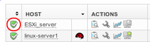
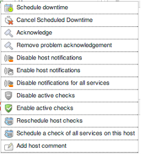
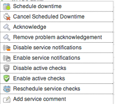

# Quick Action Menu

## About

For quick access to some host and service commands you can access the Quick action menu.
The menu can be accessed thrugh right clicking on the status icon in front of a host or service.
 

This menu will only appear if you are 'Authorized for system commands', this is set under User Rights in the configuration, see [Authorization](Authorization).

## Host Actions

The actions accessible from the host quick access menu are:

- Schedule Downtime
- Cancel Schedule downtime
- Acknowledge
- Remove problem acknowledgement
- Disable host notifications
- Enable host notifications
- Disable notifications for all services
- Disable active checks
- Enable active checks
- Reschedule host check
- Schedule a check for all services on this host
- Add host comment

## Service Actions

The actions that are available on a service quick access menu are:

- Schedule Downtime
- Cancel Schedule downtime
- Acknowledge
- Remove problem acknowledgement
- Disable/Enable service notifications
- Disable/Enable active checks
- Reschedule service check
- Add service comment
