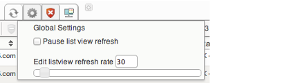
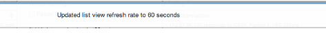

# Refresh time

## About

Every view is automatically refreshed after a certain time.
The default Global refresh time for listviews is 90 seconds.

## Pausing the page refresh

Click **Settings** in the quickbar of the menu:
 
 Check the **Pause list view refresh** check box and the Global refresh time is paused. Pause will be valid as long as you are navigating on "list views" only. Go to host or service extinfo, configure or any other non "list view" page and then the pause is back to normal.
 

## Editing the refresh time

Click on the **Settings** icon in the quickbar menu:
 
 Pull the slider to increase or decrease the refresh time for listviews.

 Once you have edited the Global refresh time a little notice will show up in the GUI. It tells you that the new Global refresh time is saved and looks like the picture below.
 
 Refresh will be valid as long as you are navigating on "list views" only. Go to host or service extinfo, configure or any other non "list view" page and then the refresh is back to default.
 The new refresh time will be your new default meaning that the next time you go to a listview or next time you login the listview will have your last refresh time.

* * * * *

## Related pages

Error rendering macro 'sv-contentbylabel' : null
