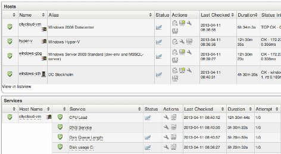

# Searching

# About

op5 Monitor has got a search functionality that makes it easy to find:

- Hosts
- Services
- Host groups
- Service groups
- Notes
- Status information

The search is case insensitive. The quick result in search field is limited to maximum 10 result rows per object type.
In the upper right corner of the GUI you find the search input field:

# Simple search

To perform a simple search
 Enter the search string in the search input field in the top right corner.
 While you are typing your search string OP5 Monitor will show you a list of hosts matching the string.
 
 If you click on a host in the drop down list you will be redirected to the **Service Status Details For Host** page for the host you clicked on. The same happens if the search found only one object matching your search string.
 OP5 Monitor will search for hosts, services, service groups, host groups and notes matching the search string you entered.
 The table below shows a list of in what parts of the object types is used in the search.

<table>
<colgroup>
<col width="50%" />
<col width="50%" />
</colgroup>
<tbody>
<tr class="odd">
<td align="left">
<strong>Object type</strong>

<strong>Variable</strong>
</td>
<td align="left">
Host

host_name  host_alias  host_address  display_name
</td>
</tr>
</tbody>
</table>

# Advanced search

To make your search more specific you should use the advanced search features.
 The following table describes the search parameters that can be used in the search function:

<table>
<colgroup>
<col width="33%" />
<col width="33%" />
<col width="33%" />
</colgroup>
<tbody>
<tr class="odd">
<td align="left">
<strong>Short parameter</strong>

<strong>Long parameter</strong>

<strong>Description</strong>
</td>
<td align="left">
h:

host:

Search for hosts
</td>
<td align="left">
s:

service:

Search for services
</td>
</tr>
</tbody>
</table>

 Remember to not use any space between the **:** and the search string

## Advanced search examples

### Search for hosts containing a certain string in the host name.

If you want to search for hosts only containing "server" in the host name
 just enter the following in the search field:

`h:server`or
`host:server`

Press **enter** to perform the search.

### Perform a search combining both hosts and services in the query.

In this example we want to find all services called either ping or http running on hosts called something like win or linux.

The query would then be:
 `h:win OR linux AND s:ping OR http`

### Search for Status Information

To search for hosts and services having a certain string in their status output you shall write a query like this:
 `si:Connection refused`
 By using the si: search term you will search the output from the latest check.

### Show all hosts or services

You may also get a list of all services and all hosts from the search function.
 To get a list showing all services and host you should write the search query like this:
 `s:% OR h:%`

### Show all hosts, services, host groups and service groups

To get a complete list of all hosts, services, host groups and service groups you only need to write a query like this:
 `%`
 This will give you a result with all object types grouped in one page.

# Notes search

To search for notes the notes column must be added to the listview.
 Go to **My Account** under the Configuration menu. 
 Add the following to the table for hosts and/or services.
 `"Notes" = notes`

 It is also possible to fetch for example the host notes on a service as well, by using the `host.notes` label.

# Limiting the number of result objects

The default search result will is limited to 100 rows. This can be changed in the search query.
 To change the limitation you only need to add limit with the number of lines to your query like this:
 `limit=10`
 The line above will give you max 10 rows in the search result.
 To return all rows set:
 `limit=0`

# Search result

No matter if you use the simple or the advanced way to do your search you will end up with the same type of result list.
 As you can see in the search result example below the search will be shown with one part for each type of object.
 
 Just like in the normal views you can sort almost all columns in the search result.

## Multiple actions

To do multiple actions from the search result the search result must first be viewed in listview.
 To view the result in listview click on **View in listview** below each category.
 

## Saving a search

To save a search query you need to view the output in the listview.

Click on **View in listview** and click on the icon **Show/Edit Text Filter **

****

Enter a name and click on **Save Filter** in the dialog.

More information can be found in the [Filters](Filters) section.

* * * * *

# Related pages

Error rendering macro 'sv-contentbylabel' : null
