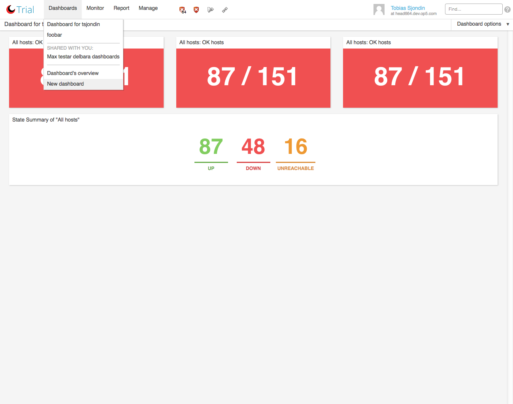
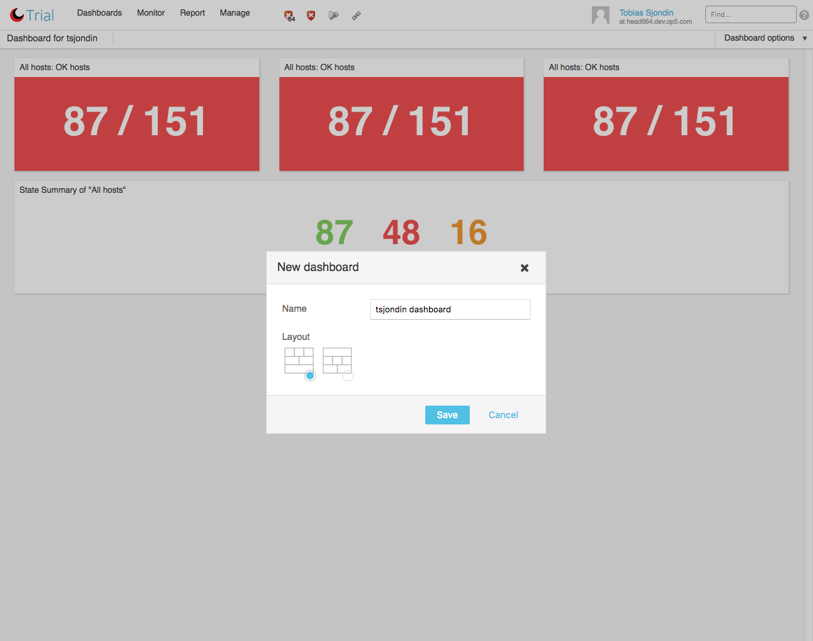
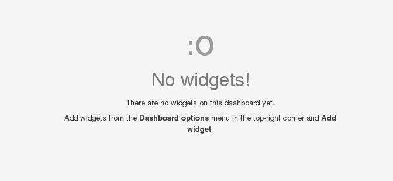
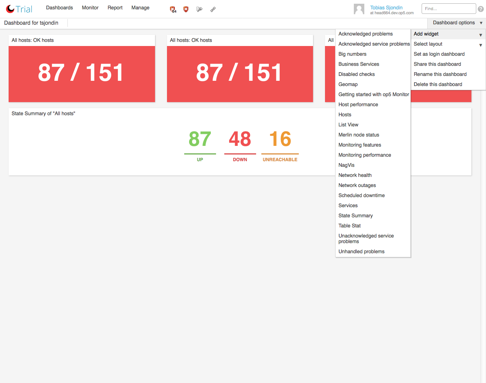
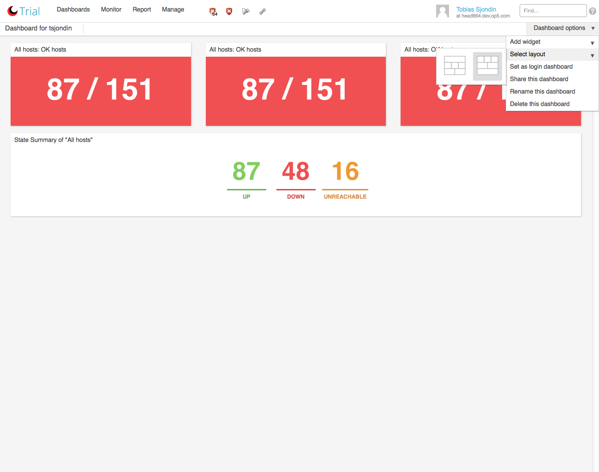
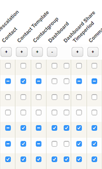
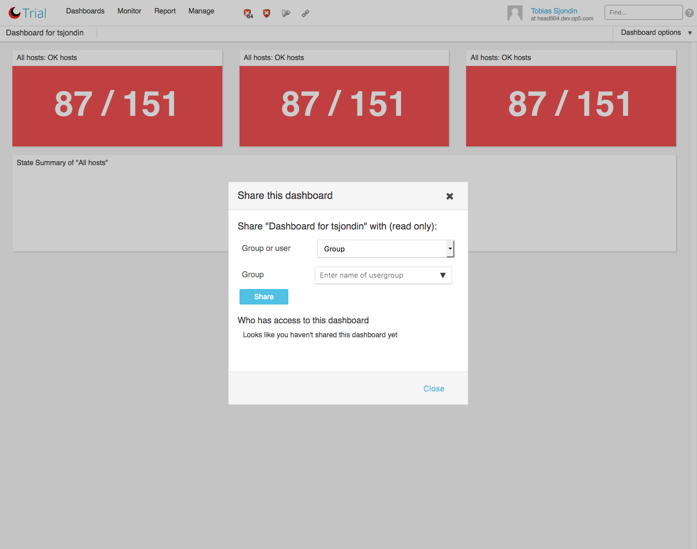
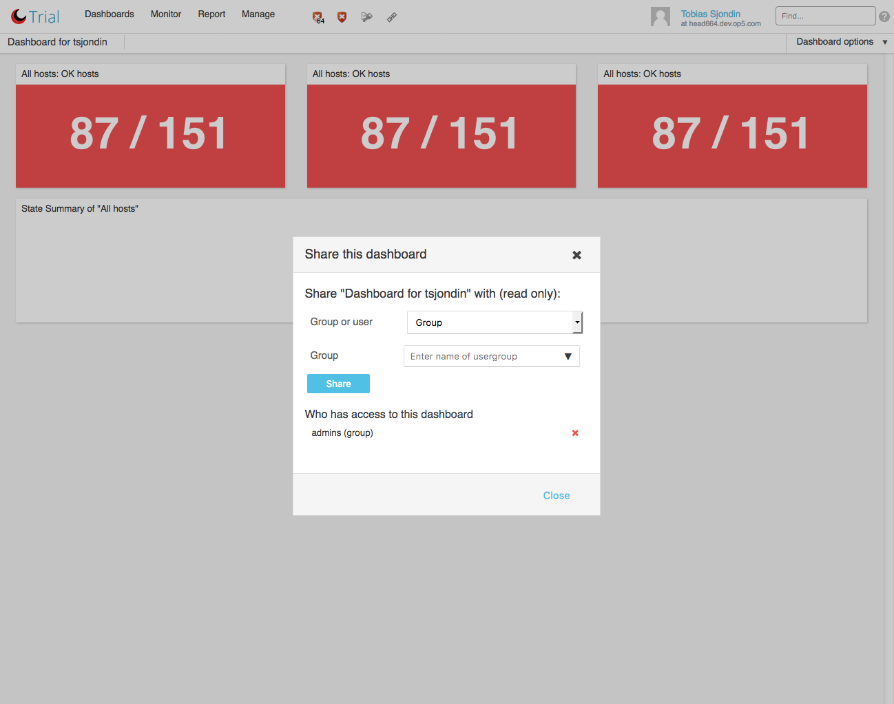

# Tactical overview

## About

Dashboards contain multiple widgets which render monitoring information and status in different ways, dashboards are accessible through the Dashboards main-menu item.

You can create multiple dashboards for different purposes which will populate this menu.

On the first login of a user in OP5 Monitor the default Dashboard will generated for you, this dashboard can be removed if it is not relevant.

## Creating new dashboards

New dashboards can be created by selecting "New Dashboard" in the Dashboards item of the main-menu.

 \

Creating a new dashboard is as simple as giving it a name and selecting a layout for it.

 \

When a new dashboard has been created it is empty and will only display a short statement that you do not yet have any widgets on the current dashboard.

 \

## Adding widgets

Widgets are added through the "Dashboard options" menu, simply hover the "Dashboard options" and then "Add widget" and you are presented with a list of widget, just click them to add the widget to your dashboard.

More on widgets is covered in the [Widgets](Widgets) chapter.

 \

## Selecting dashboard layout

The dashboard can take on two different layout which can be changed after the creation of the dashboard via the "Dashboard options" menu in the top-right corner of the dashboard view.

 \

## Sharing a dashboard

You can share a dashboard you have created with your colleagues, this makes it available to them for viewing, they can not change it.

You can for example create a dashboard and share it to a group, when a new user is added to that group they immediately gain access to this dashboard

In order to share a Dashboard you are required to have the "Dashboard Share" right. This right can be set in the "Group rights" section of OP5 Monitors configuration interface which is accessible at "Manage" -\> "Configure" -\> "Group rights"

 \

Given you have the "Dashboard share" right, you can find the "Share this dashboard" option under the "Dashboard options" menu in the toolbar.

When clicking this link, you are presented with a dialog which allows you to add groups and users to share your dashboard with.

 \

Once shared with a group or user they are shown in the lower part of this dialog. You can revoke their right to view the dashboard at any time by clicking the red cross which removes them from the list.

 \

When sharing dashboards to groups or users that are fetched from LDAP or Active Directory, the form is not auto-completed and the full name of the user or group needs to be written in the input field.

The same goes for auto completion of local users and groups if your user isn't member of a group with the permission "Access Rights". More information can be found in [Authorization section](Authorization_16482400.html#Authorization-Authorizationpoints) of the documentation. You can still share dashboards if you input the correct user or group name in the input field.

## Other options

As can be seen in this image there are also options for deleting and renaming the dashboard. There is also a "Set as login dashboard" option, which will make the currently viewed dashboard the one that is displayed when you log into OP5 Monitor. If no dashboard has been given this status, OP5 Monitor will display one of the dashboards you have access to.

 \

