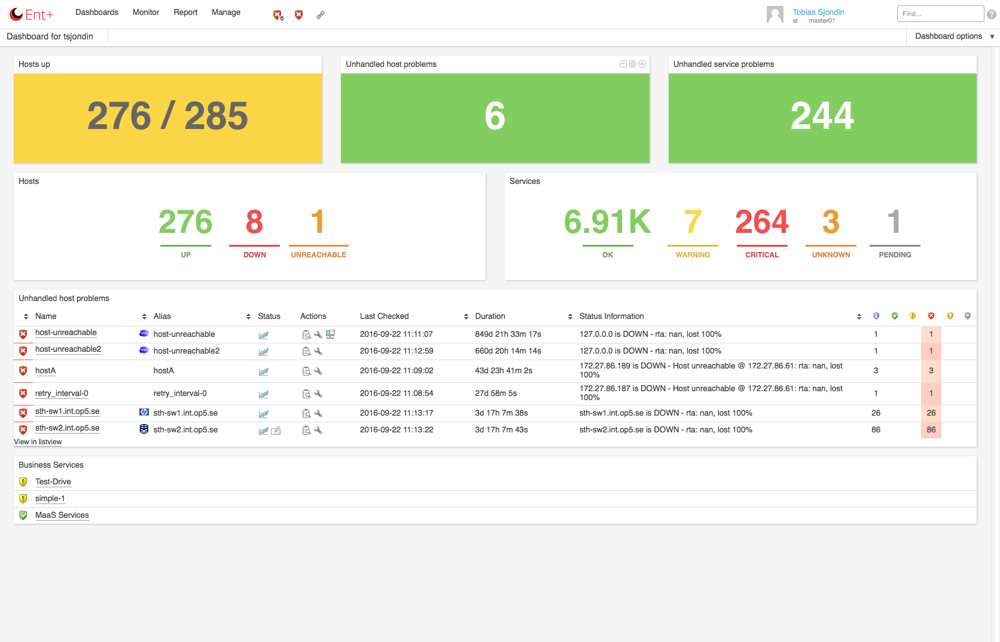
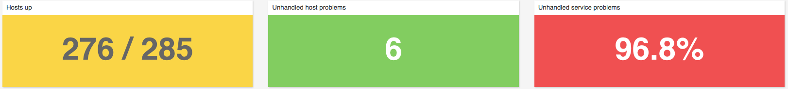
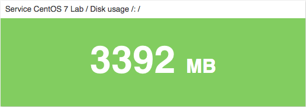
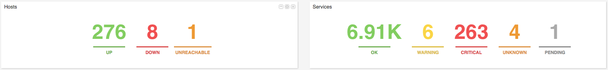
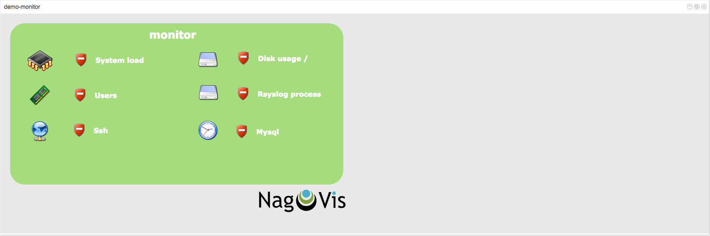
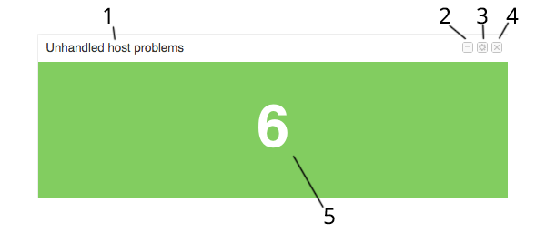
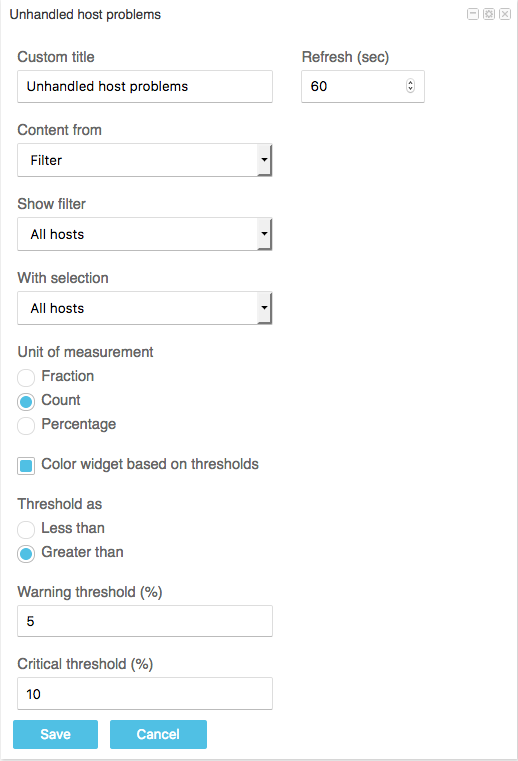

# Widgets

## About

Widgets are used on a dashboard and gives the user the ability to personalize a view to display the status data they are interested in.

The first thing you will see when you login to OP5 Monitor is a dashboard and it can look something like this.

 \

In a dashboard you may:

- Add new widgets and set them up as required
- Move these widgets around within the layout
- Remove widgets

All changes you make with the widgets are saved per dashboard.

## Widget list

op5 Monitor comes with a number of available widgets used to display data in a dashboard, among other you have access to

### Big number

Can display a host or service aggregate as a factor/percentage or count, given a configured threshold it can display as red/yellow or green. If no threshold is given it displays with a blue background.

 \

It can also display the performance data of an object and will then use the performance data thresholds to decide its state-color.

 \

### State summary

Displays the amount of objects in different states for a service or host filter.

 \

### NagVis

Displays a NagVis map of any kind in a widget box on your dashboard.

 \

### Other widgets

There are many more widgets available that display a wide array of data and status information such as, when running OP5 Monitor you can play around with them as much as you like and simply remove them from the dashboard if they do not suit your needs.

- Unacknowledged Service Problems
  - Scheduled Downtime
  - Acknowledged Service Problems
  - Disabled Checks
  - Services
  - Host Performance
  - Merlin Node Status
  - Acknowledged Problems
  - Monitoring Performance
  - Hosts
  - Network Health
  - Monitoring Features
  - Unhandled Problems
  - Business Processes
  - Network Outages
  - Geomap

## Widget parts

Below you see an example of what a widget can look like:

 \

 The following list describes the parts of a widget shown in the picture above.

1. Widget header
2. Minimize/Maximize widget content
3. Edit setting for widget
4. Remove widget from dashboard
5. Widget content

### Setting widget title

The widget header displays the title of the widget, by default many widgets will choose their name based on their setting, but this can cause some confusion, so OP5 Monitor allows you to override the generated name by assigning a custom title. To set this open up the settings for the widget and input your new title in the "Custom title" field, then click save and the widget refreshes with the new title in its header.

### Minimize and maximize

If you want to hide the content of a widget but still keep it on the dashboard page just click on the minimize icon, this can be useful when working on setting up a new dashboard or if they contain data that is of limited use during normal circumstances.

Show the widget content again by clicking the button which has now been replaced with the maximize icon.

### Widget settings

The different widgets have different settings, we will show you the Big number widget which was displayed above, it has the most settings of any widget at the moment which gives it good flexibility in showing an aggregated state.

To view and change settings click the edit settings icon in the widget header. The content is now replaced with the edit view for that widget, once you have changed the settings you want, click save and you will be returned to the widget content with updated settings.

 \

### Multiple widgets

You can add multiple widgets of the same type to the dashboard by simple adding them over and over again, the different instances of the widgets can have different settings.

This allows you to have multiple Big number, State summary, NagVis map widgets and more displaying different data and maps, displayed in a single view.

Since the update which introduced performance data into the big number widget you can have a dashboard dedicated to overview of a mission critical system and its dependencies on a performance data level of granularity, giving you a much clearer view of that systems health.

### Closing widgets

To remove a widget from the dashboard simply click the close button in its header, the widget will be permanently removed.

## Moving widgets

You may move around the widgets shown in the dashboard within the confines of the dashboards layout. Just grab a hold of it by clicking on the top bar and holding down the mouse button and move it to the position you like to place it in.

When you hover a section where you can drop the widget, a gray area will show where the widget will be placed.
