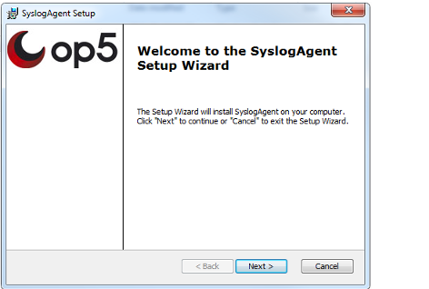
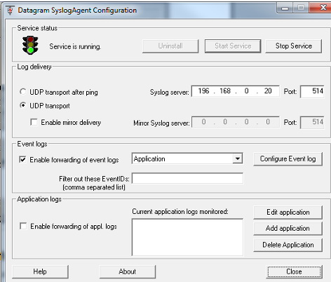
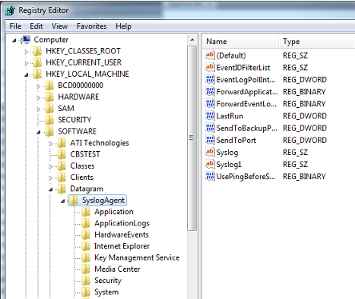
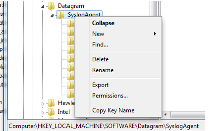

# Windows SyslogAgent

## About

OP5 SyslogAgent runs as a service under a large variety of Windows Server versions, going back to Windows 2000 Server and at least up to Windows Server 2012. It formats all types of Windows Event Log entries into syslog format and sends them to a syslog host. Either the OP5 Monitor server or older OP5 LogServer can be that destination host. It can also forward, plaintext Event Log files and text-based application logs.

OP5 SyslogAgent is a repackaged version of the Datagram SyslogAgent, which itself began as a bug-fixed version of Sabre Net's old NT\_Syslog. It is licensed as GPL software.

## Download and Installation

The OP5 SyslogAgent installation package consists of an MSI installer, available as either 32-bit or 64-bit from [our web site's Download Library](https://www.op5.com/op5-monitor/download-library/category/windows-syslog-agent/). To install, simply double-click the installation MSI file (usually as an Administrator) and follow the on-screen instructions. Note that product has not been updated since OP5 revised its logo:

 \


 By default the OP5 SyslogAgent will be installed in an OP5 subdirectory, which itself will be placed in "`%SystemRoot%\%ProgramFiles%`": by default, that path becomes "`C:\Program Files\op5\SyslogAgent\`". Please review the [upcoming section](#WindowsSyslogAgent-Configuration) for any configuration details.

## Upgrading

If a prior version of the SyslogAgent is installed it should to avoid problems, be stopped and uninstalled as a service and then uninstalled. Stopping and uninstalling the service can be done from the SyslogAgent Configuration tool.

Follow these steps to stop and uninstall the SyslogAgent service:

1. 1.  Start the SyslogAgent Configuration tool
    2.  Press the "Stop"-button (see Fig 3. in the section Configuration)
    3.  Press the "Uninstall"-button

After the service have been stopped and uninstalled, you should uninstall the previous version of the SyslogAgent from "Add/Remove software" on the windows control panel.
 Now you can proceed with the installation of the new version as usual. Note that your previous settings will be used directly when the installation is complete.

## Configuration

When the configuration tool is started the following window should be displayed:

 \


### Configuring the elementary functions

To configure the elementary functions and start the SyslogAgent started follow the following steps:

- Enter the IP address in the field **Syslog Server:**. This IP should be the one to your OP5 Logserver or OP5 Monitor server.
  - Make sure the check box "**Enable forwarding of event logs**" is checked.
  - Press **Start Service**.

Your SyslogAgent is now configured and should be sending logs to your OP5 Logserver or OP5 Monitor server.

### Configuration options

##### UDP delivery

This is the standard way of sending logs - using 'best-effort' UDP protocol. If a secondary syslog server is configured, logs are sent to both addresses.
 Separate ports can be configured for the primary and mirror server. Default is 514 (UDP).

##### UDP with Ping Delivery

With this option, the Syslog server will first be pinged before any logs are sent. As long as the Event log is not cleared before contact can be restored, no information will be lost. The same is not necessarily true for Application Logs - depending on how the particular application handles the log files.
 The server will be pinged every 20 seconds while connection is successful. When ping is unsuccessful, the Agent will eventually slow down to attempt a ping every minute.

##### Enable forwarading of event logs

By default, syslog entries are forwarded to the syslog server. If only application logging is desired, event forwarding can be disabled.
 The Syslog agent is preconfigured regarding classification of different types of entries. These settings can be modified by choosing an event log and pressing the 'Configure event log' button. Please see advanced configuration for detailed description of registry settings.

##### Filter out EventIDs

In certain cases, it can be desirable to filter out certain Event ID's. SyslogAgent supports this by entering the Event ID's to be filtered out in a comma separated list. A maximum of 30 Event ID's can be specified. For instance:

``` {style="margin-left: 30.0px;"}
562,565,4132,566,836,837
```

### Exporting a configuration

All settings are stored in the Windows Registry, and can therefore be exported to a .reg file. This way the settings can be pushed out as a Group Policy (GPO) and otherwise automated for scripting.

**Caveat**: When exporting, *delete the 'LastRun' key* before copying the file to another computer. This key helps each computer know which entries have already been sent. Failure to delete this field can cause computers not to send 'syslog' entries.
 To create a .reg file:

1. 1.  Open the RegEdit tool ('winkey-r' for a command prompt, then type 'regedit');
    2.  Navigate to HKEY\_LOCAL\_MACHINE\\SOFTWARE\\Datagram\\SyslogAgent:

 \


    3.  Right-click the folder and choose export:

 \


    4.  Save the file and open it by right-clicking the file and choosing edit;
    5.  Remove the whole line corresponding to the keyword "LastRun" (if present). That line can be found under the section: " HKEY\_LOCAL\_MACHINE\\SOFTWARE\\Datagram\\SyslogAgent]"
