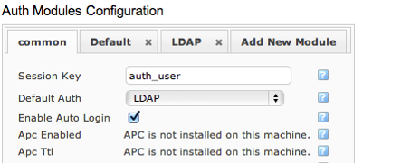
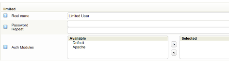

# Apache

# About

A system can also rely on apache to authenticate the user. In this case, it is up to the user to protect the `/monitor` path with access in the apache web server, either by an `.htaccess` file or in the apache configuration.
The apache driver makes it possible to use apache modules for single sign-on authentication solutions, or other systems, like mysql or kerberos.
The driver gets the authenticated username from apache, and adds the group `apache_auth_user` to all users logged in.

# Setting up an authentication module that utilizes the Apache driver

After having logged in to OP5 Monitor, go to **Configure** and then select **Auth modules**.
 Click the **Add new module** tab.
 In the dialogue that appears, name your new module.
 Choose the Apache driver from the dropdown.
 Click **Add**.
 In the common tab, check the checkbox for the option "**Enable Auto Login**".
 Save your changes by clicking "**Submit**"..
 

 The configuration file located at `/etc/op5/auth.yml` can be modified manually to enable usage of the Apache authentication driver. It should look similar to this picture:

 
 Make sure enable\_auto\_login is set to true.

# Users and permissions

The Apache authentication driver utilises similar configuration to the Default driver for group authorization. This means that you will have to set up additional "`Local users`" to resolve group memberships since Apache doesn't have a way to resolve them itself.
 For each user one or more Auth Modules can be specified. This enables the user to log in using the Auth Modules that where chosen but not the others. Just as with ordinary Local users, groups can be specified per user to give it permissions to different parts of OP5 Monior.
 

Note that some Auth Modules might not need you to specify a password for the user. This is validated every time you edit your users and passwords needs to be set for every user you have given an Auth Module that depends on username and password to log in.
