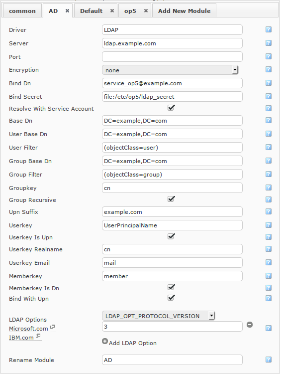

# LDAP and Active Directory

# About

For central user management, an LDAP server can be used, like Microsoft Active Directory or OpenLDAP. When used, OP5 Monitor verifies the user with the LDAP server lookup the group membership of the users in the directory.

Before we start

This documentation assumes that you have:

-   -   Administrator access to the domain
    -   Basic knowledge about LDAP structure

# Prepare your domain

In OP5 Monitor, permissions is handled by groups. Make sure you have one group available for each role in the system.
 If the domain doesn't allow to bind anonymously to resolve group memberships or find users, a service account must be added. This account needs to have read access to resolve group membership and search for users in the system.

# Connection parameters

## Server

Address to the LDAP server, or servers. Can be a space separated list of addresses. Addresses are added for redundancy. Servers will be used in that order.

## Port

TCP port to connect to. Leave blank for default. (389 for no encryption/start-tls, 636 for ssl)

## Encryption

Which type of encryption to use for connection between OP5 Monitor to the LDAP server. (none, start\_tls or ssl). Make sure to have a valid ssl certificate for the LDAP server, and php recognizes it.

## Bind DN

Distinguished name (or user principal name for active directory, which is `username@domain`) of the service account, created under "Prepare your domain" above, or empty to bind anonymously.

## Bind secret

Password for the service user.
 For security reasons, this can also be a path to a filename containing the password. To use this feature, enter `file:/path/to/secret/file`
 It is also possible to keep the password in a separate config file, when multiple LDAP-connections is used. In this case, enter "c`onfig:configname`", which will use config file `/etc/op5/configname.yml`. The config file should then contain one line per driver: "`driver name: secret`"

## Resolve with service account

Check this if you want to use Bind DN and Bind secret as the credentials for lookups in the LDAP or Active Diretory tree.

## Base DN

The distinguished name for the root of the directory to access. This is usually the DN for the domain, for example: `DC=example,DC=com`

## User base DN

The base DN to search for users. This is an absolute DN, and not relative to Base DN. In almost all cases, use the same value as Base DN here.

## User filter

A LDAP filter used to filter out user objects. Usually this is a filter for objectClass. For Active Directory "`(objectClass=user)`" should work.

## Group Base DN

The base DN to search for groups. This is an absolute DN, and not relative to Base DN. In almost all cases, use the same value as Base DN here.

## Group filter

A LDAP filter used to filter out group objects. Usually this is a filter for objectClass. For Active Directory "`(objectClass=group)`" should work.

## Groupkey

The name of the attribute identifying the group. For Active Directory, "`cn`" should work.

## Group Recursive

If groups can be nested, so that a group can be member of another group. This is possible in Active Directory, and should there be active.
 With this unchecked, only members of that group directly will be treated as members of the group. If this is the case for systems which supports nested groups. This checkbox can be unchecked for performance reasons.

## UPN Suffix

When binding with UPN (user principal name), this is the suffix to use after @, which is the domain name. For example, if the UPN of a user is "`username@example.com`", the UPN suffix is "`example.com`".

## Userkey

The key to select the username of a user in the system. Older versions of Active Directory uses sAMAccountName. But in later versions, use userPrincipalName

## Userkey is UPN

Check this if the userkey is a UPN. In that case, the domain part of the userkey will be ignored. Check this if you are using Active Directory, and userPrincipalName as userkey.

## Userkey realname

The name of the attribute in the user object describing the real name of the user. For active Directory, and most other LDAP systems, "`cn`" should work. This is used to nicely display the username of the logged in user.

## Userkey email

The name of the attribute in the user object containing the the email address. For active directory, and many other systems, "`mail`" should work.

## Memberkey

The name of the attribute in a group, which contains the reference to it's members.
 When using LDAP with posix extensions, this should be "`memberUid`". When group is of class "`groupOfUniqueNames`", this should be "`uniqueMember`".

In Active directory, use memberkey: member:1.2.840.113556.1.4.1941:

## Memberkey is DN

Check this box if Memberkey is defines the entire DN of the member user or group, not only it's name. For Active Directory, this is true. In a posix system, this is false.

## Bind with UPN

If binding to the LDAP server should be done with the user principal name instead of the DN of the user.
 For Active Directory, this is true. For all other systems, this is false.
 When binding with UPN, the system constructs a UPN from the username and UPN suffix, and tries to bind with the constructed UPN and given password. If bind succeeds, it resolves the groups.
 When binding with DN, the system tries to bind with "Bind DN" and "Bind Secret" to look in the directory for the user. If the user is found, it tries to rebind with the user DN and password given, and if that succeeds, the group membership is resolved.

## Protocol version

The LDAP protocol version to use. Almost everyone will keep this at 3.

# Example configuration for Active Directory

Server:`ldap.example.com`
 Port:
 Encryption:`none`
 Bind DN:`service_op5@example.com`
 Bind Secret:`file:/etc/op5/ldap_secret`Resolve with service account: `yes`Base DN:`DC=example,DC=com`User Base DN:`DC=example,DC=com`User filter:`(objectClass=user)`Group Base DN:`DC=example,DC=com`Group filter:`(objectClass=group)`Groupkey:`cn`Group Recursive:`yes`UPN Suffix:`example.com`Userkey:`userPrincipalName`Userkey is UPN:`yes`Userkey realname:`cn`Userkey email:`mail`Memberkey:`member`Memberkey is DN:`yes`Bind with UPN:`yes`Protocol version:`3`

# Test your connection

To test if the system can bind using "Bind DN" and "Bind Secret", go to Assign Group Rights page in OP5 configuration. A column has appeared for the driver, and the corresponding group parameters is correctly set.
 If a group is successfully resolved, the corresponding cell is turned green. If it is determined that the group doesn't exist in the LDAP domain, the cell is red. In either way, a successful connection has been established.
 If the connection failed, all the cells are gray.

# More Information

For more information and help setting up an AD connection, please read our [Active Directory Integration How-To](https://kb.op5.com/display/HOWTOs/Active+Directory+Integration+How-To)

For information on how to use LDAP SSL (SLADP) see [Certificate management for LDAP SSL (sldap) with Active Directory](https://kb.op5.com/display/HOWTOs/Certificate+management+for+LDAP+SSL+%28sldap%29+with+Active+Directory)

