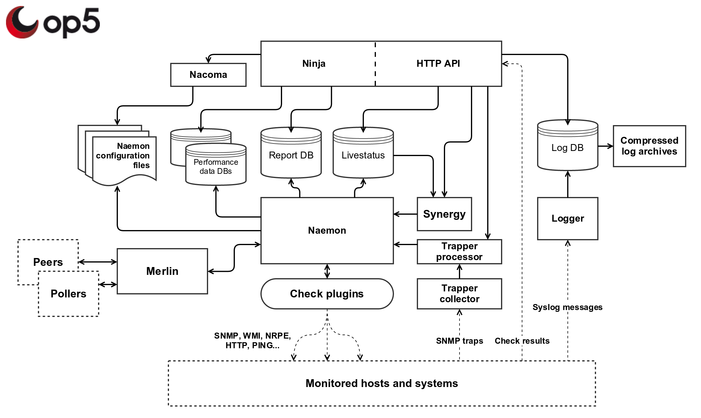

# How OP5 Monitor works "under the hood"

## Introduction

The purpose of this article is to give the reader a high-level overview of how OP5 Monitor works "under the hood".
It will cover the different components of the product and how they interact with each other.

## Overview
*
 \

This illustration is a simplified version of the components relationships*

## Components

Below are descriptions of the most critical components included in OP5 Monitor:

### Naemon -

Naemon is the core of Monitor, responsible for monitoring hosts and triggering notifications.
It's a community developed fork of Nagios 4 core, one of the worlds most used and trusted open source monitoring systems.

Naemon is responsible for scheduling checks, keeping blocking outages and similar,
but the actual monitoring and notifications is handled by plugins.

Monitor includes a lot of check plugins out of the box to monitor systems via common protocols like SNMP, WMI and NRPE,
but can easily be extended to support other applications, thanks to it's compatibility with the Nagios plugin API.

#### Additional information

- [Plugins included in OP5 Monitor](.How_op5_Monitor_works_under_the_hood_v7.3.0)
- HOW-TO: [Developing your own check plugin](.How_op5_Monitor_works_under_the_hood_v7.3.0)
- HOW-TO: [Installing third-party plugins](https://kb.op5.com/display/HOWTOs/Installing+third-party+plugins)
- Blog post: [op5 on Naemon, Nagios and the future](https://www.op5.com/blog/news/op5-naemon-nagios-future/)
- [The Naemon project website](http://www.naemon.org/) (external)

### Merlin -

Merlin is the software component in Monitor responsible for load balancing/high availability and distributed monitoring.
It takes care of tasks like splitting configuration for pollers, making sure checks get spread out over peers and synchronizing object states.

It consists of two parts - a Naemon module and a system daemon.
Merlin uses a custom protocol for exchanging state information and utilizes SSH for configuration management.

#### Additional information

- [Merlin community space](.How_op5_Monitor_works_under_the_hood_v7.3.0)
- [Distributed monitoring documentation](.How_op5_Monitor_works_under_the_hood_v7.3.0)
- [Load balanced monitoring documentation](.How_op5_Monitor_works_under_the_hood_v7.3.0)
- [Merlin work flow and design](.How_op5_Monitor_works_under_the_hood_v7.3.0)

### Livestatus -

Monitor uses a fork Mathias Kettner's Livestatus, a Naemon module that acts like a in-memory database,
containing real-time information about the states of objects in Naemon and related data.

Livestatus is used by many components inside Monitor, but can also be queried through a UNIX socket or command line tools like "mon".

#### Additional information

- [Livestatus community space](.How_op5_Monitor_works_under_the_hood_v7.3.0)
- [Documentation for the original version of MK Livestatus](https://mathias-kettner.de/checkmk_livestatus.html) (external)

### Logger -

The Logger component allows Monitor to receive syslog messages for analysis and storage.
It's built on top of the syslog-ng server and stores log data in a PostgreSQL database and compressed log archives for historical data.

The logs can be viewed and searched in Ninja or queried through the HTTP API.

#### Additional information

- [Logger documentation](.How_op5_Monitor_works_under_the_hood_v7.3.0)
- HOW-TO: [Monitoring log filters in Monitor 7.0 or higher ](.How_op5_Monitor_works_under_the_hood_v7.3.0)
- HOW-TO: [Using Logger and custom columns for root cause analysis](https://kb.op5.com/display/HOWTOs/Using+Logger+and+custom+columns+for+root+cause+analysis)
- [Documentation for syslog-ng OSE](index) (external)

### Trapper -

Trapper is responsible for handling incoming SNMP traps/notifications.
It consists of two parts - the collector and the processor.

The collector is built on a modified version of snmptrapd and inserts received traps into a MySQL database for processing.
The processor runs a set of user defined rules to handle the trap data and updates a service in Naemon via a passive check result with the status.

Trapper can be managed in Ninja or via the command line tool "traped".

#### Additional information

- [Trapper documentation](op5_Trapper_Manual)
- HOW-TO: [Getting started with OP5 Trapper](https://kb.op5.com/display/HOWTOs/Getting+started+with+op5+Trapper)
- [Manual page for snmptrapd configuration](http://www.net-snmp.org/docs/man/snmptrapd.conf.html) (external)

### Synergy -

Synergy, also known as Business Service Management (BSM),
analyze information from hosts and services in Naemon to determine a high level business/service delivery status.

It queries the Livestatus database for status information and runs a set of user defined rules to determine the state of a business object.
The business object can be "materialized" as service on a host, which will result in Synergy sending passive check results to Naemon.
This allows you to include the business objects in reports and configure alerting/event handlers for them.

Synergy can be configured in Ninja under "Business Services" or with configuration files.

#### Additional information

- [Business Services documentation](.How_op5_Monitor_works_under_the_hood_v7.3.0)
- [Business Service monitoring manual](.How_op5_Monitor_works_under_the_hood_v7.3.0)
- HOW-TO: [4 steps to turn on simple BSM in your system](https://kb.op5.com/display/HOWTOs/4+steps+to+turn+on+simple+BSM+in+your+system)
- Webinar: [Introduction to Business Services Management in OP5 Monitor](https://youtu.be/w5l_URdQKUs)

### Ninja -

Ninja is the web interface for Monitor.
It gives users the ability to view status information and monitoring metrics for hosts and service,
search for log patterns, configure business services, generate reports and similar.

#### Additional information

- [Ninja community space](.How_op5_Monitor_works_under_the_hood_v7.3.0)

### Nacoma -

Nacoma is the graphical utility for Naemon object configuration and various other aspects of Monitor,
like user permissions and management packs.
It provides tools like clone and propagate that help the users work efficiently and keeps a change log containing which users made what changes.

Nacoma stores it's settings in a MySQL database and compiles Naemon configuration files for objects after each save.

It's currently embedded inside Ninja and works as the back-end for object configuration in the HTTP API.

#### Additional information

- [Configuration tool documentation](.How_op5_Monitor_works_under_the_hood_v7.3.0)
- [Power-user tools and features in Nacoma](.How_op5_Monitor_works_under_the_hood_v7.3.0)

### HTTP API -

The HTTP API provides a [RESTful](https://en.wikipedia.org/wiki/Representational_state_transfer) interface for interacting with Monitor.
It can be used to query the status of hosts and services, extract event information and performance metrics, submit check results, change configuration and similar.

The HTTP API is a great tool for build integrations with third-party systems like reporting engines, management systems and dashboards.

#### Additional information

- [HTTP API documentation](.How_op5_Monitor_works_under_the_hood_v7.3.0)
- HOW-TO: [Submitting status updates through the HTTP API](https://kb.op5.com/display/HOWTOs/Submitting+status+updates+through+the+HTTP+API)
