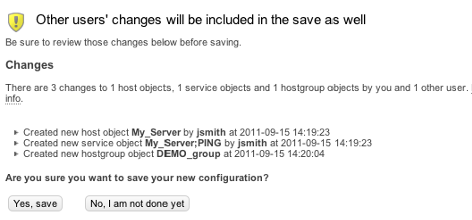

# The basics

# About

In The basics section we will take a look at the basic step you need to know when working with **Configure**

# Start working

There are many ways to jump in to Configure and start working with the configuration of OP5 Monitor.

## To start working in Configure

Click **Configure** in the **Manage** menu

This will take you to the main menu of Configure.

### Alternative

Click the **Configure** icon found on many objects in the monitoring part of OP5 Monitor 

This will take you directly to the configuration part for the object you clicked on.

# Submitting changes

When you have made any changes to an object you have to submit it to the Configure database.

## To submit the new configuration to the database

Click **Submit** at the bottom of the page
 
 As soon as the data has been saved, the configuration starting page will tell you that there is unsaved data in the Configure database. Each object type you made changes to, is decorated with a small yellow badge that informs you about the number of changed objects.

 Continue work until your work is done for this time.

# Save the changes

When you have finished working and consider your new configuration is ready to be used by OP5 Monitor you need to save the changes in the Configure database to the configuration files.
 This will also make OP5 Monitor start using the new configuration.

## To save the changes and reload OP5 Monitor

Click **Save** icon at the top of the page.

 Before the configuration is saved to disk, you have the opportunity to review the changes.
 
 To view what changes that will be written to disk click on **More info**.
 If you and another user is doing changes on the same objects that you have access to you will save the other users changes as well. The other users changes will be shown under 'More info' as well.
 In the screenshot below you will see an example where we created a new host group and jsmith at the same time added a new host.
 
 When done click **Yes, save** to write all the changes to disk.
 Now the preflight check is preformed and the data is saved to the configuration files.
 

If two users with the same permissions are editing the same host all configuration regarding the host or service will be saved.

## Permissions

The save the configuration the user must have export permissions. See [Authorization](Authorization) for more information.

# Undo changes

Sometimes it might be handy to reset the configuration to the state it was in where you started to work in Configure. The only thing you have to do then is to undo your changes.

The undo function will only work as long as you do not have saved the data to the configuration files.

## To undo the configuration changes.

Click **undo** icon at the top of the Configure page.

 This will revert the your changes since the last successful preflight check.
 
 To undo all users changes click on **complete reimport**. This will re-read the configuration files and all changes will be reverted. If any changes were made directly into the configurations files these changes will now be loaded in to the web configuration
 

# Historical Configuration Changes

Historical configuration changes can be used to track changes in the configuration. In the log you will find all changes in the configuration on objects that you have access to.
 To access the historical configuration changes log, go to **Configure** and click on the **Changelog** icon in the upper right corner.

 Limited users will only see changes that are made to the hosts and services they are contacts for.
 Full access users will see all changes.
 

## Filter config changes

To filter the configuration changes select **Toggle filter bar
** 
By using the filter bar it is possible to filter on the following:

- User
  - Object Name
  - Time

