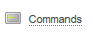
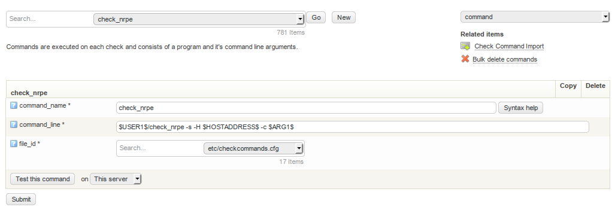

# Main objects

## About

The configuration is based on objects. There are several types of objects, each one defining different things in the monitoring process.

Each object consists of a object name and a couple of variables that needs to be configured.
For example on a host object you configure

- host name
  - address
  - notifications
  - active checks
  - etc.

In Configure you can

- add new objects
  - modify existing objects
  - remove existing objects.

A lot of objects can be cross referenced in the configuration and Configure helps you with this too.
In most of the listings you will find a small text field called **Filter by regular expression**. Use this to filter out the content you are interested in when viewing the different lists.

## Required directives

All objects have a list of directives that are required when adding a new object. The other directives can be left out. They will then get the OP5 Monitor defaults value.

This does not mean you have to set every directive for every object. One solution is called templates. They make it a lot easier to manage a large set of objects. Read more about templates in the Using Templates section.

## Hosts

Hosts are one of the central objects in the monitoring logic. Important attributes of hosts are as follows:

- Hosts are usually physical or virtual devices on your network (servers, workstations, routers, switches, printers, etc) but it could be practically anything you can reach and monitor from the OP5 Monitor server.
 - Hosts have an address of some kind, IP address or host name.
 - Hosts does not need a service directly associated to them, the services can be inherited from a hostgroup. A host can also exist without services.
  - Hosts can have parent/child relationships with other hosts, often representing real-world network connections, which is used in the network reachability logic.

### Required directives

The following directives are required for a host object.

- host\_name
- address
- max\_check\_attempts
- check\_period
- contacts
- contact\_groups
- notification\_interval
- notification\_period

The table below describes the required directives for the host object

<table>
<colgroup>
<col width="33%" />
<col width="33%" />
<col width="33%" />
</colgroup>
<tbody>
<tr class="odd">
<td align="left">
<strong>Directive</strong>

<strong>Type</strong>

<strong>Description</strong>
</td>
<td align="left">
host_name

string

This is the id of the object. I may not contain any space in the value.
</td>
<td align="left">
alias

string

A more describing name for the object.
</td>
</tr>
</tbody>
</table>

## Services

A service can be practically any thing that you can measure and monitor on a host. It is almost only your imagination and programming skills that sets the limit for what you can monitor with a service.
 A service

- must be connected to a host
  - can check things by tcp, agents, snmp etc.
  - use a check command ([Commands](#Mainobjects-Commands)) to communicate with the plugin ([Plugins](Plugins)) that gets all the data.

### Required directives

The following directives are required for a service object.

- host\_name
- service\_description
- check\_command
- max\_check\_attempts
- check\_interval
- retry\_interval
- check\_period
- notification\_interval
- notification\_period
- contacts
- contact\_groups

The table below describes the required directives for the host object

<table>
<colgroup>
<col width="33%" />
<col width="33%" />
<col width="33%" />
</colgroup>
<tbody>
<tr class="odd">
<td align="left">
<strong>Directive</strong>

<strong>Type</strong>

<strong>Description</strong>
</td>
<td align="left">
host_name

host_name object

The host the service is connected to.
</td>
<td align="left">
service_description

string

This is the id of the object. It must be unique on a host but may be reused on other hosts.
</td>
</tr>
</tbody>
</table>

## Contacts

A contact is used for two purposes:

- to send notifications to
  - permissions to view a objects in the monitoring part of OP5 Monitor.

A contact is not the same as the login account given access rights to the system.

### Required directives

The following directives are required for a service object.

- contact\_name
  - host\_notifications\_enabled
  - service\_notifications\_enabled
  - host\_notification\_period
  - service\_notification\_period
  - host\_notification\_options
  - service\_notification\_options
  - host\_notification\_commands
  - service\_notification\_commands

The table below describes the required directives for the host object

<table>
<colgroup>
<col width="33%" />
<col width="33%" />
<col width="33%" />
</colgroup>
<tbody>
<tr class="odd">
<td align="left">
<strong>Directive</strong>

<strong>Type</strong>

<strong>Description</strong>
</td>
<td align="left">
contact_name

string

The id of the contact object.
</td>
<td align="left">
host_notifications_enabled

yes/no

Used to determine whether or not the contact will receive notifications about host problems and recoveries.
</td>
</tr>
</tbody>
</table>

## Local users

Local users are user accounts that makes it possible to login to the OP5 Monitor GUI using the default driver. For more information about drivers see [Authentication Integration](Authentication_Integration) chapter
 Local users does not have any thing to do with notifications or the permissions of viewing objects in OP5 Monitor.
 Local users can be connected to a contact by giving the username the same name as the id (contact\_name) of a contact.
 A local user can also be created by checking the box "Configure access rights for this contact" when creating a contact.

### Required directives

The following directives are required for a access rights object.

- username
  - password

The table below describes the required directives for the host object.

<table>
<colgroup>
<col width="33%" />
<col width="33%" />
<col width="33%" />
</colgroup>
<tbody>
<tr class="odd">
<td align="left">
<strong>Directive</strong>

<strong>Type</strong>

<strong>Description</strong>
</td>
<td align="left">
username

string

The username is the id of the access rights and also used as login username.
</td>
<td align="left">
password

string

The password is used for the login.
</td>
</tr>
</tbody>
</table>

### Group Rights

Group rights determents the permission the user will have. For more information about group right, see [Authorization](Authorization).

## Time periods

Time periods is time defining objects that span over a week. You can define included time for each day of the week in the time period definition.
 You can also:

- use already defined time periods as excludes
- add exceptions based on dates and ranges of days

The time period objects are used at many places in the configuration. Most noticeably are in the contact objects where the time periods defines when notifications should be sent out.
 You can also use time periods to define when a service or a host should be monitored or when you are creating reports.

### A time period in detail

The following tables describes the directives of a time period and how to use them.
 The table below describes the first part of directives of a time period.

<table>
<colgroup>
<col width="50%" />
<col width="50%" />
</colgroup>
<tbody>
<tr class="odd">
<td align="left">
<strong>Directive/option</strong>

<strong>Description</strong>
</td>
<td align="left">
timeperiod_name

short name of the time period
</td>
</tr>
</tbody>
</table>

 Depending on what kind of exception type you have chosen you will get different settings choices. The two lists below describes them all.
 The table below describes the exception part of a time period.

<table>
<colgroup>
<col width="50%" />
<col width="50%" />
</colgroup>
<tbody>
<tr class="odd">
<td align="left">
<strong>Directive/option</strong>

<strong>Description</strong>
</td>
<td align="left">
exclude

Other predefined time period definitions that should be excluded from this time period.
</td>
</tr>
</tbody>
</table>

 The table below describes exception by **Date**:

**Directive/option**

**Description**

Interval

Choose Single ate or Date range

Date

Choose the date that is supposed to be used in this Exception.

From date

If you chosen date range you will here set the start date To date.

To date

If you chosen date range you will here set the end date.

Frequency

How often the exception is repeated. Valid values are positive integers greater than one. E.g:

- Date range "2012-01-01 - 2012-12-31 / 5" means every fifth day of 2012.
- Day range "1 monday march - 3 sunday may / 3" means every third day between the first monday and the third sunday every month.
- Date range "2012-06-01 / 14" means every 14th day from first of june 2012. Note that this exception has no end.

Hours

Which time to include for this exception. You can define multiple times by separating them with comma. Example:
 00:00-01:00,03:00-06:00

 The table below describes exception by **Day**:

**Directive/option**

**Description**

Interval

Choose Single day or a Day range

Weekday

Choose the weekday that is supposed to be used in this Exception.

From weekday

If you chosen Day range you will here set the start day.

To weekday

If you chosen Day range you will here set the end day.

Frequency

How often the exception is repeated. Valid values are positive integers greater than one. E.g:

- Date range "2012-01-01 - 2012-12-31 / 5" means every fifth day of 2012.
- Day range "1 monday march - 3 sunday may / 3" means every third day between the first monday and the third sunday every month.
- Date range "2012-06-01 / 14" means every 14th day from first of june 2012. Note that this exception has no end.

Hours

Which time to include for this exception. You can define multiple times by separating them with comma.
 Example: 00:00-01:00,03:00-06:00

## Commands

A command is exactly what it sounds like. It can use macros and arguments. Mostly they are used with services but they can actually be used as

- service or host check command
  - notification command
  - event handler
  - obsession

The most common exposure to commands would be check commands for services or hosts, in particular when new commands are added during upgrades or when commands are updated when upgraded.

### Directives

A command has got only two directives

- command\_name
  - command\_line

<table>
<colgroup>
<col width="50%" />
<col width="50%" />
</colgroup>
<tbody>
<tr class="odd">
<td align="left">
<strong>Directive</strong>

<strong>Description</strong>
</td>
<td align="left">
command_name

This is the id of the command and also the name shown in Configure.
</td>
</tr>
</tbody>
</table>

### Accessing commands

To access and configure commands go to **Commands** on the main configuration page

Here it's possible to utilize the search box to have a look at configured commands, add new commands and copy commands to use as a template for your custom command.

### Check Command Import

Updating OP5 Monitor often brings new functionality, and one of them are new commands that adds functionality in the product. A typical scenario is that a new plugin is added and a number of commands is added to utilize the new plugin.

Accessing this function is done via **Check command import** via the main configuration page

If new commands are available they will be listed in the upper section of the screen, and changed commands in the lower part of the screen.

In this particular case, all new commands are imported, and there are two modified commands available. Importing these commands would overwrite a by the administrator configured setting, thus I select to not do so.

Importing commands is a manual operation since updating existing commands might be destructive.

## Plugins

Plugins are compiled executable or scripts that can be run from a command line to check the status of a host or service.
 There are many plugins included in the OP5 Monitor software. A list of the plugins can be found in the [list of included plugins](https://kb.op5.com/display/PLUGINS/Plugins+List).
 If you are looking for a plugin not found in OP5 Monitor by default there are several other places to look:

- Contact OP5 for a specific development
- [www.op5.org](http://www.op5.org)
- [exchange.nagios.org](http://exchange.nagios.org)

You can use any plugin written for Nagios but you might need to modify them a bit before they work in the OP5 Monitor environment.

### Plugin search

To search the plugins that are shipped with OP5 Monitor or added afterwards to to **Plugin Search** on the main configuration page
 
 From this page you may
 See the support levels of the plugins and see descriptions of the plugins.
 The support levels are described in [Plugin Support Levels](plugin_support_levels).

