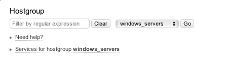

# Groups

## About

The groups in OP5 Monitor is used to group objects of the same type. There are three types of groups in OP5 Monitor

- host groups
  - service groups
  - contact groups

They are all good to use to get things a bit more organized and they have also special functions OP5 Monitor.
The following subsections will give you a brief description about how they can be used.

##
Host groups

Host groups can be used group hosts together in any way you like.

- A host can be connected to any number of hosts.
  - A host group can be connected to an other host group.

There are a few host groups included in the initial setup of OP5 Monitor but you can create your own matching your own needs.
 There are a infinite ways of using host groups and here are a couple of examples.
 Grouping hosts by

- geographic placements
  - what company they belongs to
  - who owns the hosts
  - who should be able to see the hosts in the group
  - function or operating system.

The list can be long.

### Services on Host groups

A host group can contain service checks. These service checks will be inherited on all hosts connected to the host group.
 A service on a host group work in the same way as a service for a host.
 To add a service to a host group go to 'Configure' and 'Host Groups'. Choose the host group you want to add services to then select 'Services for hostgroup'

 \

 For example a windows servers host group could contain the checks that are common for all windows servers. By doing this you will only need to change command arguments on the service in the host group instead of changing the arguments on all windows host.
 If you add new checks to the service group all hosts in the host group will get the new service once you save your configuration.
 If a host group service and a host service should get the same name, the host group service will be used, the host service will still be visible in the configuration and if the host is lifted out from the host group the host service will become active.

### Nested host groups

Host groups can be connected to each other.
 When nesting host groups together the services on host groups also will inherited to the nested host group. This only work one way.
 For example:Host group A has service X and host 1 is a member of host group A Host group B has service Y and host 2 is a member of host group BIf host group B is added as a member of host group A then host 1 will get service Y but host 2 will not get service X.
 A good way to use this feature is to have i.e a Windows host group and then a MSSQL host group. When adding the Windows host group as a member to the MSSQL host group the hosts added to MSSQL will get both the service checks that are standard for all Windows host and the default MSSQL service checks.

## Service groups

The service groups are used to group services together in the same way as for host groups. On the other hand there is almost no useful at all to for example group service groups by geographic placements.
 One good way to use service groups is to create groups containing services needed for a service you deliver to your customers.

- *An email service group*

*Let us take a simplified email service and show how the service groups can be used.*
 *To be able to deliver an email service to our customers the following services need to be working:*

- *DNS*
  - *SMTP*
  - *IMAP / POP3*
  - *WAN Connection*
  - *File Storage*

*We take al those services and place them in a service group called Customer email.*
 *If we get a problem with any of the services in the Customer email group we can easily see that the whole email service has got a problem.*
 The service group in the example above is perfect to use in Service Level Agreement reports (SLA in the OP5 Monitor user manual) to make sure we deliver the service as we promised.

## Contact groups

Contact groups are mainly used to setup where to send service and host notifications. It can also be used to setup permissions about who should be able to see what object in the OP5 Monitor GUI.
 The members of a contact group associated with a certain host and/or service are the one that will get all notifications for that object.
 A Contact group can be populated with a contact or another contact group.

### Permission to host and services

If a user does not has the access rights to see all hosts that user need to have a contact connected to the contact group associated with the host or service the user should be able to see.

#### Show partial hostgroups

If an unprivileged user is not a contact for all hosts in a hostgroup, he will not be able to see the host group in the "Hostgroup summary/overview/grid" views.
 To enable viewing of partial host group edit follow these steps logged in as root:

- 1.  Create and edit the file /opt/monitor/op5/ninja/application/config/custom/groups.php with your favorite editor.
        2.  Put the following into the file:

                <?php defined('SYSPATH') OR die('No direct access allowed.');$config['see_partial_hostgroups'] = true;

        3.  Save the file.
