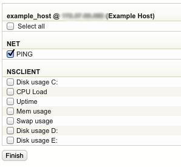
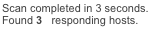
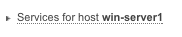
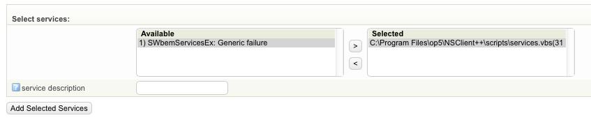
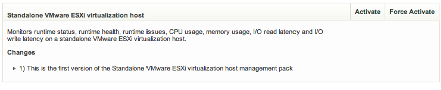
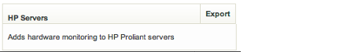

# Managing objects

## About

Now let us be a bit more hands on. In this section we will take a look at how to add/edit/delete objects using the Configure.
There are sometimes many ways to do things in OP5 Monitor but we will only show a few examples.
In the subsections to Managing objects we will assume that you start from the main page of Configure.

 \


## Before you start

### Add new

Every time you comes to a page where you can handle an object you will have the **Add new...** dialog ready for you to add a new object.

### Configuration files

Every object is placed in a configuration file. You may change what file the object is placed in at the bottom of every configuration page. This is normally not necessary and only used in special cases.

### Help

In the guides we will only describe the directive that are differ from the default value. Click the **help icon**

### Templates

Because handling templates is the same for all kind of templates, only the directives differ, we will only add a template in Contacts.

## Contacts

### Adding a contact template

Before we start to add any new contacts we will create a contact template to use with the contact in the next section. In this guide we only describes the directive we will not use the default value in.

### To add a contact template

1. Click **Contact templates**.
1. Give the contact template a name

     \


1. Change **can\_submit\_commands** to yes.

     \


    This gives this the user connected to this contact the possibility to execute commands like acknowledge problems etc.

1. Click **Submit**.
1. Click **Save**.

### Adding a contact

#### To add a contact

1. Click **Contacts** on the main page.
1. Use the template on call template we created in Adding a contact template. 

     \


1. Type in a contact\_name

     \


1. Type in an alias

     \


1. Type in the email address

     \


1. Click **Submit**.
1. If you want to create access check the "Configure access rights for this contact" box, otherwise save changes

     \


1. When Configuring access right for this contact select the access rights the contact should have, after that save the changes.

     \


### Modify a contact

1. Click **Contacts** on the main page.
1. Choose the contact you like to modify in the drop down list.

     \


1. Click **Go**.
1. In the view you will get only directives differ from the template will be shown. To change the other directives click **Advanced**.
1. Make your modifications and click **Submit**.
1. Click **Save**.

### Delete a contact

1. Click **Contacts** on the main page.
1. Choose the contact you like to modify in the drop down list.

     \


1. Click **Go**.
1. Click on **Delete**.

     \


1. Click **Save**.

## Hosts

There are many ways to add a host. A host can be added by

- **Host Wizard**
- **new host** option
- a **network scan**
- cloning of a host
- using a profile

In this guide we only describes the directive we will not use the default value in.

### Adding a host with new host option

#### To add a new hosts using the new host option - Part 1

1. Click** Hosts** on the main page.
1. Type in a host\_name.

     \


1. Type in an alias.

     \


1. Type in the address to the host, IP address is mostly the best choice.

     \


1. We assume this is a Microsoft windows server and that NSClient++ has been installed. Check for the following service checks.

    When using WMI a administrators account must be selected. It is also possible to create a user with less privileges, see how-to https://kb.op5.com/x/K4IK

     \


1. Click host logo to set the icon that will be displayed for this host in lists and maps.

     \


1. Click the icon you like to use.
1. Click **Add services**.

     \


#### To add a new host using the new host option - Part 2

1. Leave the initial settings All new services will inherit the Initial Service Settings. If you choose not to enter a value for one or more required variable, those variables must be set in the selected template.
             as it is and scroll down to the services.
1. The scan has found out that NSClient++ is installed plus two other services that can be added to this host.

     \


1. Check Select All to add all services found or select the one you like to add for this host.
1. Click **Continue to step 3**.
1. Now either click the host or service links or click **Save**.

     \


### Adding hosts with network scan

Network ranges can be specified in a very free form. Each of the four parts of the IP-address may contain any combination of comma-separated numbers, 'from-to' ranges and single numbers, as such: `10.1,2.0,4-10.1-50`.
 You can specify multiple ranges, separated by spaces, if you like.

1. Click **Hosts** on the main page.
1. Click **Network scan**.

     \


1. Fill in the desired network range. We will scan for hosts in the range from `172.27.86.8 - 172.27.86.97`

     \


1. Click **Scan Ranges**.
1. In this case, we found only hosts that had not been previously configured.

     \


1. Repeat To add a new hosts using the new host option - Part 1 for each host, except for the last step. If here is one or more host you do not like to add choose **No** in **Add this host?** When you are finished click **Scan hosts for services**.
1. Repeat To add a new host using the new host option - Part 2 for each host, except for the last step.When you are finished click **Continue to step 3**
1. Click **Save**.

### Modifying a host

1. On the start page choose the host you like to modify in the drop down list.

     \


1. Click **Go**.
1. In the view you will get only directives differ from the template will be shown. To change the other directives click **Advanced**.

     \


1. Make your modifications and click **Submit.**
1. Click **Save**.

### Deleting a host

1. On the start page choose the host you like to delete in the drop down list.

     \


1. Click **Go**.
1. Click **Delete**.

     \


1. Click **Delete all affected objects**.
1. Click **Save**.

### Renaming objects

When renaming a host or service in the web GUI it will only rename the object and will not rename the objects name in log-files, graphs or report data in the database, meaning that the history logs for the object is lost.
 To rename the object name in log-files as well a program needs to be run manually. If this is not done the object will lose its alert history.

Renaming objects in the configuration files directly is **not** supported. It must be done via the configuration interface. This is due to that the rename application needs a change log to track the changes which is only created via the configuration interface.

Follow the guideline below to rename the objects throughout the system.

1. Log in as root via SSH to your OP5 Monitor server
2. Stop the monitoring service
3. Make sure you save a backup

    ```{.bash}
    op5-backup
    ```

4. Execute the rename program
5. Start the monitoring service again

    ``` {.bash}
    sudo  su -
    mon stop
    su - monitor
    /opt/monitor/op5/merlin/rename --rename-all
    exit
    mon start
    exit
    ```

If there is a lot of historical data this program can take a while to execute and during this time the OP5 Monitor service will not be running.

Note that this does not work on schedule downtime objects. If a host is renamed that has a scheduled downtime the scheduled downtime will be removed and needs to be re-configured.

Network autoscan

It might get handy to let OP5 Monitor scan and notify you if there are any new hosts on a particular network range.
The network autoscan function will:

- scan certain range for new hosts
- notify you when new are found
- be executed every night by cron on the OP5 Monitor server.

No host will be automatically added. The network autoscan function will only find the hosts for you.

### Adding a new autoscan configuration

You may add as many autoscan configuration as you wish. When adding a your network range you may use the same syntax as when you manually scans a network from the Add new host wizard.

1. Click **Configure** in the main menu.
1. Click **Network Autoscan**.
1. Fill in the **New scan** form

     \


1. **Name**: The identifier of this autoscan configuration
1. **IP Range**: In this case a complete C net.
1. **Description**
1. **Activate**: Make this autoscan configuration active and in use.
1. Click **Save**.

### Adding a host to blacklist

In certain ranges you are scanning with the network autoscan there might be hosts you do not want to include in the result. Then you should add that host or hosts to the blacklist.

1. Click **Configure** in the main menu.
1. Click **Network Autoscan**.
1. Add a host (IP address) in the **Host** field

     \


1. Click **Add**.

### The result

After the networks scan has been executed a small result will be shown in the upper left corner of the OP5 Monitor GUI

 \


 To add the hosts that has been found you only need to click on the text to the right of the icon. You will then come to the Add new host wizard the same as when you have done a manual network scan.

## Services

 Services can be added in a few different ways in Configure. You may add a service by using

- **add service for this host**
- **scan host for network services**
- **scan host for snmp interfaces**
- **scan host for windows services with agent**
- **scan host for windows services using WMI**

We will take a look at the **add service for this host.**
In this guide we only describes the directive we will not use the default value in.
The default service template will used.

### Adding a service

#### To add a service using add service for this host

1. On the start page choose the host you like to add a new service to in the drop down list.

     \


1. Click **Go**.
1. Click **Services for host...**.under related items menu to the right.

     \


            The add new service pages is shown.
1. Type in a service\_description.

     \


1. We will use the check\_nt\_cpuload command for this service.Type in as many characters you need in the filter by regular expression field until the command shows up.

     \


1. Click **Syntax help** to see what arguments are needed for this command.

     \


    You can see that we have a macro called **\$ARG1\$**. This is the first, and in this case the only, argument we need to give to this command.
1. Click **Syntax help** again to hide the help text.
1. Type in the argument If more than one the shall be separated by a ! like this: argone!argtwo..

     \


1. Click **Submit**.
1. Click the **Save** icon.

If the arguments include an exclamation mark "!" this has to be escaped with an back slash (). Example: username!crypticpassword!!warning!critical
This will out put "crypticpassword!"

### Modifying a service

#### To modify a service

1. On the start page choose the host you like to modify a service on in the drop down list.

     \


1. Click **Go**.
1. Click **Services for host ...** .

     \


1. Choose the service you like to modify in the drop down list.

     \


1. Click **Go**.
1. In the view you will get only directives differ from the template will be shown. To change the other directives click **Advanced**.

     \


1. Make your modifications and click **Submit**.
1. Click **Save**.

### Test this check

**Test this check** makes it possible for you to test the service you added or modified before you save the new configuration and reload monitor. This is a nice way to make sure the service works as it is supposed to.
 In the guide below we will work with the service created in Adding a service.

#### To test a check

1. Pick up the service you like to test as it is done in Modifying a service.
1. Click **Test this check**, at the bottom of the page.

     \


1. The output looks like the one below. If you get any errors it will be shown here in the output

     \


1. Click **Hide check** to hide the output.

#### To test a hostgroup check

1. Pick up the service you like to test as it is done in Modifying a service.
1. Select the host that you would like the test to run on from the drop down menu.

     \


1. Click **Test this check**, at the bottom of the page.

     \


1. The output looks like the one below. If you get any errors it will be shown here in the output

     \


1. Click **Hide check** to hide the output.

### Deleting a service

#### To delete a service

1. On the start page choose the host you like to delete a service from in the drop down list.

     \


1. Click **Go**.
1. Click **Services for host ...** .

     \


1. Choose the service you like to delete in the drop down list.

     \


1. Click **Delete**.

     \


1. Click **Save**.

### Scanning host for network services

When you added your host you had the opportunity to add services found during the scan for network services. This scan function can also be reached afterwords.

#### To scan a host for network services

1. Open up the host, in **Configure**, you like to add new services on.
1. Click **Scan host for network services**.
1. Select the new services found and click **Continue to step 3**.
1. Click either the host or service link to go back to the place where you started.
1. Click **Save**.

**Additional information**: In a distributed environment a selectbox will appear when hovering over the menu item "Scan host for network services" where you can select from which OP5 Monitor system that should preform the scan.

 \


### Scanning a host for snmp interfaces

In many times when you are about to monitor a switch or a router you need to setup a lot of services. It is hard work and takes a lot of time to add them one by one.
 Instead of adding all interface services one by one you should use the scan for snmp interfaces function.

#### To add snmp interfaces

1. Open up the host, in **Configure**, you like to add new services on.
1. Click **Scan host for SNMP interfaces**.
1. Set the SNMP community.
1. Chose SNMP version.
1. Click **Scan host**.

     \


1. Select the services you like to add.
1. Click either the host or the service link to get back.
1. Click **Add selected services**.
1. Click **Save**.

## Scanning host for windows services

There are two ways to scan a windows host for services:

1. Using the windows agent NSclient++
1. Using WMI, Windows Management Instrumentation

The following sections will describe how to accomplish this using the different techniques.

### Scan for services using agent

Adding a service that checks a windows services is many times harder than you think. You need to

1. have access to the windows server
1. know the exact name of the windows service

With OP5 Monitor you do not need to do anything more than make sure the latest agent (NSClient++) is installed and follow the next few steps.

#### To add windows services

1. Open up the host, in **Configure**, you like to add new services on.
1. Click **Scan host for Windows Services**.
1. Choose which server to preform the scan:

     \


1. Select the Windows Services you like to add as a new service in OP5 Monitor.

     \


1. Give the new service a **Service description**.
1. Click **Add Selected Services**.
1. Click either the service link or the **Scan for more service** button.
1. Click **Save**.

### Scan for service using WMI

Scan for services using Windows Management Instrumentation has a number of dependencies to be able to work:

- WMI enabled on the windows server
- User account on the windows server with sufficient privileges

There are two ways to scan for WMI on a windows host:

- When adding a new host
- Scanning a existing host

#### Scanning for WMI when adding a new host

To scan a host for WMI-counters and services upon adding the host to your OP5 Monitor configuration as partly described in: Adding a host with new host option.

To scan for WMI counters when adding a new host:

1. Select **Configure** in the main menu
1. Click on **New Hosts**
1. Enter the information about the host
1. Select the checkbox **Add WMI**

     \


1. Enter username and password
1. Press **Add Services**

     \


1. Select the services you wish to add from the list

     \


1. Press **Finish** at the end of the page.

     \


    The host is added and you can save your configuration.

     \


1. Press **Save** in the top right corner

     \


1. Review your changes then by clicking on **More info** press **Save objects I have change**

     \


After this the configuration will be saved and final preflight configuration check has been performed.

 \


Your configuration is saved and the host and its services are ready to be monitored.

 \


## Custom Variables

Custom variables can be used to store custom information for hosts, services and contacts in the configuration. These variables can be used as a macro in command arguments and notifications for example.
All custom variables will automatically get a underscore "\_" as a prefix to prevent name collisions with the standard variables.
The custom variable will also automatically be converted to upper case.
In order to prevent name collision among custom variables from different object types, Naemon prepends "\_HOST", "\_SERVICE", or "\_CONTACT" to the beginning of custom host, service, or contact variables, respectively, in macro and environment variable names.
These variables can be used as macros in same way as the standards macros in OP5 Monitor.
When using a custom variable as a macro a "\$"-sign is always used before and after the variable name.

| **Entered Name** | **Variable Name** | **Macro Name** |
| -------------- | ----------------- | ------------------- |
| snmp\_community | `_SNMP_COMMUNITY` | `$_SNMP_COMMUNITY$` |
| location | `_LOCATION` | `$_LOCATION$` |

### Creating a new custom variable

Go to the configuration for a host, service or contact and click on **add custom variable**.

 \


 Enter a variable name and the value of the variable. Note that the prefix underscore and conversion to upper case is done automatically.

 \


Click on **submit** and save the configuration.

### Custom SNMP example

Instead of using the SNMP community name hardcoded in the check command or in the command arguments in the service check we will create a custom variable that we will use as a macro in the command arguments.

In this example we will move the SNMP community name on a traffic check on a switch port from being in the command arguments to a custom variable.

First we create a custom variable on a switch traffic check, see Creating a new custom variable.

Name the variable: `snmp_community` (the prefix and upper case conversion will be done automatically).

Enter the name of your SNMP community as a value. Let's say for this example that the community name is "qwerty"

Change the command argument of the command argument use the newly created variable.

- Before: `qwerty!2!100mbit!70!90`
- After:  `$_SERVICESNMP_COMMUNITY$!2!100mbit!70!90`.

 \


Click on **submit** and save the configuration.

## Dynamic Button

The dynamic button is a customizable button which any script can be added to.
If defined, a link in the service information page will appear under "Service Commands" on the service ext info page.

### Configuration

To configure the dynamic button two custom variables has to be created on the service which the button should be added to.
The first one is the command line and the second one is the permissions.
The prefix \_OP5 symbolizes that this is a dynamic button variable. If an H is added to the prefix (\_OP5H) the custom variables will not be visible in the Service State Information table.


- `_OP5H__ACTION__NAME`
- `_OP5H__ACCESS__NAME`

Note that there are two underscores!

#### Action

The action has the variable name `\_OP5H__ACTION__NAME`
The value of the action is the path to the script that should be executed.
The name of the button is set by replacing "NAME" in the variable name. When using spaces in the name, this should be replaced by one underscore.
 **Example:**
To name the dynamic button "Restart Service" and it will execute the script /opt/plugins/custom/restart\_service.sh. The variable name should be:

- **Variable name**: `_OP5H__ACTION__RESTART_SERVICE`
- **Value**: `/opt/plugins/custom/restart_service.sh`

#### Access

The `OP5HACCESS_NAME` sets who will be able to use the dynamic button. This is set on contact-groups only.
If a user is not in a group that is specified in the access variable the button will not be visible for the user.
The access variable name must have the same name as the action name.

For example, If you want to give access to the "Restart Service" action to the support-group and windowsadmins groups the setup should look like this:

- **Variable name**: \_`OP5H__ACCESS__RESTART_SERVCE`
- **Value**: `support-group,windows-admins`

## Escalations

Escalations let you configure escalation of notifications for this host. The idea is that if you have a really important host you can send the first notification to the default contact group in order for them to solve the problem. If the problem is not solved in lets say 30 minutes you can send the notification to a broader range of contacts, as the name implies, escalate the issue.

Host and service escalations works exactly in the same way so we will only take a look at host escalations from now on.

### Adding a host escalation

In this guide we will add a small escalation chain that does the following:

- First notification is sent to the support-group
- After 10 minutes the second (the last one) is sent to the sysadmins group.

#### To add a host escalation

1. On the **Edit Host** page, choose the host you like to add an escalation to in the drop down list.

     \


1. Click **Go**.
1. Click **Escalations**.

     \


1. Add the escalation number one.
1. Choose the contact group that shall have the notification.

     \


1. Set the start number in the escalation chain.

     \


1. Set the end number in the escalation chain If the start number is 1 and the end number is two it means that the first and the second notification will be handled by this escalation.

     \


1. Set the notification interval which is the number of minutes to wait to the next notification.

     \


1. Choose the time period when this escalation will be in use.

     \


1. Choose what states this escalation will be valid for.

     \


    In this case we do not use the escalation for unreachable or recovery which means that unreachable and recovery notifications will be sent to the contact group set on the host.

1. Click **Submit**.
1. Choose Add new host escalation

     \


1. Click **Go**.
1. Add the escalation number two.
1. Choose the contact group that shall have the notification.

     \


1. Set the start number in the escalation chain.

     \


1. Set the end number in the escalation chain We have set the first notification and the last notification to 2 because this escalation will only be used once.

     \


1. Set the notification interval which is the number of minutes to wait to the next notification.

     \


1. The escalation interval is set to 0 because there will be no more escalations when this one is done.
1. Choose the time period when this escalation will be in use.

     \


1. Choose what states this escalation will be valid for.

     \


    In this case we do not use the escalation for unreachable or recovery which means that unreachable and recovery notifications will be sent to the contact group set on the host.

1. Click **Submit**.
1. Click **Save**.

### Modifying a host escalation

#### To modify a host escalation

1. On the start page choose the host you like to modify an escalation on in the drop down list.

     \


1. Click **Go**.
1. Click **Escalations**.

     \


1. Choose the escalation you like to modify.

     \


1. Click **Go**.
1. Make the modifications you like to do and click **Submit**.
1. Click **Save**.

### Deleting a host escalation

#### To delete a host escalation

1. On the start page choose the host you like to delete an escalation from in the drop down list.

     \


1. Click **Go**.
1. Click **Escalations**.

     \


1. Choose the escalation you like to modify.

     \


1. Click **Go**.
1. Click **Delete**.

     \


1. Click **Save**.

## Access rights and contacts

To be able to login to OP5 Monitor you need to have a user, described in Local users on page Main Objects. But you need to have a contact, described in Contacts on page Main Objects, to be able to receive notifications and in some cases even be able to see any hosts or services. By connecting access rights to a contact you will be able to login and get notifications with the user created in access rights. So basically what you need to do is to configure a new contact. Add the contact to an existing contact group or create a new contact group specific for the new contact. If you created a new contact group make sure to add the contact group for the hosts and services that you want to make available in the customized view. Add new access rights and connect it to the contact you created earlier.

### Connecting access rights to contacts

#### To connect access rights to a contact

1. Configure a new contact.
1. Add the contact to an existing contactgroup or create a new contactgroup specific for the new contact. If you created a new contactgroup make sure to add the contact group for the hosts and services that you want to make available in the customized view.
1. Configure a user in access rights with the exact same name as the contact you created.
1. Set the options for the new access right.When selecting options do not use the last four options, authorized for all. By doing this the new user will only see the hosts and services that uses the contactgroup that he is a member of.

## Management packs

A management pack is essantially a group of services connected to a hostgroup with the possibility to add custom variables. These are then used by the Host Wizard. The benefit with using management packs is that the monitoring will be more homogenous. The picture below shows how management packs integrates into OP5 Monitor.

 \


### Creating management packs

To create a management pack a hostgroup must be created and the services that should be included in the management pack should be added to that hostgroup. See Services on Host groups on page Groups for more information.
 After the hostgroup with services has been created the hostgroup can be converted into a management pack.
 To create a new management pack from a hostgroup go to **Management Packs** in the configuration.

 \


1. Enter a name for the management pack.
1. Select whitch hostgroup that should be used for the management pack.
1. Select an icon (a larger icon looks better in the host wizard).
1. Enter a description.

    It is also possible to add custom variables, these can be used for information that needs to be entered when using the host wizard. Such as username, password and SNMP community names.

     \


    In this example we create a management pack for HP Servers with one custom variable for SNMP community name.

1. Click on **Submit** to save the management pack.

### Group in Group with Management Packs

It is possible to use the group in group with management packs. This works in the same way as it does for normal hostgroups.

### Group in group example

The hostgroup fruits includes the hostgroup '`apples`'.

If a management pack i associated with '`fruits`' will the host be added to the hostgroup '`fruits`' and it will get all the services that is on the hostgroup '`fruits`', but it will not be affected by the '`apples`' hostgroup.

If a management pack is associated with apples the host will be added to the hostgroup apples and get all the services that is in the hostgroup '`apples`' AND all the services that is in the hostgroup '`fruits`'.

 More concrete; A hostgroup '`linux`' is created with the check '`check_ssh_cpu`' A hostgroup '`generic`' is created with the check '`check_ping`'

 Management pack '`generic server'` is associated with the hostgroup '`generic`'. Hosts that are added with the management pack '`generic server`' will get the '`check_ping`' service.

 Mangement pack '`linux servers`' is associated with the hostgroup '`linux`'. Hosts added with the '`linux servers`' will get both the '`check_ssh_cpu`' and the '`check_ping`' checks.

### Activate Management Packs

Management packs that is not created by the user, provided by OP5 or a third party, needs to be activeted.
 To activate a management pack go to **Mangement Pack Management** in the configuration.

 \


 Click on **Activate** to activate a management pack.

 \


 **Force Activate** will override any management pack with the same name.

### Import Management Packs

To import a management pack from a json-file go to Management Pack Management.

 \


 Click on **Choose File** to select the json-file that should be imported.

 \


 Click on **Upload json file** to import the management pack.

### Export Management Packs

Export management packs makes it possible to share your management pack with others or upload it to another OP5 Monitor server.
 Go to Mangement Pack Mangement under configuration.

 \


 Click on Export on the management pack to export this to a json-file. The file will be downloaded to you computer.

 \


