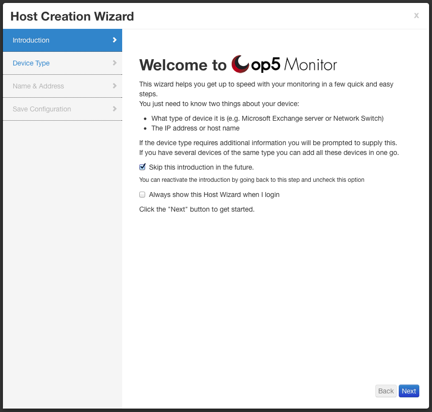
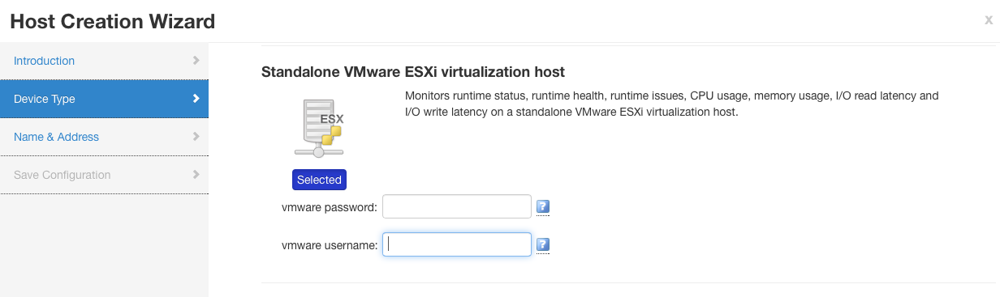
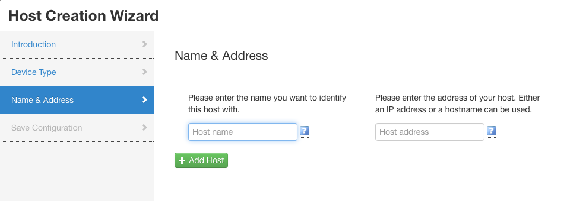
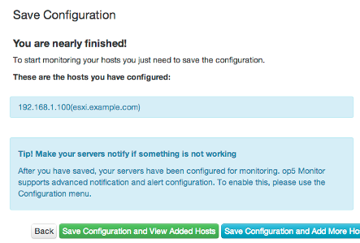

# Host Wizard

## About

Host wizard is a tool to create a new host based on management packs (preconfigured services).

## Adding a host using Host wizard

- Go to the **Configuration** menu and select **Host Wizard**
    
    This will open the Host Wizard popup
- On the first page you will find some information about the wizard and two options. **Skip this introduction in the future** will enable/disable the introduction page in the future. **Always show Host Wizard when I login** will enable/disable the wizard popup on each login.
    
    Click on **Next** to go to Device type selection
- Select the device type that corresponds to the host that you are adding. Multiple types can be selected.In this example we will add a ESXi host.
    
    Some device types might require some input, these are mandatory.When the correct device types has been selected click on **Next** to continue.
- Enter the host address (either the DNS-name or IP number) to the host and a hostname.
    
    If you would like to add more than one host using the same device type click on **+ Add Host** to get more address and name fields. Click on **Next** to continue.
- Review the information and click on **Save Configuration and View Added Hosts**. It is possible to
- the configuration and go back to adding more host, with different device types, by selecting **Save Configuration and Add More Hosts
    ** 

### Groups rights for Host Wizard

The Host Wizard requires the following rights for a user:
 configuration\_information

- Misc \> FILE
  - Api \> API config
  - Host \> Host add delete
  - Host Template \> Host template view all
  - Hostgroup \> Hostgroup view all
  - Management Pack \> Management pack view all
  - Configuration \> Export

For more information on group rights and how to use them see[Group Rights](Authorization_16482400.html#Authorization-group_rights).
