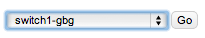
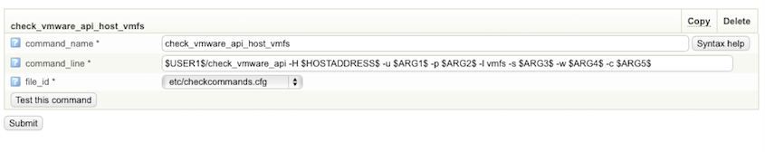
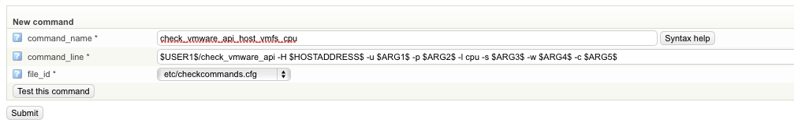
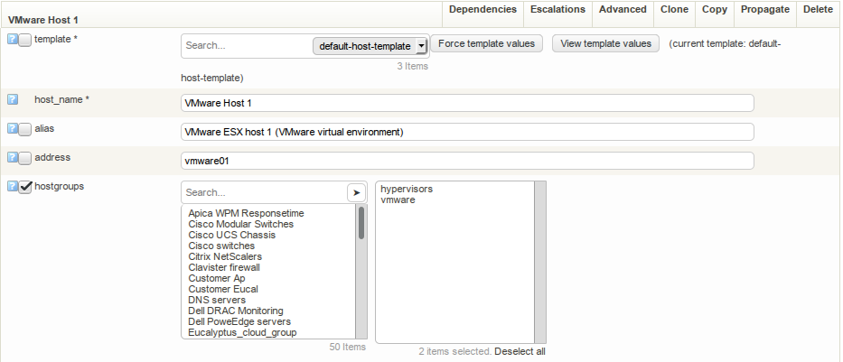
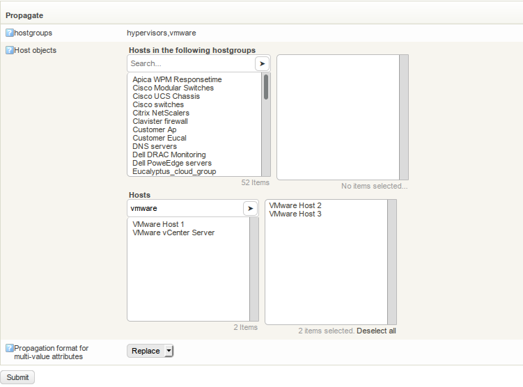
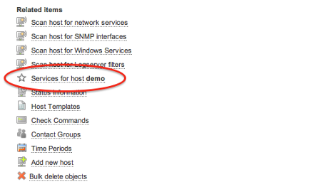
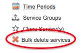
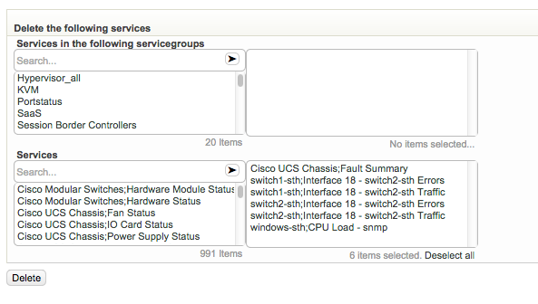

# Make things easy

# About

Making things easier to handle with OP5 Monitor.

# Cloning objects

## Cloning from an existing Host

To clone a host follow these steps:

- On the start page choose the host you like to create a profile of in the drop down list.
        
  - Click **Go**.
  - Click the **Clone** button
  - Select the services you wish to include
  - Select **Save as Profile**
  - Enter name and description for the profile you are creating
  - Click **Clone**

## Cloning services

If you want to create the same service check on multiple host first create the service check on the host, then clone the service check to one or more hosts.
 It is also possible to clone multiple services to one or more hosts or hostgroups.

### To clone a service to an other host

- Choose the Configure web menu.
  - Choose your host you want to copy from, then click **Go**
  - Click **Services for host...** in the 'RELATED ITEMS' menu.
  - Select the service (or one of the services) you want to clone then click on **Go** and then on **Clone**.
  - Select the service(s) you want to clone.
  - You can chose to clone the service(s) to a list of hosts, a hostgroup or all hosts in a hostgroup.
  - Click **Clone**.

# Copy objects

There are a number of objects that can be copied in the configuration tool and make a exact copy of the object, besides the name that must be unique.
 These are the objects that is possible to make a copy of:

- Hosts
  - Services
  - Hostgroups
  - Servicegroups
  - Check commands
  - Contacts
  - Contactgroups
  - Templates
  - Timeperiods
  - Host Dependencies
  - Service Dependencies
  - Host Escalations
  - Service Escalations

The copy will inherit all the values set on a object except the name.
 To illustrate this let us make a copy of a check command and modify it slightly:

- Click on **Configure** in the main menu:
  - Select **Commands** in the configuration menu
        
  - Search for a command to copy:
        
  - Click **Copy**
  - Make the changes you want. A new name is required. and i.e create a listing of the attached VMFS-storages:
        
  - Click **Submit**

This approach should apply to the most objects that are possible to copy.

# Propagate settings

To change the same directive on many objects of the same type can be a really time consuming work. This is where the propagate function in OP5 Monitor is very handy.
 With the propagate function you can copy the value of a directive from one object to one or many other objects of the same type.
 In the guide below we will use the propagate function to copy the hostgroups setting from one host to a couple of other hosts.

## To propagate a value of a directive

- On the start page choose the host you like to propagate a directive value from in the drop down list.
        
  - Click **Go**.
  - Click the tab **Propagate.**
        
  - Tick the check box for the configuration option, in this example we want to propagate the setting **hostgroup** to another host so it also is associated with the same hostgroups as VMware Host 1.
        

  - Click **Propagate selected settings** on the bottom of the page.
        ** **

  - Select the host objects (host or whole host groups) you like to propagate the settings to. In this example I want to propagate the value to the hosts VMware Host 2 and VMware Host 3.
        

  - Click **Submit**

  - In order to select more than one item at a time the following options are available:
  - Hold down the primary mouse button when selecting a series of items and all items will be moved to the right-hand box.

  - Click on the arrow next to the search box and all items matching the current search filter will be moved to the right-hand box.

  - To remove all items from the right-hand box, click "Deselect all"

  - Select how you want to propagate your settings with the **Propagation format for multi-value attributes option**.

        This option is only available when propagating multi-value options such as contacts and hostgroups for example. You can choose the following options:

        <table>
        <colgroup>
        <col width="50%" />
        <col width="50%" />
        </colgroup>
        <tbody>
        <tr class="odd">
        <td align="left">
<strong>Option</strong>

        
<strong>Description</strong>
</td>
        <td align="left">
Replace

        
Replace the destination values.
</td>
        </tr>
        </tbody>
        </table>

  - Click **Submit**.
  - Click **Save**.

If you have made changes in the setting on the object, as the host in the example above, you need to click **Submit** to save the changes before you can propagate them.

# Bulk delete

Bulk delete is powerful tool to remove several host or services at once.
 Bulk delete support the following objects:

- Hosts
  - Services
  - Hostgroups
  - Servicegroups
  - Contacts
  - Contactgroups
  - Commands
  - Time Periods

As an example, we will delete two services "Ping" on two different hosts, but the process is similar on all objects listed above.
 To delete multiple services this is preformed trough Configure

-  Select a host which services you want to delete and click **GO**
  - Click **Services for host** in the right menu.
         
  - Click on **Bulk delete objects
        **
  - Select the services that you want to delete and click **Delete**
        
  - Click **Delete**
