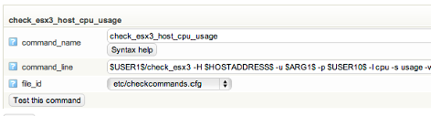

# Macros

## About

Macros can be used to a lot of things. It can for example be used for paths, passwords and retrieving information from OP5 Monitor.
You can read more about notification commands in Notification macros in the Notifications chapter.

## Pre-defined macros

By default OP5 Monitor has a number pre-defined macros. All from path to plugin folder to retrieving information about the last state of service check.
 Below is a list of some macros a complete lite of macros can be found in the Naemon documentation: <http://www.naemon.org/documentation/usersguide/macrolist.html>

| **Macro** | **Description** |
|----------------------------|-------------------------------------------------------|
| \$USER1\$ | Path to `/opt/plugins`. |
| \$ARG\#\$ | The Nth argument passed to the command. ex `$ARG9` | 
| \$HOSTNAME\$ | Short name for the host. |
| \$HOSTADDRESS\$ | Address of the host. |
| \$HOSTSTATE\$ | A string indicating the current state of the host ("UP", "DOWN", "UNREACHABLE") |
| \$SERVICEDISPLAYNAME\$ | An alternate display name for the service. |
| \$SERVICESTATE\$ | A string indicating the current state of the service ("OK", "WARNING", "UNKNOWN", "CRITICAL") |

## Custom macros

It is possible to create your own macros. This can be used to store passwords or user names for example. When creating custom macros, they should be added the file `/opt/monitor/etc/resource.cfg`.

A custom macro should use the `$USER#$` macro.

To define a password for a check, first add the macro in `resource.cfg`

```
# Password for vmware user
$USER10$=secretpassw0rd
```

After that add the macro to check command, in this example we use the `check_esx3_host_cpu_usage` check command.

- `command_name`: `check_esx3_host_cpu_usage`
- `command_line`: `$USER1$/check_esx3 -H $HOSTADDRESS$ -u $ARG1$ -p $USER10$ -l cpu -s usage -w $ARG2 -c $ARG3$`

 \


This check will use the following macros:

- **\$HOSTADDRESS\$** - Will get the address of the host from the configuration
- **\$ARG1\$** - Use the fist argument from the check command.
- **\$USER10\$** - Use the argument specified in resources.cfg with the same name.
- **\$ARG2\$** - Use the second argument from the check command.
- **\$ARG3\$** - Use the third argument from the check command.
