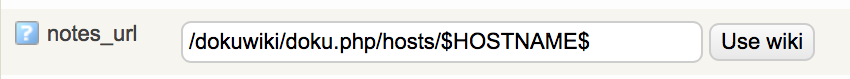
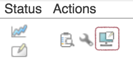

# Managing wiki pages

# Introduction

OP5 Monitor includes a wiki, which can be used for documenting any host or service, including hostgroups and service groups. It will generate individual pages for each. It also has built-in versioning, so you can view and track changes in wiki pages and restore an older version. You can use the wiki to document:

- hardware information, serial numbers, and other information about a host or service;
- workflows;
- how to act when there is a problem with a host or service.

The official Dokuwiki manual can be found here: <http://www.dokuwiki.org/manual>

# Creating a wiki page

To create a wiki page for a host or service:

1. Go to the host, service, hostgroup, or servicegroup where you seek to create a page;
2. Click the wrench icon to edit the page;
3. Click on the **Advanced tab;
    **
4. Scroll down to 'notes\_url' and click **Use wiki**. This will add a notes URL to a wiki page:
    
    Here are some default locations that clicking the button will generate. Note that each of these consider the Apache root content page as their root (that is: "/var/www/html"):
    object
    notes URL default
    host
    /dokuwiki/doku.php/hosts/\$HOSTNAME\$
    service
    /dokuwiki/doku.php/hosts/\$HOSTNAME\$/\$SERVICEDESC\$
    servicegroup
    /dokuwiki/doku.php/servicegroups/\$SERVICEGROUPNAME\$
5. Click **Submit**, then click to **Save** your configuration;
6. Find the object in List View and click on **Extra notes** icon in the Actions column. It looks like a pen against a white note on top of a monitor:
    
7. Click on **Create page**;
8. Edit the information and click on **Save.**

# Deleting a wiki page

If you edit a page and remove all its content, then DokuWiki will delete the page as well as its associated page name.
