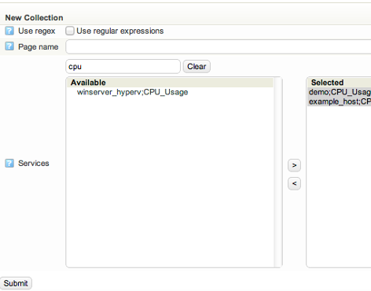
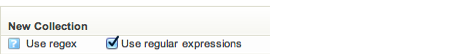
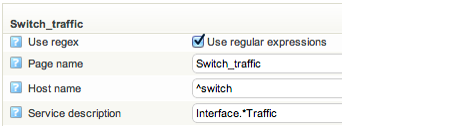
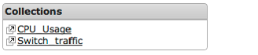

# Collections

## About

Collections provides the opportunity to collect graphs of different hosts and services on to one page. That way - as an example - you can display the traffic rates of all tape libraries.

## Creating a new collection

The setup of Graph Collections is done through the configuration page.
 Go to Configure and click on the **Graph Collections** icon.

 There are two ways to select which services to show in the graph, either use the GUI to select the services from the list or use regular expressions.

### GUI selection

Enter a collection name and select which services to put in the collection by selecting them from the list.
 

### Regex selection

Check the checkbox for **Use regex
** 
 The host and services is now selected by a regular expression.
 In the example below we select all graphs from the host which names starts with "switch" and services that contains "Interface" and "Traffic". Note that regular expressions are case sensitive.
 

## Viewing Collections

The collections are found under graphs in the main menu on the left and click on the **Collection icon
** 
 Note that his icon is only visible when at least one collection is created.
 All the collections are listed in the panel to the right.
 
