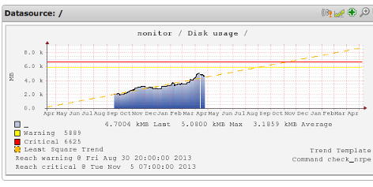
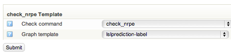

# Graph prediction

## About

A graph prediction plots a line across the graph to predict when it will cross the thresholds.

## Activate graph prediction

The graph prediction is not used by default. To enable graph prediction you have to change the template that is used for the specific check command.
 Edit the template for the check command, follow instructions in Changing Graph template.
 Select the template **lslprediction-label** and click on **submit**.

 This will change the layout of your graphs.
