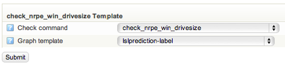

# Graph templates

# About

Graph templates controls how your graphs look. By changing the template for on check command you can customize how the graph for that check will look.

# Changing Graph template

By default a the template default is used for drawing graphs. This can be changed for a specific check command.
 To change the template for a check command go to **configuration** and select **graph templates**. Select a template that you would like to modify, then press **go**.
 
 Select the check command that will use this temple and select the template. There are several templates in the system by default.
 
