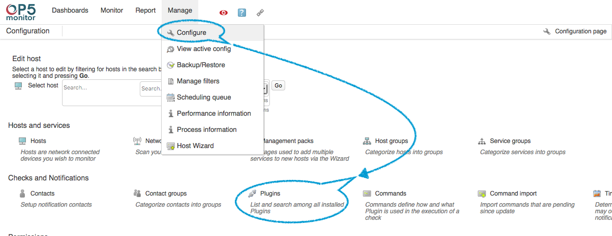
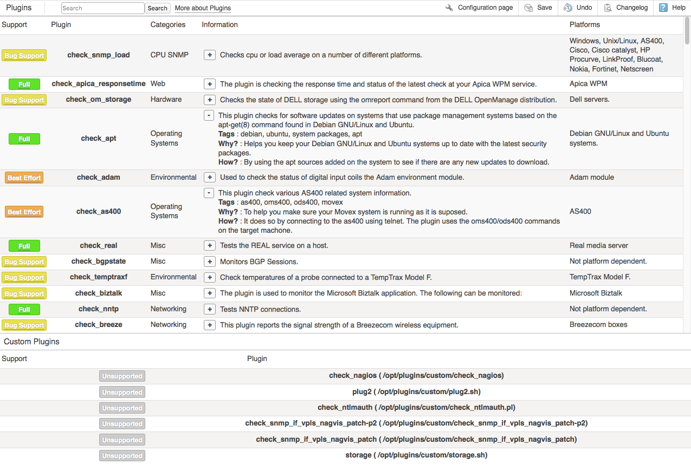

# Plugins

# Introduction

OP5 Monitor ships with many plugins: mature scripts that cover most monitoring needs. But what can you do if one of your corporate applications or specialized pieces of hardware cannot be monitored straight out of the box?
Often you can find a plugin at the [Nagios Exchange](https://exchange.nagios.org/). OP5 Monitor uses the same plugin format as Nagios Core. This means you can often download a plugin, place it into '/opt/plugins/custom/', import it into Configure, and start using it right away.
If you still cannot find a suitable plugin anywhere, you may consider writing your own plugin. Since the plugin interface is very straight-forward, anyone with a fair amount of UNIX scripting experience can do this. Obviously you would do this at your own risk, and without the resources of OP5 Support.
If you need help developing a plugin, you may also contact OP5 to get a quote for work from our Solutions Architects.

# Browsing plugins

The Configure interface contains a list of plugins that contains general information about the plugins shipped with OP5 Monitor. You can get either using the URL "https://{\$your.op5.server}/monitor/index.php/plugin/index" (substituting your OP5 server's FQDN for the {\$your.op5.server} variable), or from the TAC:

1. Open the *Manage* drop-down menu and click on *Configure*. Once there, click on the *Plugins* icon in the middle of the "Checks and Notifications" row:
    
2. This will bring you to a list of installed plugins, complete with descriptions of what each plugin does. The left-most column tells you OP5's ability to support you through defects with the specific plugin:
    

For more information on how to use these plugins and create new check commands, see [Commands.](https://kb.op5.com/display/DOC/Main+objects#Mainobjects-Commands)
