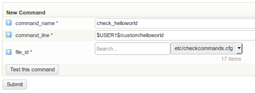

# Adding your first plugin to OP5 Monitor

## About

In this section we will create a very simple check plugin to demonstrate *OP5 Monitor*'s [plugin interface](The_plugin_interface.md). We will use basic tools, such as writing it in the Bourne shell (the original Unix shell language). The resulting plugin may not be very useful, but going through this process will teach you the necessary steps for creating your own monitoring plugins.

This tutorial requires that you have shell access to the server running *OP5 Monitor* as well as some basic Unix shell knowledge. If you are coming from the Windows world, take heart: you can now install PowerShell starting with version 7 of Red Hat Enterprise Linux (RHEL) and CentOS, on which OP5 Monitor runs. Follow along as best you can, and it will be worth your while.

Windows users may use [PuTTY](http://www.chiark.greenend.org.uk/%7Esgtatham/putty/latest.html) for terminal access via SSH and [WinSCP](https://winscp.net/eng/index.php) for file transfers via SFTP (SSH). MacOS, Linux, and other Unix users may use 'ssh' or 'scp' from a local terminal window.

## Creating the plugin

1. Open a SSH session to the host running OP5 Monitor.
2. Move to the custom plugins directory, create the file "helloworld", and make it executable:

    ``` {.bash data-syntaxhighlighter-params="brush: bash; gutter: false; theme: Confluence" data-theme="Confluence" style="brush: bash; gutter: false; theme: Confluence"}
    cd /opt/plugins/custom
    touch helloworld
    chmod 755 helloworld
    ```

3. Open the plugin with your favorite text editor and add the following code to the empty file.For Windows admins that are not familiar: the opening line is called a 'shebang' line because of the hash ('sharp') and exclamation point ('bang'). It tells the command shell which application will run this script. It serves the job of a suffix in DOS but allows argument values and other useful features:

    ``` {.bash data-syntaxhighlighter-params="brush: bash; gutter: false; theme: Confluence" data-theme="Confluence" style="brush: bash; gutter: false; theme: Confluence"}
    #!/bin/sh
    echo 'WARNING: Hello, world!'
    exit 1
    ```

4. Save and exit your text editor;
5. The shell script is now a usable check plugin. You can test it by executing it in the terminal and verifying that it exits with the return code "1" (warning state).
    For Windows admins: '\$?' is a shell variable that returns the last exit code. You can use this inside scripts as well, so that you can test for success or other states without writing more scripts.

    ``` {.bash data-syntaxhighlighter-params="brush: bash; gutter: false; theme: Confluence" data-theme="Confluence" style="brush: bash; gutter: false; theme: Confluence"}
    $ ./helloworld
    WARNING: Hello, world!
    $ echo $?
    1
    ```

## Using the plugin in OP5 Monitor

### Configuring the plugin as a check command

1. Go to the configuration page and enter the "Commands" section;

2. Add a new command with the following parameters:

    ``` {.text data-syntaxhighlighter-params="brush: text; gutter: false; theme: Confluence" data-theme="Confluence" style="brush: text; gutter: false; theme: Confluence"}
    command_name: check_local_helloworld
    command_line: $USER1$/custom/helloworld
    ```

    It should look like this in the configuration dialog:
    

3. Click "Submit" and save the configuration.

Now you may use your check command with a service as described in Adding a service.
