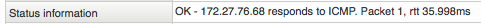

# The plugin interface

## About

A plugin is a small executable that takes optional command line parameters as input and

1. Performs a test
2. Reports a diagnostic message on stdout (will be shown in the web GUI)
3. Returns an exit code.

## Example

Execute `check_tcp` to test the port 80/tcp on 193.201.96.136

``` {.bash data-syntaxhighlighter-params="brush: bash; gutter: false; theme: Confluence" data-theme="Confluence" style="brush: bash; gutter: false; theme: Confluence"}
## /opt/plugins/check_tcp -H 193.201.96.136 -p 80
TCP OK - 0.043 second response time on port 80|time=0.042824s;0.000000;0.000000;0.000000;10.000000
## echo $?
0
## /opt/plugins/check_tcp -H 193.201.96.136 -p 143
Connection refused
## echo $?
2
```

 In the example above we first execute` check_tcp` to test that port 80/tcp on 193.201.96.136 responds, which it does, hence the exit code of 0.
 Then we check port 143/tcp on the same host and that port is not open, hence the result is Critical - exit code 2.
 The result output is actually built upon two parts divided by a | sign (pipe). The text on the

- left hand side of the | is the status information
  - right hand side of the | is the performance data.

The performance data is not mandatory but you need it if you want your plugin to be able to produce graphs for you in OP5 Monitor.

## Status information

The Status information is the text describing the result in human readable form. The plugin must print the status output to stdout when your plugin is executed.
 You will see it in the Status state information on the Service or Host information page.

 \


 This text can be anything, you like to use to describe the status situation for your plugin, including HTML.

## Performance data

The performance data is data displaying the result in numbers. The plugin must print the status output to stdout when your plugin is executed. It is also to produce performance graphs in OP5 Monitor.
 So if you want graphs from your plugin you need to have performance data in your output.
 The performance data is setup like this:
 `'label'=value[UOM];[warn];[crit];[min];[max]`
 Performance parts with descriptions*:*

**Part**

**Description**

label

The label can contain any characters. If space is included quotes are needed.

value

The plugin was able to check the service, but it appeared to be above some "warning" threshold or did not appear to be working properly

UOM

Can be any of:

- no unit assuming an integer as a value
- s - seconds (also us, ms)
- % - percentage.
- B- Bytes (also KB, MB, GB and TB)
- c - A continuous counter like bytes transmitted on an interface.

warn, crit, min, max

- Can all be null and trailing unfilled semicolons can be dropped.
- min and max is not needed if UOM is %.
- value, warn, crit, min and max must be of the same UOM.

## Example 2

Performance data output:
 `time=0.218901s;;;0.000000 size=42236B;;;0`
 The example 2 above shows a performance data output from a plugin with two values separated with one space in the output.

## Return code

The return code is the one that OP5 Monitor uses to determine what state the services is in. It may be one of the following:
 `0, 1, 2, 3`
 Any return code above 0 is to be known as **problem states**.
 The return codes in detail*:*

<table>
<colgroup>
<col width="33%" />
<col width="33%" />
<col width="33%" />
</colgroup>
<tbody>
<tr class="odd">
<td align="left"><p><strong>Nr</strong></p>
<p><strong>Name</strong></p>
<p><strong>Description</strong></p></td>
<td align="left"><p>0</p>
<p>Ok</p>
<p>The check did ok and everything seems to be working fine.</p></td>
<td align="left"><p>1</p>
<p>Warning</p>
<p>The plugin was able to check the service, but it appeared to be above some &quot;warning&quot; threshold or did not appear to be working properly</p></td>
</tr>
</tbody>
</table>
