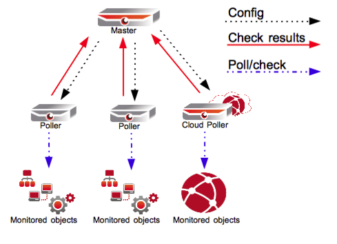

# Distributed Monitoring

## Introduction

The OP5 Monitor backend can easily be configured to be used as a distributed monitoring solution. The distributed model looks like this.

 \


In the distributed monitoring solution:

- All configuration is performed on the master node.
  - All new configuration is distributed to the pollers.
  - Each poller node is responsible for its own host group (site).
  - The master node has all the status information.
##
Before we start

### Prerequisites

There are a few things you need to take care of before you can start setting up a distributed monitoring solution. You need to make sure you have at least two servers of **the same architecture **(32/64 bit), both running the **same** version of OP5 Monitor.

More specifically, make sure that:

- OP5 Monitor version \>=7.2.1 is installed and running on all servers.
  - The following TCP ports must be opened on the poller nodes, to allow master nodes to successfully communicate with poller nodes:
  - 22 (SSH), used for distributing configuration from master to poller nodes.
  - 15551 (merlin), used for state communication, such as check results.
  - All server names must be resolvable by DNS or manually via */etc/hosts*.
  - All servers' system clocks must be synchronized, preferably by NTP.
  - The host group which the poller will be responsible for must be set up on the master, in advance. At the bare minimum, the host group must contain at least one host, with at least one contact and one service.

### Cluster state information

In the OP5 Monitor system, a tool called *mon* can be found via the command line (accessed via SSH). To view the current cluster state, run the command like this:

`mon node status`

All known nodes, the local one, peers and pollers, should be displayed, including their current state. A properly synchronized and online cluster should display all nodes as *ACTIVE*. Beware of any text colored in red.

More information regarding the mon command can be found here.

## The configuration

### Setting up the new distributed monitoring solution

This distributed configuration will have one master and one poller node:

- master01
  - poller01

The poller will be monitoring a host group named *se-gbg*.

#### Master-side configuration

1. Make sure that the host group which the poller will be responsible for is already configured, saved and can be found in the status pages of the OP5 Monitor web interface. Remember, at the bare minimum, the host group must contain at least one host, with at least one contact and one service.

2. In case of running a load balanced setup with peered masters, make sure all peers are fully connected and synchronized according to mon node status. The following steps (starting from step 3), should be performed on all masters.

3. Log onto the master via SSH, as root. OP5 recommends establishing non-root accounts with sudo privileges.

4. To verify that the host group exists, print its current host members: `mon query ls hostgroups -c members name=se-gbg`

5. Add the new poller to the configuration:

    `mon node add poller01 type=poller hostgroup=se-gbg takeover=no`
    **Before continuing, make sure that the *master* can resolve the name, *poller01* in this case, by DNS or manually via *'/etc/hosts'.***

6. Set up SSH connectivity between the master and the poller:

        mon sshkey push poller01asmonitor mon sshkey push poller01

7. *Optional* – "Monitor only" key exchange

    For increased security, OP5 recommends creating the public SSH key for the monitor user from the master to pollers and placing within the authorized\_keys file. This enables monitor to securely exchange configuration data without first requiring root keys to be exchanged.

    1.  **Log onto the master via SSH as root to run these commands:**

        ``` {.bash data-syntaxhighlighter-params="brush: bash; gutter: false; theme: Confluence" data-theme="Confluence" style="brush: bash; gutter: false; theme: Confluence"}
        mkdir -p /opt/monitor/.ssh
        chown monitor:root /opt/monitor/.ssh
        su monitor
        ssh-keygen -t rsa
        scp ~/.ssh/id_rsa.pub root@poller.company.com:
        ```

    2.  **Log on to the poller via SSH (as root, for one last time):**

        ``` {.bash data-syntaxhighlighter-params="brush: bash; gutter: false; theme: Confluence" data-theme="Confluence" style="brush: bash; gutter: false; theme: Confluence"}
        mkdir -p /opt/monitor/.ssh
        chown monitor:root /opt/monitor/.ssh
        mv ~/id_rsa.pub /opt/monitor/.ssh
        su monitor
        touch ~/.ssh/authorized_keys
        cat ~/.ssh/id_rsa.pub >> ~/.ssh/authorized_keys
        more ~/.ssh/authorized_keys
        rm ~/id_rsa.pub
        ```

8. Add the master to the poller's configuration:
    `mon node ctrl poller01 mon node add master01 type=master connect=no`**
    **

#### Pushing the configuration

In case of peered masters, **perform these steps only on *one* of the masters**.

1. Restart naemon on the master to prepare for configuration push.
    `service naemon restart `
2. Push configuration from the master to the new poller:
    `asmonitor mon oconf push poller01 `
3. Restart OP5 Monitor on the new poller:
    `mon node ctrl poller01 mon restart`
4. Restart OP5 Monitor on all masters:
    `mon node ctrl --self --type=peer mon restart`

### Adding a new host group to a poller

A poller can handle several host groups, which is a simple way of increasing a poller's scope.

#### Master-side configuration

In case of running a load balanced setup with peered masters, make sure that all peers are fully connected and synchronized according to mon node status first. The steps below should be performed on all masters.

1. Log on to the master via SSH, as root.
2. Edit the file */opt/monitor/op5/merlin/merlin.conf *using a text editor:
    `nano /opt/monitor/op5/merlin/merlin.conf`
3. Find the configuration block related to the poller. Within this block, append the new host group onto the *hostgroup* setting's value, prefixed by a comma. In this case a host group called *se-sth* is added.
    In this example, the line originally looked like:
    `hostgroup = se-gbg`
    And then once the new host group had been added:
    `hostgroup = se-gbg,se-sth`
    Note that the hostgroups should be **comma-separated only**, without any white space. Otherwise the error "`Incompatible object config (sync triggered)`" may arise during the naemon restart.

Finish up by pushing the configuration.

### Removing a poller

In this instruction we will remove a poller called:

- poller01

The poller will be removed from the master's configuration, and then all distributed configuration on the poller will be removed.

#### To remove a poller

In case of peered masters, **perform these steps only on *one* of the masters**.

1. Log on to the master via SSH, as root.

2. Remove the poller from the configuration on all masters:
    `mon node ctrl --self --type=peer mon node remove poller01`

3. Restart OP5 Monitor on all masters:mon node ctrl --self --type=peer mon restart` `
4. Restart OP5 Monitor on the poller:
    `mon node ctrl poller01 mon restart`

### File synchronization

Information regarding how to synchronize files and/or directories from a master to a poller can be found in the File synchronization chapter.

### Notify through master

Depending on the setup of a poller, it might be difficult to send notifications directly from the poller. This could be due to a non-existing or non-accessible SMS/SMTP gateway. In such scenarios it is possible to send notifications through the master instead.

#### Master-side configuration

The steps below should be performed on all masters. This will matter most when running a load balanced setup with peered masters:

1. Log onto the master via SSH, as root.
2. Edit the file */opt/monitor/op5/merlin/merlin.conf *using a text editor. For example:
    `nano /opt/monitor/op5/merlin/merlin.conf`

3. Find the configuration block related to the poller. Insert the option *"notifies = no"* ** at the end of the block:

    **example of poller without notification, master side**

    ``` {.bash data-syntaxhighlighter-params="brush: bash; gutter: false; theme: Confluence" data-theme="Confluence" style="brush: bash; gutter: false; theme: Confluence"}
    poller poller01 {
      address = 192.0.2.50
      port = 15551
      takeover = no
      notifies = no
    }
    ```

4. Restart OP5 Monitor:
    `mon restart`

#### Poller-side configuration

1. Log onto the poller via SSH, as root.
2. Edit the file */opt/monitor/op5/merlin/merlin.conf *using a text editor:
    `nano /opt/monitor/op5/merlin/merlin.conf `
3. Find the *module* configuration block. Insert the option *"notifies = no"* ** at the end of the block:

    **example of poller without notification, poller side**

    ``` {.bash data-syntaxhighlighter-params="brush: bash; gutter: false; theme: Confluence" data-theme="Confluence" style="brush: bash; gutter: false; theme: Confluence"}
    module {
      log_file = /var/log/op5/merlin/neb.log;
      notifies = no
    }
    ```

4. `Restart OP5 Monitor:mon restart`

## More information

For more information and advanced examples, please have a look at the How-To document found in the merlin project.
