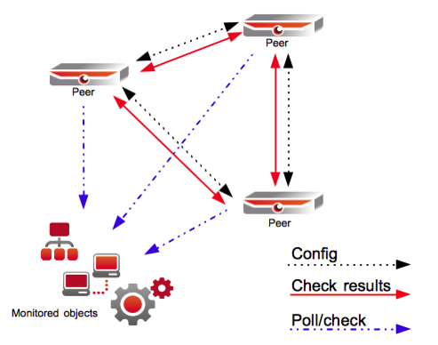

# Load balanced monitoring

## Introduction

The OP5 Monitor backend can easily be used as a load balanced monitoring solution. The load balanced model looks like this.

 \

The load balanced solution have two or more peers in the same environment sharing the same tasks (the hosts to monitor). Any new configuration made on any of the peers is distributed to the other peers. The peers divides the load automatically and keep tracks of when one peer go down, the other(s) take over the job.

## Before we start

### Prerequisites

There are a few things you need to take care of before you can start setting up a load balanced monitoring. You need to make sure you have at least two servers of **the same architecture **(32/64 bit), both running the **same** version of OP5 Monitor.

More specifically, make sure that:

- OP5 Monitor version \>=5.2 is installed and running on all servers.
  - The peers will connect to each other on the following TCP ports, that must be opened up for successful communication:
  - 22 (SSH), used for distributing configuration between peers.
  - 15551 (merlin), used for state communication, such as check results.
  - All server names must be resolvable by DNS or manually via */etc/hosts*.
  - All servers' system clocks must be synchronized, preferably by NTP.
  - All nodes should be in the same geographical location. If distribution is required, please look at [Distributed Monitoring](Distributed_Monitoring)

### Cluster state information

In the OP5 Monitor system, a tool called *mon* can be found via the command line (accessed via SSH). To view the current cluster state, run the command like this:

`mon node status`

All known nodes, the local one, peers and pollers, should be displayed, including their current state. A properly synchronized and online cluster should display all nodes as *ACTIVE*. Beware of any text colored in red.

More information regarding the mon command can be found [here](The_mon_command).

## The configuration

### Setting up the load balanced solution

This load balanced configuration will be set up with two peered nodes ("peers"):

- peer-blue
  - peer-green

#### To set up a load balanced monitoring solution

1. Log on to peer-green via SSH, as root.

2. Add peer-blue to peer-green's configuration:
    `mon node add peer-blue type=peer`
3. Set up SSH connectivity towards all of peer-green's configured peers:

    mon sshkey push --type=peer
    asmonitor mon sshkey push --type=peer

4. Log on to peer-blue via SSH, as root.
5. Add peer-green to peer-blue's configuration:
    mon node add peer-green type=peer
6. Set up SSH connectivity towards all of peer-blue's configured peers:
    mon sshkey push --type=peer
    asmonitor mon sshkey push --type=peer
7. Push peer-blue's configuration to peer-green:
    asmonitor mon oconf push peer-green
8. Restart OP5 Monitor on all nodes:
    `mon node ctrl --self -- mon restart`

9. After a minute or two, make sure that the peers are fully connected and synchronized according to [mon node status](#Loadbalancedmonitoring-monnodestatus).

In case you have been running OP5 Monitor for a while already, and you are now about to convert your standalone server to a load balanced setup, you should think of peer-blue as your current OP5 Monitor server, and peer-green as the new peer. This is important to get right, as you may otherwise push the new peer's empty host/service object configuration to the current server, effectively overwriting your actual configuration. If in doubt, please consult your technical contact at op5.

In addition, you will also want to copy /opt/monitor/var/status.sav from your original master to the new peer, in order for them to agree on host/service comments, acknowledgements, scheduled downtimes etc. issued on the original master before the new peer was added. To achieve this, you need to stop the Monitor service with on both nodes before copying the file and then start the Monitor service again on both nodes:

On both peers: mon stop

On peer-blue: scp /opt/monitor/var/status.sav peer-green:/opt/monitor/var/status.sav

On both peers: mon start

### Adding another peer

In this instruction we will have the following hosts:

- peer-green
- peer-blue
- peer-red (This is the new one.)

#### To add a new peer

1. Log on to peer-red via SSH, as root.

2. Add all the previously existing peers to peer-red:
    mon node add peer-green type=peer
    mon node add peer-blue type=peer
3. Set up SSH connectivity towards all of peer-red's configured peers:
    mon sshkey push --type=peer
    asmonitor mon sshkey push --type=peer
4. Add peer-red to all other nodes:
    mon node ctrl --type=peer mon node add peer-red type=peer
5. Log on to all previously existing peers via SSH, as root, and set up SSH connectivity towards all their configured peers (including the new peer-red):
    `mon sshkey push --type=peer`
    `asmonitor mon sshkey push --type=peer`

6. On any one of the previously existing peers (green or blue in this case), push its configuration to the new peer:
    `asmonitor mon oconf push peer-red `
7. Finally, on any of the peers (old or new), trigger a full restart OP5 Monitor on all nodes:
    `mon node ctrl --self -- mon restart`
8. After a minute or two, make sure that the peers are fully connected and synchronized according to [mon node status](#Loadbalancedmonitoring-monnodestatus).

### Removing a peer

In this instruction we will remove a peer called:

- peer-red

The peer will be removed from all other peers' configuration.

#### To remove a peer

1. Log on to peer-red via SSH, as root.
2. Remove oneself from all other peers:
    `mon node ctrl --type=peer mon node remove peer-red\; mon restart`

    The backslash (\\) in front of the semi-colon (;) is important to get right in this command.

3. Remove all local configuration:
    `mon node remove $(mon node list --type=peer) `

4. Restart OP5 Monitor:mon restart
5. Unless peer-red isn't powered off, the node will be running with the same configuration as its previous peers, but as a standalone server, performing all host/service check on its own.

### File and directory synchronization

Information regarding how to synchronize files and/or directories between peers can be found in the [File synchronization](File_synchronization) chapter.

## More information

For more information and advanced examples, please have a look at the [How-To document](https://kb.op5.com/display/MERLIN/Merlin+How-To) found in the merlin project.
