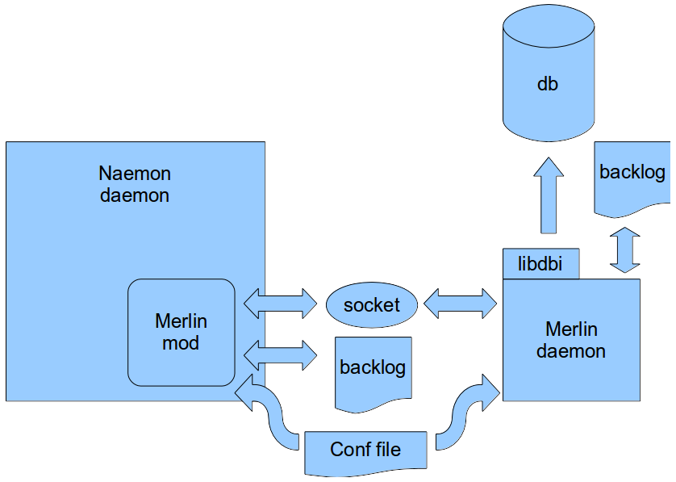

# Merlin

# About

Merlin is the backend engine for a load balanced and/or distributed setup of OP5 Monitor.
Merlin, or Module for Effortless Redundancy and Load balancing In Nagios, allows the OP5 Monitor processes to exchange information directly as an alternative to the standard nagios way using NSCA.
Merlin functions as backend for Ninja by adding support for storing the status information in a database, fault tolerance and load balancing. This means that Merlin now is responsible for providing status data and acts as a backend, for the Ninja GUI.

# Merlin components

## merlin-mod

merlin-mod is responsible for jacking into the NEBCALLBACK\_\* calls and send them to a socket. If the socket is not available the events are written to a backlog and sent when the socket is available again.

## merlind

The Merlin deamon listens to the socket that merlin-mod writes to and sends all events received either to a database of your choice (using libdbi) or to another merlin daemon. If the daemon is unsuccessful in this it writes to a backlog and sends the data later.

## merlin database

This is a database that includes Naemon object status and status changes. It also contains comments, scheduled downtime etc.

## Illustration

This picture illustrates the components described above
 
