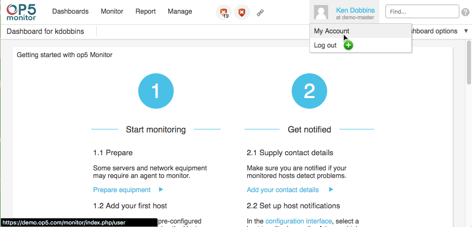
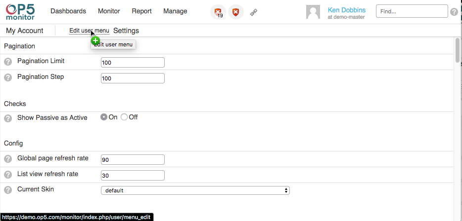
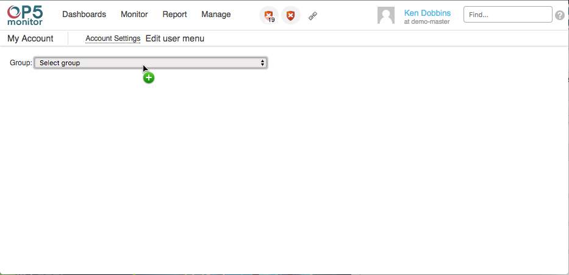
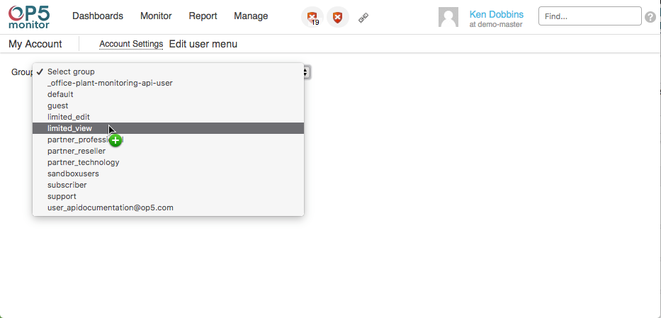
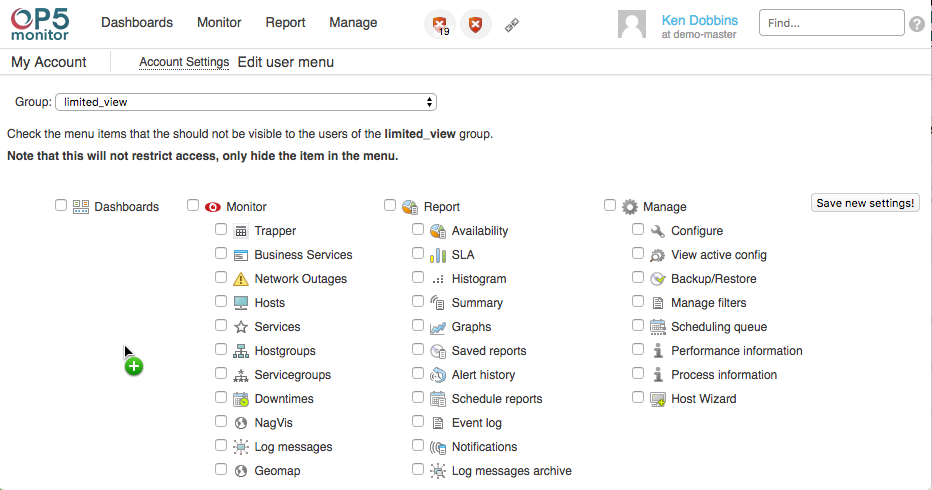

# User Menus

## About

It is possible for an administrator to customize users menu.

This can be uses to limit the menu options for users that are not allowed to use certain parts of OP5 Monitor.

## Customizing

Full access users have complete control over what other user\_group have available in the OP5 menu.

\*\*Please be aware that menu's access is controlled at the user\_group level only, it is not possible to control on a user by user basis.\*\*
\*\* To make a user\_group available to edit the User Menu, the "Access Rights" in the "Misc" section of the groupright page must be unchecked. All other grouprights are allowed\*\*

You can follow the following procedure to edit the user menu for a user\_group.

1. Click on your user name in the top right of the OP5 GUI and click on "My Account" as shown in the below image.

 \

2. At This point you should be at the "My Account" page.
    Now you will click on "Edit user menu" as shown in the below image.

 \

3. This brings us to the "Edit user menu" page.
    You will want to select a user group from the drop down as shown in the below images.

 \

 \

4. Now we are where the magic can happen.
    This page will enable you to remove links and menus from the user\_groups GUI. Each option will hide that menu item when it is checked. You can hide an entire menu by selecting the main menu title, or select individual areas from a menu.
    Here is an image of what you will be seeing.

 \

    Be sure to click "Save new settings!" when you finish editing your user menus.

## Menu Options Selection Details

This is a table of what each individual option hides from the user.

|Dashboards | This removes the actual "Dashboards" menu, however the user will still see the default dashboards assigned to that user. They will be still be able to edit the dashboard through the active dashboard options menu on the right of the dashboard |

|  | Menu | Business Service Page | Host Page | Service Page |
| --------------- | --------------- | -------------------------------------------------- | -------------------------------------------------- | -------------------------------------------------- |
| Monitor | Removes Entire Menu From GUI |  |  |  |
| Trapper | Removes Item From Menu |  |  |  |
| Business Services | Removes Item From Menu |  |  |  |
| Network Outages | Removes Item From Menu |  |  |  |
| Hosts | Removes Item From Menu |  |  |  |
| Services | Removes Item From Menu |  |  |  |
| Hostgroups | Removes Item From Menu |  |  |  |
| Servicegroups | Removes Item From Menu |  |  |  |
| Downtimes | Removes Item From Menu |  |  |  |
| NagVis | Removes Item From Menu |  |  |  |
| Log messages | Removes Item From Menu |  |  |  |
| Geomap | Removes Item From Menu |  |  |  |
| Report | Removes Entire Menu From GUI |  Options \> Report |  Options \> Report |  Options \> Report |
| Availability | Removes Item From Menu |  Options \> Report \> Availability **Requires Report Menu Item Enabled to View In Options** |  Options \> Report \> Availability **Requires Report Menu Item Enabled to View In Options** |  Options \> Report \> Availability **Requires Report Menu Item Enabled to View In Options** |
| SLA | Removes Item From Menu |  |  |  |
| Histogram | Removes Item From Menu |  Options \> Report \> Histogram **Requires Report Menu Item Enabled to View In Options** |  Options \> Report \> Histogram **Requires Report Menu Item Enabled to View In Options** |  Options \> Report \> Histogram **Requires Report Menu Item Enabled to View In Options** |
| Summary | Removes Item From Menu |  |  |  |
| Graphs | Removes Item From Menu |  Options \> Links \> Graphs |  Options \> Links \> Graphs |  Options \> Links \> Graphs |
| Saved reports | Removes Item From Menu |  |  |  |
| Alert history | Removes Item From Menu |  Options \> Report \> Alert history **Requires Report Menu Item Enabled to View In Options** |  Options \> Report \> Alert history **Requires Report Menu Item Enabled to View In Options** |  Options \> Report \> Alert history **Requires Report Menu Item Enabled to View In Options** |
| Schedule reports | Removes Item From Menu |  |  |  |
| Event log | Removes Item From Menu |  Options \> Report \> Event log **Requires Report Menu Item Enabled to View In Options** |  Options \> Report \> Event log **Requires Report Menu Item Enabled to View In Options** |  Options \> Report \> Event log **Requires Report Menu Item Enabled to View In Options** |
| Notifications | Removes Item From Menu |  Options \> Links \> Notifications |  Options \> Links \> Notifications |  Options \> Links \> Notifications |
| Log messages archive | Removes Item From Menu |  |  |  |
| Manage | Removes Entire Menu From GUI |  |  |  |
| Configure | Removes Item From Menu |  Options \> Configuration \> Configure |  Options \> Configuration \> Configure |  Options \> Configuration \> Configure |
| View active config | Removes Item From Menu |  |  |  |
| Backup/Restore | Removes Item From Menu |  |  |  |
| Manage filters | Removes Item From Menu |  |  |  |
| Scheduling queue | Removes Item From Menu |  |  |  |
| Performance information | Removes Item From Menu |  |  |  |
| Process information | Removes Item From Menu |  |  |  |
| Host Wizard | Removes Item From Menu |  |  |  |