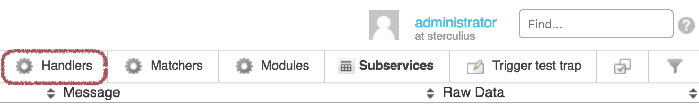
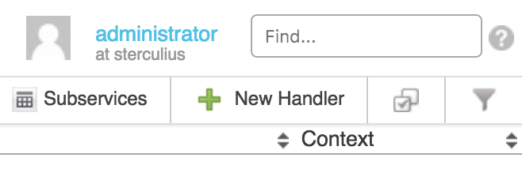
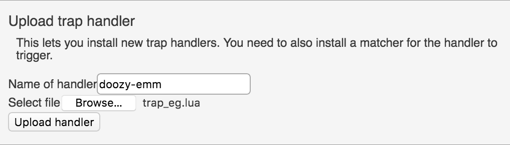
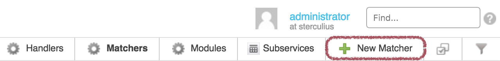
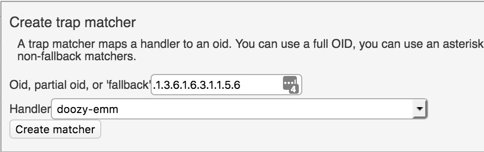
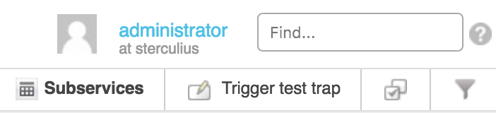
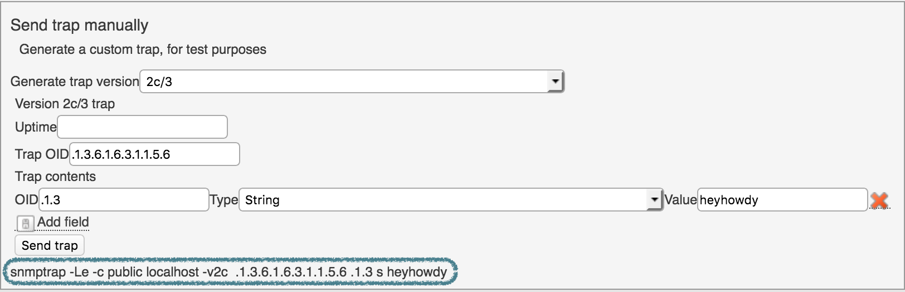

# OP5 Trapper

## About

In this chapter we will cover the Trapper extension.

## Preface

Throughout the manual we may use the terms 'trap' from SNMP v1 and 'notification' from SNMP v2 interchangeably, except the places where it is stated explicitly. For the sake of readability, we will also use foreshortened, fake examples of SNMP OIDs – e.g.: ".1.1", ".1.2", ".1.3". You will need to substitute real OIDs into your instances.

## Workflow

## Quick Start

This is an overview of the screens and steps to create a Trapper trap. The sections after this will cover more of the details. The important part is that you need at least one handler before you can create any matchers -- in other words, you need a Lua script to handle incoming SNMP data before the matchers can act on the data.

1. Create a new Lua snippet with your favorite text editor and set values for the desired parameters. You can make this a normal text file, and the contents can be as simple as the one line in this example. We provide more advanced examples in the upcoming handlers section(OP5 Trapper):

    |  **matcher example** |
    | ------------------------------- |
    | `result.state = STATE.WARNING ` |

2. Upload the handler.

    1.  From the TAC, go to "Monitor -\> Trapper", then click on the Handlers button in the Listview banner. You can also use the URL "https://{your.op5.svr}/monitor/index.php/listview?q=%5Btrap\_handlers%5D%20all\#", replacing "{your.op5.svr}" with your Monitor's FQDN;

     \


    2.  Click on New Handler, which will open a dialogue pop-up on the same page:

     \


    3.  Enter a name for the handler and select the handler that should be uploaded:

     \


    4.  Click on Upload handler to start the upload.

3. Create a new matcher --

    1.  Click on the **Matchers** button to get the Matchers listview;

    2.  Click on New Matcher from the banner:

     \


    3.  The pop-up dialogue, which is cut off in this screen shot, reads:
        *"A trap matcher maps a handler to an oid. You can use a full OID, you can use an asterisk as a wildcard, or you can use the string "fallback" to only run your matcher when there are no matching, non-fallback matchers."*

     \


    4.  Select the appropriate handler, based in this case on our work above;

    5.  Click on **Create matcher**.

4. Test the new matcher or handler --

    1.  Click on the **Subservices** button;

    2.  Click on "**Trigger test trap**" to get the next pop-up dialogue:

     \


    3.  Enter the information requested by the pop-up:

     \


    You need to provide some very specific details. We have an example based in the above screenshot. We will get into the meanings later.
   
    Notice the last line of text at the bottom of the pop-up. This is the command-line 'snmptrap' syntax being generated by the fields above. The default syntax before any entries would read:

    `snmptrap -Le -c public localhost -v2c    i`

    The results from these screen shots will read:

    `snmptrap -Le -c public localhost -v2c  .1.3.6.1.6.3.1.1.5.6 .1.3 s heyhowdy`

    4.  Click on Send trap.

## Matchers

Note: The handler must be created before the matcher!

A matcher is a rule which defines which trap that should be processed by which handler. A trap matcher maps a handler to an OID (object identifier). You can use a full OID, you can use an asterisk as a wildcard, or you can use the string "fallback" to only run your matcher when there are no matching, non-fallback matchers.

Example: `.1.3.6.1.\*`

Keep in mind that a trap could be matched to more than one matcher. Fallback will only be used if it’s impossible to match the trap with any of the other matchers.

## Handlers

A handler is a rule that defines what should be done when an OID is matched by a matcher.

---------------------------------------------------------------------
**Parameter**            **Valid state values**
------------------------ --------------------------------------------
`result.host`            Host name; should match an existing host.

`result.message`         Status information.

`result.notify`          Updates a passive service check even if there is no state change. It is recommended to enable this feature if the notification text might change even though the state remains the same. 
                         The available options are: \

                             - NOTIFY.ALWAYS \
                             - NOTIFY.NEW_STATE \

`result.service`         Service description; should match an existing service in order to be mapped to that service and visible outside Trapper.

`result.state`           Sets the event state. 

                         The available states are: \

                             - STATE.OK \
                             - STATE.WARNING \
                             - STATE.CRITICAL \

                         This parameter is mandatory!

`result.tag`             Subservice name; will default to ‘default’. Useful if several different SNMP traps should be mapped to the same service.
---------------------------------------------------------------------


| **OID variable** | **Value** |
| -------------------- | ---------------------------------------- | 
| `trap.date.year` | Year |
| `trap.date.month` | Month |
| `trap.date.day` | Day |
| `trap.date.weekday` | The number of a day in a week, starting from Sunday: |
| | 1. Sunday |
| | 2. Monday |
| | 3. Tuesday |
| | 4. Wednesday |
| | 5. Thursday |
| | 6. Friday |
| | 7. Saturday |
| `trap.fields` | Traps’ variable bindings in a key-value form. |
| | `trap.fields[ ".10.10" ]` will evaluate to the value of variable binding with oid `.10.10`. Note the quotes in the example: OIDs are strings and all strings must be enclosed on quotes. |
| | An alternative, shorter, syntax to access `trap.fields` is: `trap[[ .10.10 ]]`. |
| `trap.host` | The host that have sent the trap. |
| `trap.oid` | The object identifier (OID) of the trap. |
| `trap.timestamp` | Trap date and time in Unix time format. |
| `trap.time.hour` | Hour |
| `trap.time.minute` | Minute |
| `trap.time.second` | Second |

### Context

Variables used in handler (as well as trap and result structures) exist in scope of one handler call and their values do not persist across different handler calls, even between the calls done

While processing the same trap (e.g. when the same handler matched the same trap several times). If there is a need to retain values between different trap calls the special associative array \`context\` could be used:

`context[ "name" ] = <value>`

To retrieve the saved value just refer to the context with the same key:

`var = context[ "name" ] or <default value>`

Code containing context variables can be found in the section [Code examples](https://kb.op5.com/display/DOC/op5+Trapper#op5Trapper-Codeexamples).

### Actions

| **Action** | **Description** |
| --------------- | ---------------------------------------- |
| `action.reject()` | Stop processing this trap by this and all following handlers and drop it. |
| `action.ignore()`| Stop processing this trap by this handler and proceed to next handler if any. |
| `action.done()` | Stop the handler normally; useful to return from deep nested constructions. |

### Code examples

#### Example 1 - Basic handler

This is a very basic handler that will set the state to "Critical". result.state is the only mandatory parameter.

- very basic handler: `result.state=STATE.CRITICAL`

#### Example 2 - Conditional state including historical data

A device periodically sends a trap with the OID `.1.1` with its temperature in variable binding `.10.10`. A temperatures below 40 is considered OK and above 100 a problem. Between 40 and 100 we want the state to be WARNING if the temperature increases and OK state if it decreases.

- Temperature warning:

```
result.service = "Temperature"
t = trap.fields[ ".10.10" ]
if t < 40 then
result.state = STATE.OK
elseif t > 100 then
result.state = STATE.CRITICAL
else
prev_t = context[ "temperature" ] or 0
 if t > prev_t then
      result.sate = STATE.WARNING
else
      result.state = STATE.OK
  end
end
context[ "temperature" ] = t
```

#### Example 3 - Multiple occurrences

A device can send us a trap with the OID \`.1.1\`. When this trap is received the service "Detections" should normally change state to WARNING but if 3 such traps are received within two minutes the service state should change to CRITICAL.

- Multiple occurrences:

```
result.service = "Detections"
time_prev_prev = context[ "prev-prev" ] or 0
time_prev = context[ "prev" ] or 0
time = trap.timestamp
if time - time_prev_prev < 120 then
result.state = CRITICAL
else
result.state = WARNING
end
context[ "prev-prev" ] = time_prev
context[ "prev" ] = time
```

The timestamps of two previously received traps are used to calculate the time difference and at the end the handler updates the timestamps.

## Modules

To include "module-name" in a handler has the same effect as including the body of the module "module-name" in the handler. This may be convenient when multiple handlers share identical code sections.

## Language

Handlers DSL is created on top of a subset of the Lua programming language. The [Lua Reference Manual](http://www.lua.org/manual/5.1/) is a good source if you need more information about the language.

Note that handlers run in separate secure sandboxes, and potentially dangerous functionality, like access to the file system, will not be available.

Please note that comments in Lua have the following syntax:

- Comments:

```
-- This is a one-line comment.
-- Here is another one-line comment.

--[[
In contrast, this is
a multi-line comment as
a bare-bone haiku.
 --]]
```

## Map to service

In addition to result.state the following parameters are also mandatory:

- result.service - The service in trapper must have the exact same name as the service on the node. A specific script might be needed if the node name shows up as an IP address in trapper.
- result.message

A service must either already exist on the host that generates the traps or it needs to be created if the traps should be visible outside trapper:

- service\_description: Must exactly map the value used for result.service.
- check\_command = bizproc\_pas
- active\_checks\_enabled = No
- passive\_checks\_enabled = Yes
- max\_check\_attempts = 1

