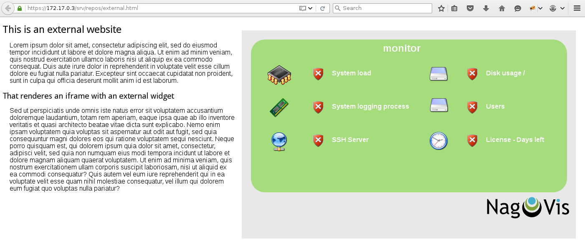

# External Widget configuration

## About

This guide will take you through the process of setting up a NagVis and Listview widgets as an external widgets, so you can display them on external websites. External widgets are often used to set up various status displays on large monitors.

## Local user account

To be able to display content in a external widget, you will need a local user account configured in OP5 Monitor. TODO: Insert link to Local user configuration (missing)

- Create a new local user account via the OP5 Monitor web interface. In this example, the user is called *externalview.*
- Make sure the new user is allowed to view the widget, by adding proper group rights. Preferably, only add a minimum set of rights.
- Log on to the new user account, using the ordinary OP5 Monitor web interface.

## Configuration

1. Log on to the OP5 Monitor system via SSH, as root, and execute the following command:

    ```
    cp -pv /opt/monitor/op5/ninja/application/config/{,custom/}external_widget.php
    ```

2. Edit the newly created file using your favorite text editor. For example, like this:

    ```
    nano /opt/monitor/op5/ninja/application/config/custom/external_widget.php 
    ```

3. The file will contain several comment blocks (the text within /\* ... \*/), and a few lines starting with *\$config* that will need to be set properly.

    1.  Set the *username* parameter to the name of the user that was added in the instructions found in the beginning of this article:

        **username**

        ```{.php}
        $config['username'] = 'externalview';
        ```

    2.  Set the *groups* parameter to the group that the user is a member of. Since the user's password is not configured, groups cannot be looked up automatically, and must be manually specified. In this case, the group is set to *guest* like this:

        **single group**

        ``` {.php}
        $config['groups'] = array('guest');
        ```

        Alternatively, in case of several group memberships:

        **multiple groups**

        ``` {.php}
        $config['groups'] = array('guest', 'external_users');
        ```

    3.  Set the *widgets* parameter according to one of the examples below:

        1. NagVis Example

            **external\_widget.php**

            ```{.php}
            $config['widgets']['company_network'] = array(
                'name' => 'nagvis',
                'friendly_name' => '',
                'setting' => array(
                    'width' => 1280,
                    'height' => 1024,
                    'map' => 'automap'
                )
            );
            ```

        2.  Listview example

            **external\_widget.php**

            ``` {.php}
            $config['widgets']['unhandled_problems'] = array(
                'name' => 'listview',
                'friendly_name' => '',
                'setting' => array(
                    'query' => '[services] state != 0 
                        and acknowledged = 0 
                        and scheduled_downtime_depth = 0 
                        and host.scheduled_downtime_depth = 0',
                    'columns' => 'default',
                    'limit' => 50,
                    'order' => ''
                )
            );
            ```

### Explanation of configuration parameters

- *company\_network* and *unhandled\_problems* in these examples are the external widget names, which is used in the external widget URL, such as:

    `https://op5-monitor/monitor/index.php/external_widget/`*`company_network`*

- *name* should be set to the internal name of the widget. The internal widget names available in your system can be found by running this (oneliner) command via SSH:

    ```{.bash}
    for d in /opt/monitor/op5/ninja/modules/*/widgets/* \
             /opt/monitor/op5/ninja/application/widgets/* 
    do [ -d "$d" ] || continue
        echo "${d##*/}"
    done | sort
    ```

- *friendly\_name* can be empty or have any value, but it must be defined.
- *setting* and its content depends on what widget is being used, and it is mainly populated for the NagVis and Listview widgets.
- To configure multiple external widgets, just add additional items for the *\$config['widgets']* array. Just make sure to keep the keys unique (*company\_network *and *unhandled\_problems* in the examples above).

## Displaying the widget

Add an iframe to the HTML document of the external website, such as below, to display the external widget.

```{.html}
<iframe 
src="https://<your monitor server>/monitor/index.php/external_widget/company_network"
height="500px" 
frameborder=0 
width="600px" 
scrolling='no'>
</iframe>
```

The *company\_network* part of the URL is the name given in the configuration (see example and description above).

## The result

When done your external widget can render on any site with access to the OP5 Monitor server, such as this:

 \


