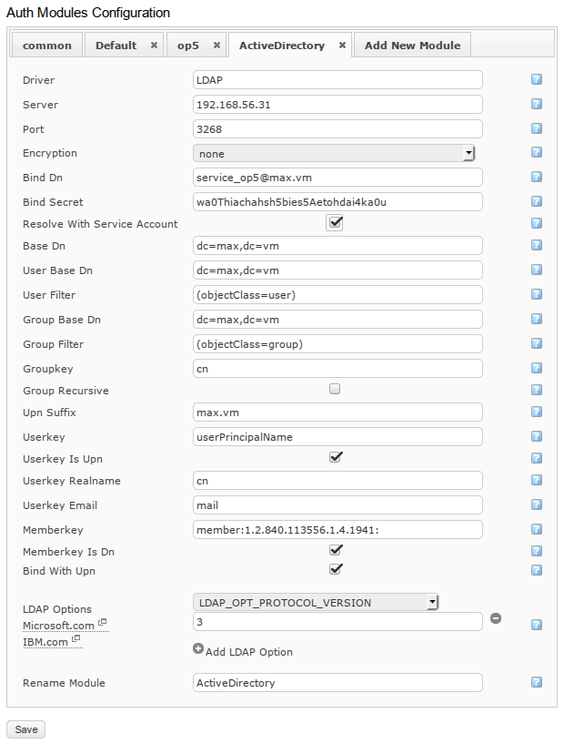
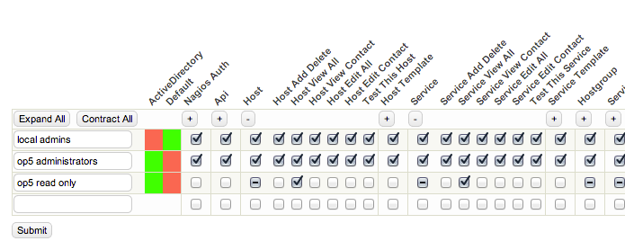

# Active Directory Integration How-To

Version

This article was written for version 6.1 of Monitor, it could work on both lower and higher version if nothing else is stated.

# Introduction

It’s very common to have an Active Directory server for user management. Therefore, integrating OP5 Monitor to Active Directory is a very common task, which isn’t necessarily trivial. This howto shows how to design and integrate OP5 Monitor in a way that is easy to manage.

Active Directory is a registered trademark of Microsoft, and is one of many implementations of an LDAP directory server. Other implementations use different schemas, and therefore many of the fields below is the same for every Active  Directory integration.

This HowTo assumes that the Active Directory works on only one domain.

/\*\*/ Introduction Preparations Prepare Active Directory Configure OP5 Monitor to access Active Directory Testing the connection Testing users and group memberships Configure group rights Troubleshooting

# Preparations

To be able to integrate OP5 Monitor, you need access to the Active Directory, where you should be able to add users and groups, which will be needed.

It is important to have knowledge of the structure of the Active Directory. Knowing where users and groups are defined will save you some trouble when creating the Auth Module for Active Directory in OP5 Monitor.

# Prepare Active Directory

When configuring the group rights, OP5 Monitor binds with a service account in the Active Directory to get access to user information and group memberships. Therefore you need to create a service account for the OP5 Monior in your domain. (May be skipped if you already have a service account.) 

Take note of the “User logon name”, and the field to the right. Together they make the field “userPrincipalName”. Of course, you also need the password for the account.

Then create one group per set of permissions you are using for monitor. In this example, we set up two groups:

-   OP5 administrator

-   OP5 read only

The administrator group gets full access to the OP5 Monitor system, and limited user has permissions to view everything but cannot edit anything.

These groups are created in the Active directory resulting in OP5 Monitor not handling who have access, but how the users access monitor. Hence the groups are named after permissions, not after the structure of the organisation.

 

The users are placed in the group NOC users. The NOC users group is placed in the OU Structure. The NOC users group is a member of the group OP5 administrators which is placed in the OU Services. This gives us an example of how recursive groups are set up.

Another thing to note is the distinguished name for the domain.

In Active Directory Users and Computers, enable “Advanced Attributes” from the View menu. Then right click on the domain, and press properties. Under the Attribute Editor tab, find “distinguishedName”. In this case “DC=max,DC=vm” 

The preparations of the Active Directory is now done.

# Configure OP5 Monitor to access Active Directory

Active directory is interfaced using LDAP.

To access Active Directory, you first need to add a new Auth Module of type LDAP.

Go to the configuration menu, and press configure. On the configuration page, press “Auth Module”

 

Create a new module by clicking the Add New Module tab. Call it, for example “ActiveDirectory” and set “LDAP” in the Driver Type selection. Click “Add”. A new tab will appear with LDAP specific settings.

  

Many of the fields in the form are the same for every active directory integration. Their respective configurations are described below.

### Server

This is the address to your LDAP server. If the system has several identical LDAP servers, these can be added as a list separated by spaces, and if the first fails, the second is used instead etc.

### Port

Normally when connecting to LDAP you would use port number 389 (port number 636 for ssl) but Active Directory has two separate LDAP interfaces.

The first interface is the one available at the default LDAP ports (389, 636).

When building an Active Directory forest with multiple domains and trusts, Active Directory uses referrals to pass users between servers. This is a problem for the PHP ldap interface OP5 Monitor uses.

Therefore the second interface (called Global Catalog) is preferred. When using this LDAP interface, the Active Directory server itself forwards the requests, so the client only needs to have access to the first server. To access the Global Catalog, use port number 3268 instead (port number 3269 for ssl).

Use 3268 as Port number

### Encryption

To use encryption, the Active Directory CA needs to be added and available for the php-ldap-interface, which uses OpenLdap. Easiest is to skip encryption, at least in the beginning.

 

Use “none” as encryption

If encryption is required, this article can help you enable it for Active Directory

### Bind DN

This is the login name of the service account. According to the LDAP specification, a user should bind with the entire DN as login name. Active Directory has an extension, which allows users to bind with just the User Principal Name, so this is the UPN of the service account created under “Prepare Active Directory”.

 

This example uses: service\_op5@max.vm

### Bind Secret

This is the password of the service account.

### Resolve with service account

Check this if you want to use Bind DN and Bind secret as the credentials for lookups in the LDAP or Active Diretory tree.

### Base DN

This is where to find the root of the domain. This is what you found under the “Prepare Active Directory” header.

 

This example uses: DC=max,DC=vm

### User Base DN

This is where to find user objects in the domain. Because searching for users in an Active Directory uses an index, there is no performance reason why not to search the entire directory for users. Therefore the preferred value of this field is the same as “Base DN”

This can be used to limit access to users in a smaller OU, but access control is better to handle by groups.

 

This example uses: DC=max,DC=vm

### User Filter

Types of ldap objects is defined by different classes, and this field describes how to filter out objects describing users.

User in Active Directory has the class of user, so the filter is always (objectClass=user)

 

Use (objectClass=user) as user filter

### Group Base DN

This is where to find group objects in the domain. By the same reason as for User Base DN, you probably want to use the same value as Base DN here.

 

This example uses: DC=max,DC=vm

### Group Filter

This is the filter of how to identify a group in the tree. Active Directory uses groups as class “group”

 

Use (objectClass=group) as group filter

### Group Key

Group key is the name of the attribute that defines the name of group. Active Directory uses the Common Name field, but the short version “cn”

Use “cn” as group key

### Group Recursive

This is a tricky field.

Not all directory servers supports groups as members of groups. Active Directory does, and that’s one key feature of Active Directory.

Checking this option makes OP5 Monitor not only resolve the group membership of the user, but also the group membership of the groups found, and does that until no more groups is found.

In bigger directories this is a heavy operation. Fortunately, Active Directory can do this internally, so the client don’t have to.

 

Use “false” as group recursive

### UPN Suffix

As said in “Bind DN”, Active Directory identifies users on User Principal Name when binding instead of DN. When binding as a regular user, the username is combined with a @ and the this value to build up the userPrincipalName for the user before binding, given the field “Bind with UPN” is set.

In this example, a user is called “msikstrom@max.vm", which makes the UPN Suffix to “max.vm”

This example uses: max.vm

### Userkey

The attribute name of the login name. Active directory combines the login name with the domain, and stores it in the userPrincipalName field.

 

Use “userPrincipalName” as userkey

### Userkey is UPN

Checking this box makes OP5 Monitor cut away the username after the @-sign, when using user principal name as userkey. This is what Active Directory does.

Check the checkbox “Userkey is UPN”

### Userkey realname

The key used to retrieve the real name of the user. The real name is used to display the full name of the user instead of the username in some places. Active directory handles this in the “Common name” field, in short “cn”.

 

Use “cn” as userkey realname

### Userkey email

The key used to retrieve the user email address. Active Directory, like most other systems, uses the key “mail”

 

Use “mail” as userkey mail

### Memberkey

This is the attribute in a group to define the groups members. Members can either be described just as the username, or by the distinguished name of the user (the entire path). Active directory uses the Distinguished Name.

Active directory calls this attribute “member”

Active Directory not only have users as members of groups, but also other groups. So the value of the attributes can be the DN of other groups, as described in Groups Recursive. It is possible to let active directory resolve those nested group memberships by using a extended search syntax, in the form member:oid:, which would look like this: member:1.2.840.113556.1.4.1941:

In Active directory, use memberkey: member:1.2.840.113556.1.4.1941:

### Memberkey is DN

As described under “Memberkey”, this is if the group membership attribute is defined as a distinguished name (entire path in the domain) or just the username.

 

For active directory, check this box.

### Bind with UPN

This is to enable the feature in active directory to bind using user principal name instead of the distinguished name. We want to use it.

 

Check “Bind with UPN” for Active Directory

### LDAP options

This box is new in monitor 6.1, but for active directory, the important part is avalible in monitor 6.0 under the name “Protocol Version”

 

Set “protocol version”/LDAP\_OPT\_PROTOCOL\_VERSION to 3

 

Advanced: If several identical servers are specified to be used as failover servers the LDAP option LDAP\_OPT\_TIMELIMIT will set the amount of seconds to wait for a timeout.

# Testing the connection

Under configure, go to the page “Assign group rights” 

Each authentication module is represented with a column in the group rights table. The box intersecting the auth module column and a group row represents if that group is available using the corresponding module.

There are three possible cases:

-   A red box - The authentication module (in this case Active Directory) says that the group doesn’t exist.

-   A green box - The authentication module says the group does exist.

-   A gray box - The authentication module can’t by some reason tell if the group is available.

At this moment, we are interested in if the boxes is red/green or gray under the column for our connection to the Active Directory server. Given that the boxes are gray, something is wrong with the connection, and the settings needs to be checked. If the boxes is red/green, the connection is up, and the Active Directory server answers.

# Testing users and group memberships

Once the connection is up, testing of group membership of a group can be tested with the “Lookup user” field above the group membership table.

 

One a user is looked up, the membership of the groups is printed either in the table as checkboxes (if the group exists there), and for groups that doesn’t exist in the table, the group is printed in the list “XX is also member of:”

 

If this list is empty, either the user can’t be found in the domain, or no groups is found. Check the settings. Check the settings and try again.

# Configure group rights

Now when the connection and search filters is working, it’s time to configure group rights for the users.

At the configure group rights table, there is an empty field at the bottom. Type the name of the group you want do add, for example “op5 administrators”, as added in the “Prepare Active Directory”, and press submit. Do the same for “op5 read only”

 

Once added, check all checkboxes for “op5 administrators” and the following for “op5 read only”:

-   Host View All

-   Service View All

-   Hostgroup View All

-   Servicegroup View All

     

 

# Troubleshooting

Information about what’s happening behind the scenes in the LDAP connection can be found in the authentication log, using debug level. To enable the debug log for authentication:

1.  Open /etc/op5/log.yml

2.  Change to “level: debug” instead of “level: error” under the auth-section.

3.  Try to log in

4.  Read the file: /var/log/op5/auth.log

After leaving the system, make sure to disable debug log, and go back to level “error” again, so the log doesn’t get flooded.

If you are contacting the support about LDAP authentication, they will ask for the auth debug log.

 

### Stacktrace when logging in to OP5 Monitor saying: ldap\_search(): Operations Error.

One of the reasons you may get this stacktrace is if you are trying to search the global scope of the Active Directory in 2003 or 2008 servers schema. This can sometimes be resolved by adding an LDAP option to your auth module.

Add LDAP Option LDAP\_OPT\_REFERRALS with the value 0 (zero). This option handles whether referrals should be followed by the client or not. Setting it to 0 turns this off. It might also help to use the Global Catalog instead of the default LDAP port. Use port 3268.

